# Computador

>“Computador é aquele que faz cômputos ou que calcula; máquina à base de circuitos eletrônicos que efetua grandes operações e cálculos gerais, de maneira ultra rápida." 

>"Computador é a entidade mais veloz do mundo, pois fará qualquer coisa que nós lhe ordenarmos a uma velocidade extremamente alta." 

>"Computador é um equipamento capaz de aceitar elementos relativos a um problema, submetê-lo a operações predeterminadas e chegar a um resultado."

```{r, echo=FALSE, out.width="100%", fig.align='center'}

```

---

class: center, middle, inverse

### Dica de Filme: 

```{r, echo=FALSE, out.width="45%", fig.align='center'}

```

Fonte: [IMDB](https://www.imdb.com/title/tt2084970/)
---
# Arquitetura de Computadores

Estudo sobre como projetar as partes de um sistema de computador que são visíveis para os programadores.

Atributos que têm impacto direto sobre a execução lógica de um programa. Exemplos: 

 + Conjunto de instruções;

 + Número de bits usados para representar os vários tipos de dados (caracteres 2b ou 4b);

 + Mecanismos de E/S (Entrada e Saída);

 + Técnicas de endereçamento à memória.

---

# Projeto de computadores atuais

**Conceitos Básicos**

  + Dados/Instruções são armazenados em uma única memória de leitura/escrita;

  + Conteúdo da memória é endereçado pela posição;

  + Execução de instruções de modo sequencial (salvo exceções).


```{r, echo=FALSE, out.width="60%", fig.align='center',fig.cap=""}

```

---

# Projeto de computadores atuais

  + Base no modelo de John Von Neumann (IAS);

  + Formado pelos componentes: memória, CPU, E/S, barramentos;

  + CPU dividida em ULA e unidade de controle.

```{r, echo=FALSE, out.width="70%", fig.align='center',fig.cap="Um microprocessador, ou simplesmente processador, é um circuito integrado (ou chip), que é considerado o 'cérebro' do computador."}
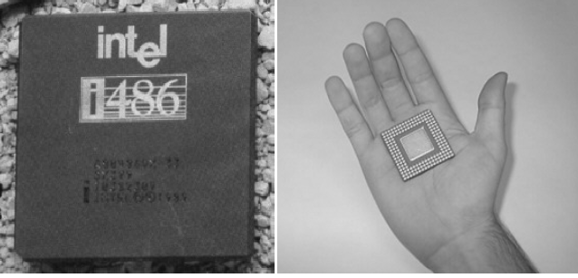
```
---

#### Componentes básicos de um computador

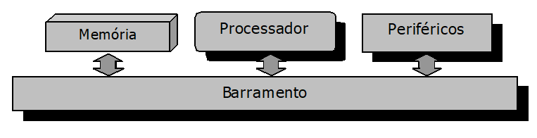


O **processador** (ou microprocessador) é responsável pelo tratamento de informações armazenadas em memória (programas em código de máquina e dos dados).

A **memória** é responsável pela armazenagem dos programas e dos dados. 

**Periféricos**, que são os dispositivos responsáveis pelas entradas e saídas de dados do computador, ou seja, pelas interações entre o computador e o mundo externo. Exemplos de periféricos são o monitor, teclados, mouses, impressoras, etc.

**Barramento**, que liga todos estes componentes e é uma via de comunicação de alto desempenho por onde circulam os dados tratados pelo computador.

---


---

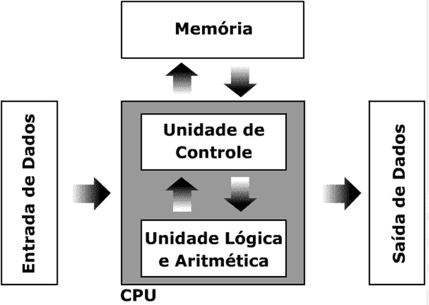

---
### Exemplo de como funciona o computador:

Uso de um programa que faz cálculos matemáticos:
  + Usuário digita: $10+20*2$
  + **UC** recebe estes dados
  + **UC** verifica que precisam ser calculados
  + **UC** envia para a **ULA**
  + **ULA** realiza o cálculo necessário
  + **ULA** *retorna* o valor $50$ para a **UC**
  + **UC** armazena na memória
  + **UC** mostra o resultado no dispositivo de saída
  
---
class: middle, center, inverse

# Conceitos Básicos

---
class: middle, center, inverse

## Abstração

---

## Abstração

  > A realidade é complexa e rica em detalhes! 

```{r, echo=FALSE, out.width="70%", fig.align='center',fig.cap="Floresta tropical."}

```
---

```{r, echo=FALSE, out.width="200%", fig.align='center',fig.cap="Vegetação."}

```

---

```{r, echo=FALSE, out.width="200%", fig.align='center',fig.cap="Corpo d'água."}

```

---
```{r, echo=FALSE, out.width="200%", fig.align='center',fig.cap="Relevo."}

```

--

Qual desses aspéctos mais lhe chamou a atenção?

---
## Abstração
É a operação mental que observa a realidade e captura apenas os aspectos relevantes para um contexto.

--
```{r, echo=FALSE, out.width="40%", fig.align='center',fig.cap="'."}

```

---
## Abstração

Perceba que a realidade é a mesma.

 > Isto é, uma figura em preto e branco.

Mas, dependendo da observação da realidade, você pode ter abstrações diferentes.

Por isso, a abstração depende mais do observador do que da realidade observada.

--

Cuidados que devemos ter para não cair em engodos abstrativos

[Teoria da conspiração](https://pt.wikipedia.org/wiki/Teoria_da_conspira%C3%A7%C3%A3o) 

  + [terraplanismo](https://pt.wikipedia.org/wiki/Terra_plana)
  
  + [criacionismo](https://pt.wikipedia.org/wiki/Criacionismo)
  
  + [movimento antivacina](https://www.ufcspa.edu.br/noticias/34-meu-perfil/imprensa/noticias/810-movimento-antivacina)
  
  + [negacionismo climático](https://pt.wikipedia.org/wiki/Negacionismo_clim%C3%A1tico)

---
class: middle, center

# O [Método Científico](https://pt.wikipedia.org/wiki/M%C3%A9todo_cient%C3%ADfico) é uma "vacina" para isso...

---
class: middle, 

Assim, os objetivos dessa aula serão:

  + apresentar os conceitos básicos para criação de algoritmos que envolvem a abstração do problema, a descrição e a organização dos métodos para sua resolução.
  
  + Treinamento do encadeamento lógico e organizado do pensamento. 
  
  + Aprender a documentar e implementar tais métodos, mesmo que de forma simples, por meio de um ferramental próprio, que poderá ser: lápis e papel, calculadora ou uma linguagem de programação.

---
class: center, middle, inverse

### Dica de Leitura: 

```{r, echo=FALSE, out.width="45%", fig.align='center'}

```

---

### Simples resultados da aplicação do método científico

```{r, echo=FALSE, out.width="45%", fig.align='center', fig.cap="A cientista da computação Margaret Hamilton posa com o software de orientação Apollo que ela e sua equipe desenvolveram no MIT. Estima-se 660.000 linhas de código."}

```


Fonte: [NASA](https://solarsystem.nasa.gov/people/320/margaret-hamilton/)

---
## Sistema computacional

```{r, echo=FALSE, out.width="120%", fig.align='center'}
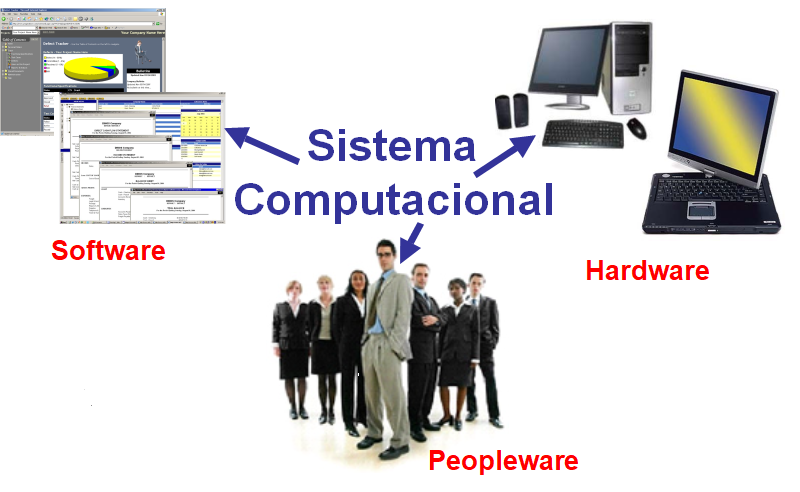
```

---
## Programação de Sistema Computacional

```{r, echo=FALSE, out.width="120%", fig.align='center'}
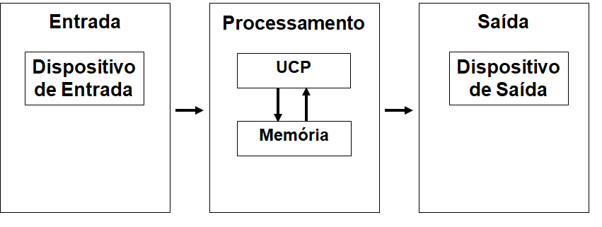
```
**Exemplo 1** – Exibir a média de dois números  
**Exemplo 2** – Exibir se o aluno está aprovado ou reprovado
---

### Comentário em Programação

Um comentário é um pedaço de texto adicionado ao código para fornecer informações adicionais ou contexto sobre o código para outros desenvolvedores ou para o futuro eu do programador. Os comentários não são executados pelo computador.

Comentar seu código na programação é importante por vários motivos:

**1) Aprimorando a legibilidade do código**: o código bem comentado é muito mais fácil de ler e entender, especialmente para outros programadores que podem estar trabalhando na mesma base de código. 

**2) Facilitando a manutenção e a depuração**: Eles podem ajudar a identificar e isolar problemas, tornando mais fácil corrigi-los.

**3) Documentando o Código**: Eles podem fornecer detalhes sobre como o código funciona, por que certas decisões de design foram tomadas e como usar o código de forma eficaz. 

**4) Colaboração e trabalho em equipe**: ao trabalhar em equipe, comentar seu código pode ser uma forma de se comunicar com os membros da equipe. 
---

Comentar o código é uma boa prática a ser seguida no desenvolvimento de software, pois pode tornar o código mais fácil de ler, manter, entender e estudar para você e outras pessoas que possam trabalhar no código no futuro. Esta prática é considerada fundamental para o processo de aprendizado.
  
.pull-left[
Em Pseudocódigo o comentário será feito com `\\`.

```{r, eval=FALSE}
Início
  \\ Declaração
  \\ Entrada
  \\ Processamento
  \\ Saída
Fim
```

]
  
.pull-right[
Em R, o comentário poderá ser feito com `#`.
```{r}
# Declaração de variáveis
# Entrada
# Processamento
# Saída
```

]  
---
### Identação
  
Identar é afastar o texto de sua margem, com espaços ou tabulações, que tem como objetivo criar uma hierarquia entre os blocos das instruções para ressaltar ou definir a estrutura do algoritmo.

```{r, echo=FALSE, out.width="100%", fig.align='center'}
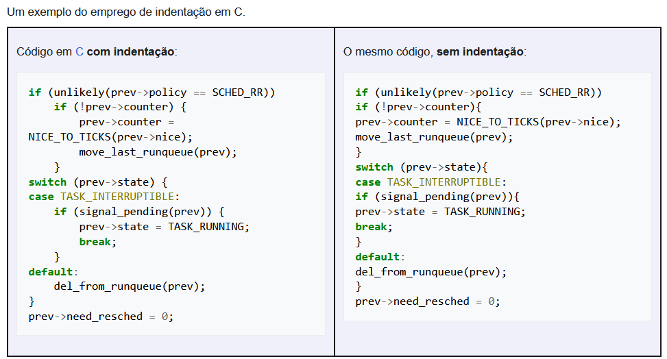
```

Fonte: [Wikipédia-Identação](https://pt.wikipedia.org/wiki/Indenta%C3%A7%C3%A3o)
---
# **Exemplo 1** – Exibir a média de dois números  


---

**-Algoritmo-** 

*OBS: A orientação da execução das declarações será sempre de cima para baixo, da esquerda para a direita.*


```{r, eval=FALSE}
início  
  inteiro: x;  
  inteiro: y;  
  real: media;   
  leia(x,y);   
  media <- (x+y)/2;  
  escreva(média);  
fim. 
```


Implementação em R
```{r}
x <- 3
y <- 4
media <- (x+y)/2
media
```

---
**Exemplo 2** – Exibir se o aluno está aprovado ou reprovado

Algoritmo - Pseudocódigo

```{r, eval= FALSE}
início  
  caracter: nome; 
  inteiro: prova1;  
  inteiro: prova2;  
  leia(prova1,prova2);   
  se ((prova1+prova2)/2 >= 5)  
  então escreva(nome,":Aprovado(a)"); 
  senão escreva(nome,": Reprovado(a)"); 
fim.
```


Implementação em R

```{r}
nome <- "Maria"
prova1 <- 5
prova2 <- 8
if((prova1+prova2)/2 >= 5 ){
  print(paste0(nome, ": Aprovado(a)"))
}else{
  print(paste0(nome, ": Reprovado(a)"))
}
```

---
class: center, middle, inverse

# Linguagem de Programação, Algoritmos
# &
# Lógica de Programação

---

## Linguagem de programação

É o conjunto de palavras e regras que permitem **comunicar** ao computador o que este deve **executar**.

Em computação, uma linguagem de programação é a ferramenta de **comunicação** entre o **programador** que visa resolver um problema e o **computador** que irá ajudá-lo a resolver.


```{r, echo=FALSE, out.width="65%", fig.align='center'}
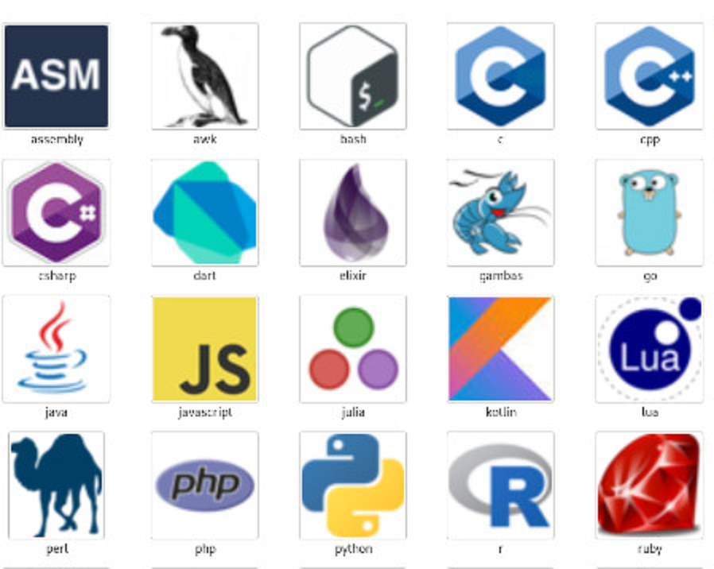
```

---

## Algoritmo

Sequência lógica e não ambígua de **instruções** que levam à solução de um problema num tempo finito.


  + As instruções devem ser definidas em uma ordem correta.
 
  + A sequência lógica e as instruções não devem dar margem à dupla interpretação.

  + A sequência lógica deve resolver exatamente (nem mais e nem menos) o problema identificado.

  + A sequência lógica não deve possuir iterações infinitas.


---

### Exemplos de algoritmos
  + Receitas de comidas
  + Coreografia
  + Manuais de instalação

### Contraexemplos de algoritmos
  + Listas de compras
  + Dança informal
  + Índice remissivo de um livro

--

### Atenção:
Um algoritmo é **“uma solução”** e não **“a solução”** de um problema.
Um problema pode ser resolvido por mais de um algoritmo! ** -- SEMPRE -- **

Tarefas que possuem **“padrão de comportamento”** podem ser descritas por um algoritmo.

Ex: Qual será o próximo número da sequência $0,1,4,9,16,25$?

---
**Exemplo 3** – Apresente os números de $1$ a $10$, com os valores ímpares negativos e pares positivos.

Algoritmo - Pseudocódigo

```{r, eval=FALSE}
início
  inteiro: contador;
  inteiro: resultado;
  para contador <- 1 até 10 faça 
    resultado <- contador * pot(-1, contador);
    escreva(resultado);
  fim para
fim.
```

---
**Exemplo 3** – Apresente os números de $1$ a $10$, com os valores ímpares negativos e pares positivos.

Implementação em R

```{r}
resultado <- integer()
for(contador in 1:10){
  resultado <- contador * (-1)^contador
  print(resultado)
}
```

---
## Lógica de Programação

É o encadeamento lógico de "*instruções*" para o desenvolvimento de "*programas*".

### Instrução
+ Informação que representa uma ação elementar que deve ser executada.
+ O ";" (**ponto-e-vírgula**) indica o fim de uma instrução!
+ Em **R** cada instrução deve ser digitada em uma linha, se mais de uma instrução for digitada na mesma linha, usa-se, então, o ponto-e-vírgula.

.pull-left[
```{r}
x <- 2
y <- 3
x*y
```
]

.pull-right[
```{r}
x <- 2; y <- 3; x*y
```
]

Ambas as instruções retornam o mesmo valor, $6$.

---
## Lógica de Programação

É o encadeamento lógico de "*instruções*" para o desenvolvimento de "*programas*".

### Programa
É a implementação das instruções (codificação + tradução + execução) de um algoritmo em uma linguagem de programação.
Existem vários tipos de linguagens de programação:


  + **Linguagem de Máquina:** Possuí uma notação binária (zeros e uns), a qual tornava a programação trabalhosa, cansativa e fortemente sujeita a erros.  
  + **Linguagem Assembly:**  Surgiu para minimizar as dificuldades da programação em notação binária.  
  + **Linguagem de Alto Nível:** Aproxima-se das linguagens utilizadas por humanos para expressar problemas. Cada declaração numa linguagem de alto nível equivale a várias declarações numa linguagem de baixo nível.


---
1 - Totalmente codificadas em binário ( $0$´s e $1$´s ).

2 - Usa instruções simbólicas para representar os $0$´s e $1$´s.

3 - Voltadas para facilitar o raciocínio humano.

```{r, echo=FALSE, out.width="120%", fig.align='center'}
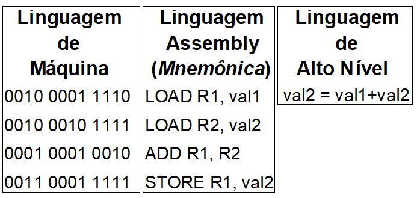
```

---

## BAIXO NÍVEL	

**VANTAGENS:** Programas são processados mais rapidamente. Ocupam menos espaço na memória.	

**DESVANTAGENS:** Programas têm pouca portabilidade (são específicos para um tipo de processador) e não são estruturados.

## ALTO NÍVEL	

**VANTAGENS:** Programas têm maior portabilidade e as linguagens são mais estruturadas (facilitam a programação).

**DESVANTAGENS:** Programas exigem mais tempo de processamento (tradução para linguagem de máquina gera código genérico e complexo, + Memória).


---

Se o computador só entende linguagem de máquina, o que deve ser feito para que ele entenda programas em linguagem assembly ou de alto nível?

> Resposta: Usar um tradutor!

--

**Tradutores** no contexto de linguagens de programação são programas que recebem como:

 * **entrada um programa em linguagem assembly ou de alto nível** (dita linguagem fonte); 

 * **saída  as instruções deste programa traduzidas para linguagem de máquina**.

--

#### Principais Tipos

**1) COMPILADOR:** traduz de uma vez só todo o programa escrito em linguagem de alto nível (código-fonte) para um programa equivalente escrito em linguagem de máquina (código-objeto).

**2) INTERPRETADOR:** traduz (sem gerar código-objeto) e em seguida executa, uma-a-uma, as instruções de um programa em linguagem de alto nível (código-fonte).


---
class: middle

```{r, echo=FALSE, out.width="90%", fig.align='center'}
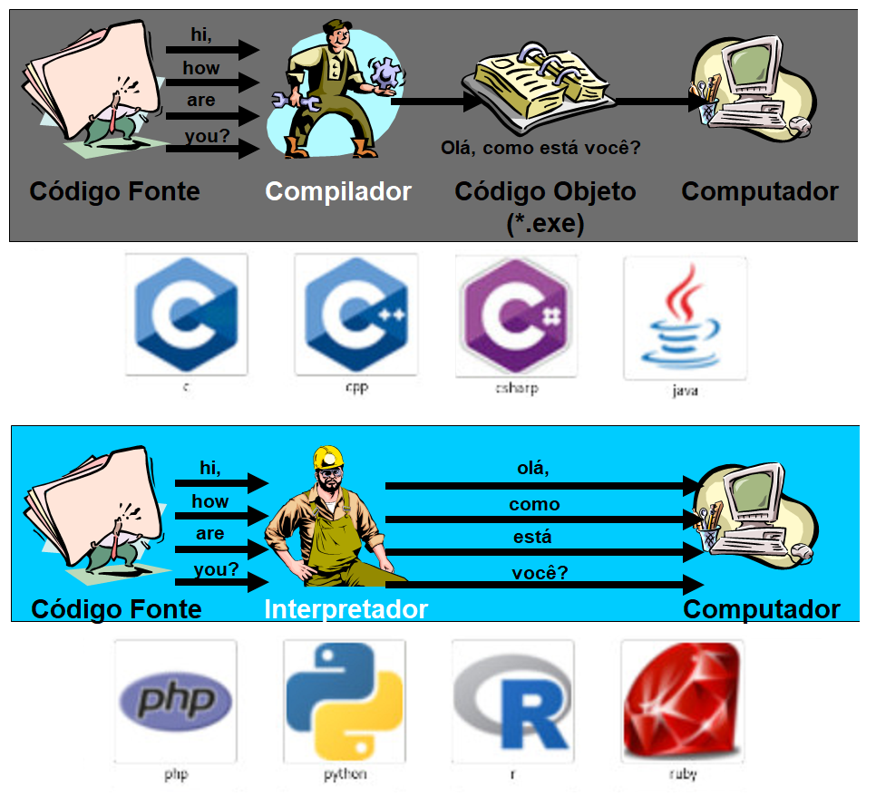
```

---

## Representação de um algoritmo

### Exemplo: 

Algoritmo para converter uma temperatura de Fahrenheit para Celsius.

#### Descrição narrativa
      1. solicite a temperatura em Fahrenheit;

      2. transforme a temperatura em Fahrenheit para Celsius;

      3. informe a temperatura em Celsius.

Características:   

  +	De fácil entendimento, porém, imprecisa.  
  +	Pouca confiabilidade.  
  +	Extensão (normalmente, escreve-se muito para dizer pouca coisa).  

---

#### Fluxograma

Características:  

•	Padrão mundial, ferramenta bastante conhecida, pois as figuras dizem muito mais que palavras, porém, a representação complica-se à medida que o algoritmo cresce.  
•	Pouca atenção aos dados, não oferecendo recursos para declará-los.

Principais símbolos:

```{r, echo=FALSE, out.width="90%", fig.align='center'}
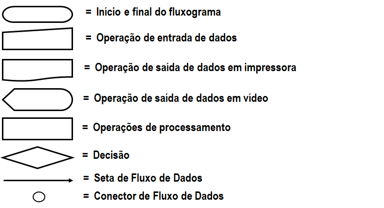
```


---

## Representação de um algoritmo por Fluxograma

Algoritmo para converter uma temperatura de Fahrenheit para Celsius.

```{r, echo=FALSE, out.width="90%", fig.align='center'}
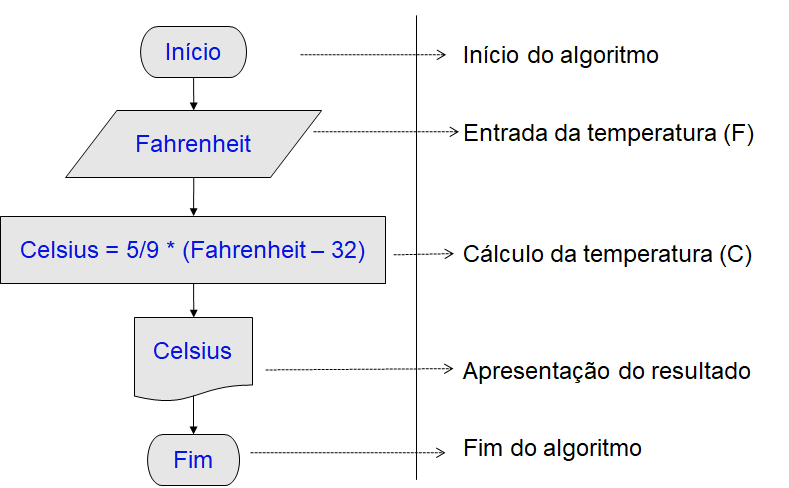
```

---

### Representação por Linguagem algorítmica (pseudocódigo)

A forma geral de um algoritmo em pseudocódigo:

    Algoritmo <nome_do_algoritmo>
    Início
      [<declaração_de_variáveis>]
      [<sub-algoritmos>]
      Início
      <corpo_do_algoritmo>
    Fim.   
Características:   

  +	É independente da linguagem de programação e, no caso do Brasil, usa o português como base.   
  + Define-se melhor quais e como os dados vão estar estruturados.  
  + Passagem quase imediata do algoritmo para uma linguagem de programação qualquer.  
  + Exige a definição de uma  linguagem não real para trabalho e não é padronizada.

---

## Pseudocódigo do algoritmo Fahrenheit-Celsius

    Algoritmo Fahrenheit-Celsius
    Real: Fahrenheit, Celsius;
    Início
      Ler (Fahrenheit);
      Celsius <- 5/9 * (Fahrenheit – 32);
      Escrever (Celsius);
    Fim

Implementação em R

```{r}
Fahrenheit <- 77
Celsius <- 5/9*(Fahrenheit - 32)
Celsius
```

---

## Construindo algoritmos

Uma boa prática para construir algoritmos é dividir o problema em $3$ fases (Entrada, Processamento e Saída).

```{r, echo=FALSE, out.width="90%", fig.align='center'}

```

**ENTRADA**: São os dados de entrada do algoritmo.  

**PROCESSAMENTO**: São os procedimentos utilizados para chegar ao resultado final.  

**SAÍDA**: São os dados já processados.  


---

No algoritmo Fahrenheit-Celsius temos:
  
  + **ENTRADA:** Temperatura em Fahrenheit  

  + **PROCESSAMENTO:** Celsius = 5/9 *(Fahrenheit – 32)    

  + **SAÍDA:** Temperatura em Celsius  

Num algoritmo para calcular a área de um triângulo temos:

--

  + **ENTRADA:** Base e Altura do triângulo  

  + **PROCESSAMENTO:** Área = (Base * Altura)/2  

  + **SAÍDA:** Área

--

  > Dividir o problema em Entrada, Processamento e Saída irá ajudá-lo a ordenar corretamente as instruções do seus algoritmos.

Por isso, antes de construir um algoritmo, pare para pensar e identificar:

Que dados preciso para começar? – **Entrada**  
Quais são os cálculos e decisões? – **Processamento**
Que dados devem ser exibidos? – **Saída**


---

## Atividades

1) Calcular e exibir a média ponderada de $2$ notas dadas.   
(nota1 = peso $6$ e nota2 = peso $4$).

--
```{r, eval=FALSE}
Algoritmo media-ponderada
Real: mediaP, nota1, nota2;
Início
  Ler(nota1, nota2);
  mediaP <- (nota1*6 + nota2*4)/(6+4);
  Escrever(mediaP);
Fim.
```

Implementação em R

```{r}

```

---

2) Reajustar um salário em $7,75%$.

--

```{r, eval=FALSE}
Algoritmo reajuste-salarial
Real: porcentagem, salario, novo_salario
Início
  Ler(salario, porcentagem);
  novo_salario = salario + salario*porcentagem;
  Escrever(novo_salario);
Fim.
```

Implementação em R

```{r}
porcentagem <- 0.075 # real
salario <- 1212.00 # real 
novo_salario <- 0.00 # real
novo_salario = salario + salario*porcentagem # processamento
cat("Novo Salário: R$", round(novo_salario,2)) # saída
```

---

3) Calcular o desconto de $23\%$ sobre o preço de um produto.

--

```{r, eval=FALSE}
Algoritmo desconto
Real: preço, desconto;
Início
  Ler(preço);
  desconto <- preço*0.23;
  Escrever(desconto);
Fim.
```

Implementação em R

```{r}
preco <- 4274.90 #real
desconto <- preco *23/100
cat("desconto: R$ ", desconto)
cat("Preço com desconto: R$", preco-desconto)
```


---

4) Dada uma taxa de câmbio, transformar um valor em Dólar para Reais.

--

```{r, eval=FALSE}
Algoritmo dolar-real
Real: valor_dolar, taxa_cambio, valor_real;
Início
  Ler(valor_dolar, taxa_cambio);
  valor_real <- valor_dolar * taxa_cambio;
  Escrever(valor_real);
Fim.
```

Implementação em R

```{r}
taxa_cambio <- 5.24
valor_dolar <- 405.78
valor_real <- valor_dolar * taxa_cambio
cat("valor em R$", round(valor_real,2))
```

---

5) Dada uma taxa de câmbio, transformar um valor em Reais para Dólar.

```{r, eval=FALSE}
Algoritmo real-dolar
Real: valor_dolar, taxa_cambio, valor_real;
Início
  Ler(valor_real, taxa_cambio);
  valor_dolar <- valor_real * taxa_cambio;
  Escrever(valor_dolar);
Fim.
```

Implementação em R

```{r}
taxa_cambio <- 5.24
valor_real <- 4274.90
valor_dolar <- valor_real / taxa_cambio
cat("valor em USD", round(valor_dolar,2))
```


---

class: middle, center, inverse

# Conceitos Básicos

## Identificadores e Palavras Reservadas


---

## Identificadores

São nomes únicos definidos pelos programadores para identificar/distinguir os elementos de um algoritmo.


--
## Palavras Reservadas

São instruções primitivas que têm significados pré-determinados e fazem parte da estrutura de qualquer linguagem de programação.


```{r, eval=FALSE}
if; else; in; for; while; repeat; break; function
next; NULL; Inf; NA; NaN; TRUE; FALSE; T; F
```


---

### Algumas regras para os nomes de Identificadores:

1) Devem começar por um caractere alfabético, nunca por um caractere numérico.

2) Podem ser seguidos por mais caracteres alfabéticos e/ou numéricos.

3) Não é permitido o uso de espaço em branco ou de caracteres especiais, como: @, #, &, *, +, ?, $ (exceto o _ e o . ).

4) Não poderá ser uma palavra reservada a uma instrução do algoritmo.

5) Devem ser significativos.

6) Não podem ser repetidos dentro de um mesmo algoritmo/sub-algoritmo.

---

## Recomendação

> Você deseja que os nomes de seus objetos sejam descritivos, portanto, precisará adotar uma convenção para várias palavras. Recomendamos snake_case, onde você separa palavras minúsculas com underline.

```{r, eval = FALSE}
i_use_snake_case # chatGPT_to #<<
otherPeopleUseCamelCase
some.people.use.periods
And_aFew.People_RENOUNCEconvention
```

---

## Exercício

Identifique os erros e reescreva os identificadores abaixo:

vm

13salário

salário$

salário_mínimo 

salário+reajuste

novoSalário

fumante? 

preço médio

%desconto

km/h

---

## Exercício - Resposta

Identifique os erros, se houver, e reescreva os identificadores abaixo, se necessário:

vm: não tem significado, ideal `valor_médio`, por exemplo;

13salário: não se inicial com número, ideal `salario_13`;

salário$: não utilizar caractere especial, ideal `salario`;

salário_mínimo: correto, outra opção seria `salario_minimo`;

salário+reajuste: não utilizar caractere especial, ideal `salario_reajuste`;

novoSalário: correto, outra opção `novoSalario`;

fumante? :não utilizar caractere especial, ideal `fumante`;

preço médio: não utilizar caractere especial, espaço, ideal `preco_medio`;

%desconto: não utilizar caractere especial, ideal `desconto`: 

km/h: não utilizar caractere especial, ideal `km_h`. 

---

class: middle, center, inverse

# Tipos de Dados

---

### Tipos de Dados

As fases de **Entrada**, **Processamento** e **Saída** podem manipular vários tipos primitivos de dados, a saber: 


Tipo Primitivo | Descrição | Exemplo
:--- | :---: | :---:
Inteiro | Representa o conjunto de números inteiros | 1, 40, -8, 1024
Real | Representa o conjunto de números reais | 3.14, 2.455, -9.88
Caracter | Representa um ou mais caracteres do teclado | "Oi Mundo"
Lógico | Representa valor lógico (Verdadeiro ou Falso) | TRUE, FALSE

**OBS**: Um Caractere **SEMPRE** deve estar entre aspas "   "

Todos os exemplos abaixo serão considerados do tipo caractere: 

"A"   
"Discente",  
"Fone 3333-33333",   
"1"  

---

**Exercício:** Classifique os dados de acordo com o seu tipo, sendo (I = Inteiro, R = Real, C = Caractere e L = Lógico):  

.pull-left[

a(__)  0	   
 
b(__) + 36  
 
c(__) 0,3257  

d(__) F  
 
e(__)  1  
 
f(__) "F"  
 
g(__) "+3257"	  
 
h(__) -1  
 
i(__) 0,0      
 
j(__) - 0,001	     
 
k(__) "-0,0"	  
 
l(__) ".F."  
 
]
 
 .pull-right[
 m(__) "o"
 
 n(__) +0,05	     
 
 o(__) ".V."		  
 
 p(__) 7/2
 
 q(__) 32     
 
 r(__) +3257	     
 
 s(__) V		  
 
 t(__) -32   
 
 u(__) "A"	  
 
 v(__) "abc"	     
 
 x(__) -1,9E123	  
 
 z(__) "0"  
]

---

**Exercício: Respostas** Classifique os dados de acordo com o seu tipo, sendo (I = Inteiro, R = Real, C = Caractere e L = Lógico):  

.pull-left[

a(I)  0	   
 
b(I) + 36  
 
c(R) 0,3257  

d(L) F  
 
e(I)  1  
 
f(C) "F"  
 
g(C) "+3257"	  
 
h(I) -1  
 
i(R) 0,0      
 
j(R) - 0,001	     
 
k(C) "-0,0"	  
 
l(C) ".F."  
 
]
 
 .pull-right[
 m(C) "o"
 
 n(R) +0,05	     
 
 o(C) ".V."		  
 
 p(R) 7/2
 
 q(I) 32     
 
 r(I) +3257	     
 
 s(L) V		  
 
 t(I) -32   
 
 u(C) "A"	  
 
 v(C) "abc"	     
 
 x(R) -1,9E123	  
 
 z(C) "0"  
]


---
class: middle, center, inverse

# Variável e Constante

---

## Constante

**Constante** é um identificador que representa valores constantes, ou seja, que não variam no decorrer do algoritmo. 

Seu uso poupa tempo quando tem que alterar o seu valor no algoritmo. 

Ao trocar o valor de uma constante, todas as instruções que a usam irão manipular, automaticamente, o novo valor.

A declaração de uma constate, geralmente é realizada no momento da declaração das variáveis no início do programa.

---

Exemplo de constantes no R:

```{r}
pi # valor de Pi
exp(1) # constante de Euler
letters # letras minúsculas
LETTERS # letras maiúsculas
```
---

Exemplo de constantes no R:

```{r}
month.name # meses
month.abb # meses abreviados
```


---

**Variável** é um **endereço físico** da memória principal, que é representado por um **identificador** que, ao longo do seu tempo de existência, pode armazenar vários conteúdos de um único tipo pré-determinado.

Endereço físico | Identificador	| Conteúdo	| Tipo
:--- | :---: | :---: | :---: | :---:
1000:2000|	Nome|	"João" | Caracter
2001:3000|	RG|	12345|	Inteiro
3001:4000|	Salário|	999,99|	Real
4001:5000|	Fumante|	F	|Lógico

```{r}
x <- 1:4 # x é um conunto de números que vão de 1 a 4
print(x)

x[5] <- "A" # x foi coagido a um conjunto de caracteres
print(x)
```


**OBS**: Conversão de tipos ou **COERÇÃO** são as diferentes formas de, implícita ou explicitamente, alterar uma entidade de um tipo de dados em outro.


---

class: middle, center, inverse

# Expressões

---

Uma **expressão** é uma fórmula para processamento de um valor.

As principais expressões são as seguintes:

**Aritméticas**: Retornam um valor numérico (inteiro ou real).   
EX: $10+(3+1)/2$ 
RETORNO: $12$

```{r}
10+(3+1)/2
```

**Relacionais**: Retornam um valor lógico $V$ ou $F$.  
EX: $7 = 14/2$  
RETORNO: $VERDADEIRO$

No R o operador relacional de igualdade são dois sinais de igual (`==`).
```{r}
(7 == 14/2) 
```


**Lógicas**: Retornam um valor lógico $V$ ou $F$.  
EX: $(3=2+1) E (3>2)$  
RETORNO: $VERDADEIRO$

```{r}
(3 == 2+1) & (3>2)
```


---


---
class: middle, center, inverse

# Operadores


---

**Operadores Aritméticos**: são as operações aritméticas básicas.

```{r, echo=FALSE, out.width="100%", fig.align='center'}
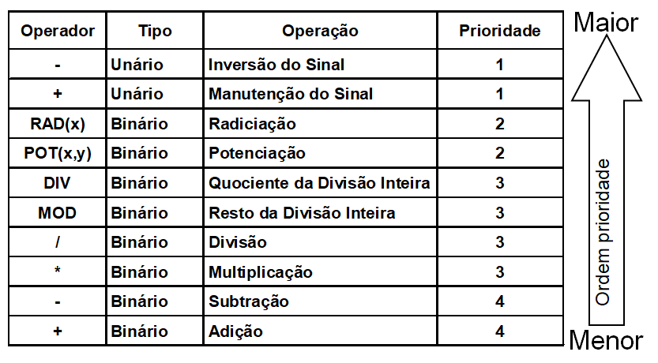
```


---

### Exemplos

Operador	| Operação	| Exemplo	| Resultado | No R
:--- | :--: | :---: | :---: | :---: 
+	| Adição| 	4+3	|7 | `4+3`
-	| Subtração| 	4-3 |	1 | `4 - 1`
*	| Multiplicação| 	4*3|	12 | `4 * 3` 
/	| Divisão| 	4/3	| 1,33 | `4 / 3`
MOD	| Resto da Divisão Inteira| 	5 MOD 3|	2 | `5 %% 3`
DIV	| Quociente da Divisão Inteira|	5 DIV 3|	1 | `5 %/% 3`
POT(x,y)	| Potenciação| 	POT (4,3)|	64 | `4^3` ou `4**3`
RAD(x)	| Radiciação| 	RAD(4)|	2 | `sqrt(4)`
+	| Manutenção do Sinal|	+- 4|	- 4 | `+(-4)`
-	| Inversão do Sinal	| -- 4|	+4 | `-(-4)`

---

### Exemplos - Implementados no R

.pull-left[
```{r}
4+3
4 - 1
4 * 3 
4 / 3
5 %% 3
5 %/% 3
```
]

.pull-right[
```{r}
4^3
4**3
sqrt(4)
+-4
--4
```
]

---
**Operadores Relacionais**: são operadores binários (de mesma prioridade) que somente retornam os valores lógicos $V$ ou $F$.

Operador| Símbolo	| Comparação | Exemplo no R | Retorno
:--- | :---: |:---: | :---:
$>$	| > |maior que | `7 > 5`  | TRUE 
$<$	| < |menor que | `7 < 5` | FALSE
$\geq$| >= | 	maior ou igual | `7 >= 40/5` | FALSE
$\leq$| <= |	menor ou igual | `7 <= 40/5` | TRUE
$=$	| = |igual| `4 == 8/2` | TRUE
$\not=$| <> |	diferente| `4 != 8/2` | FALSE

Estes somente são usados para efetuar comparações, as quais só podem ser feitas entre dados do mesmo tipo.

```{r}
x <- "Meu Nome"; x == "MEU NOME"
```


O resultado de uma comparação é sempre um valor lógico. 

---

```{r}
7 > 5 # maior que
7 < 5 # menor que 
7 >= 40/5 # maior ou igual a
7 <= 35/5 # menor ou igaul a
4 == 8/2 # igual a 
4 != 8/2 # não igual a
```


---

**Operadores Lógicos** ou **Booleanos**: são usados para combinar expressões relacionais e lógicas. Também retornam como resultado valores lógicos, ou seja, $V$ ou $F$.


Operador	| Tipo	| Operação|	| Prioridade
:--- | :---: | :---: | :---: | :---:
NÃO |	Unário	| Negação |	 | 1
E	| Binário	| Conjunção	|  | 2
OU	| Binário	| Disjunção	|  | 3

**Exemplos**
.pull-left[
```{r}
! TRUE # Negação
TRUE & FALSE # Conjunção
TRUE & TRUE # Conjunção
```
]

.pull-right[
```{r}
TRUE | FALSE # Disjunção
TRUE | TRUE # Disjunção
```
]

---

## Ordem de prioridades dos operadores

```{r, echo=FALSE, out.width="80%", fig.align='center'}
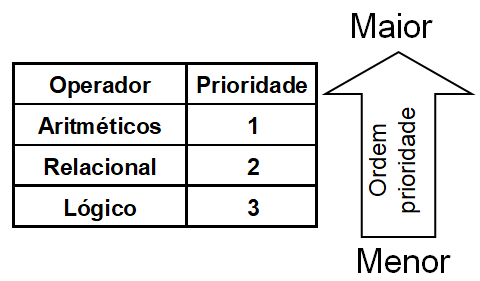
```

Observações:
Operadores de igual prioridade, execução da esquerda para direita.
Para alterar a ordem de prioridade, utilizar parênteses.

---
**Exercício**

Imagine que você está parado na beira de um penhasco e deixa cair uma pedra da borda. Assim que você solta a pedra, ela começa a cair em direção ao solo devido à força da gravidade. A aceleração da rocha ao cair é de $9,8$ metros por segundo ao quadrado (m/s²), que é a aceleração da gravidade na Terra.

.pull-left[
```{r, echo=FALSE, out.width="90%", fig.align='center'}

```
]

.pull-right[
Nessa condição a rocha continuará acelerando até atingir a chamada  velocidade terminal, e então cairá com velocidade constante, pois a força de resistência do ar vai equilibrar a força da gravidade.

]
---

A velocidade terminal é a velocidade máxima que um objeto pode atingir ao cair através de um fluido, como ar ou água, devido ao equilíbrio entre a força da gravidade e a resistência do fluido. Assim, a fórmula para calcular a velocidade terminal de um objeto em queda é dada pela expressão:

$$
v_t = \sqrt{\frac{2mg}{\rho .  A . C_D}}
$$
Onde:  
$v_t$ é a velocidade terminal em metros por segundo $(m/s)$;  
$m$ é a massa do objeto em quilogramas $(kg)$;  
$g$ é a aceleração da gravidade em metros por segundo ao quadrado $(m/s²)$;  
$ρ$ é a densidade do fluido em quilogramas por metro cúbico $(kg/m³)$;  
$A$ é a área da seção transversal do objeto perpendicular à direção do movimento em metros quadrados $(m²)$;  
$C_D$ é o coeficiente de arrasto, que depende da forma e das propriedades da superfície do objeto.  
---
No exemplo da rocha caindo no ar, podemos assumir que a densidade do ar é de aproximadamente $1,21$ kg/m³, e podemos estimar o coeficiente de arrasto para uma rocha esférica em torno de $0,47$.
Digamos que a rocha tenha uma massa de $1$ quilograma e um raio $r$ de $0,1 metros$. Sabendo que a seção transversal da rocha pode ser calculada por:

A = π.r²

Construa um código em R para calcular a velocidade terminal da pedra, não esqueça de documentar o seu código na forma de um pseudo-código.

```{r, eval=FALSE}
início
  // declaração de constantes

  // declaração de variáveis

  //entrada

  //processamento

  //saída

fim.
```


**Resposta**: a velocidade terminal da rocha caindo no ar será de aproximadamente: 
---

```{r}
## declaração das constantes
g <- 9.8
rho <- 1.2
cd <- 0.47

## declaração das variáveis
r <- 0.1
m <- 1
vt <- 0

## processamento
A = pi*r^2
vt <- sqrt((2 * m * g) / (rho * A * cd))

## saída
cat(round(vt,2), " m/s")
```


