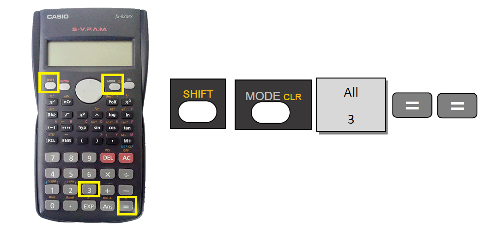
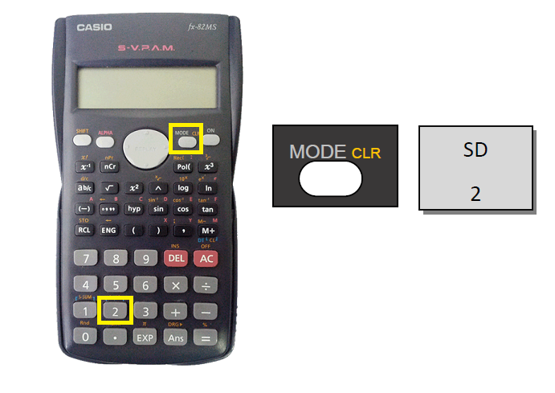
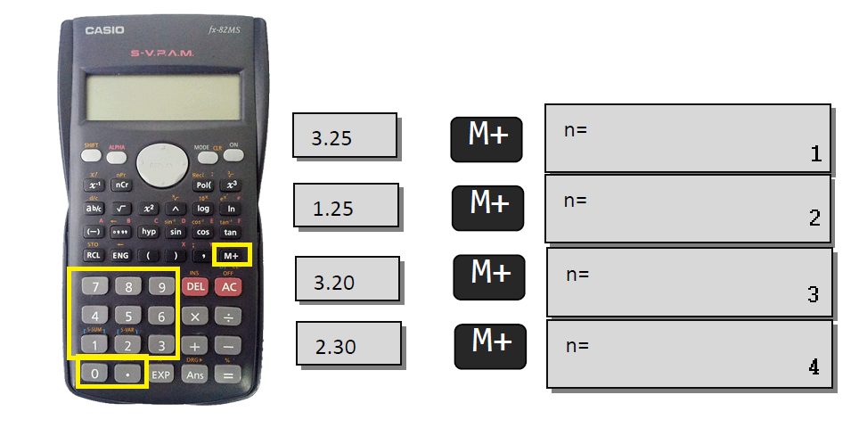
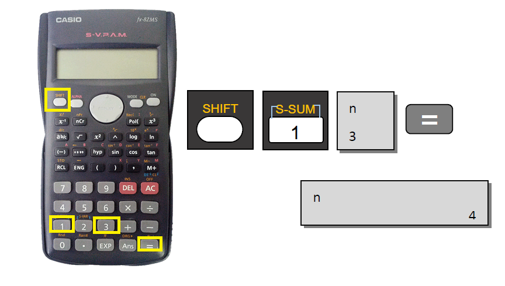
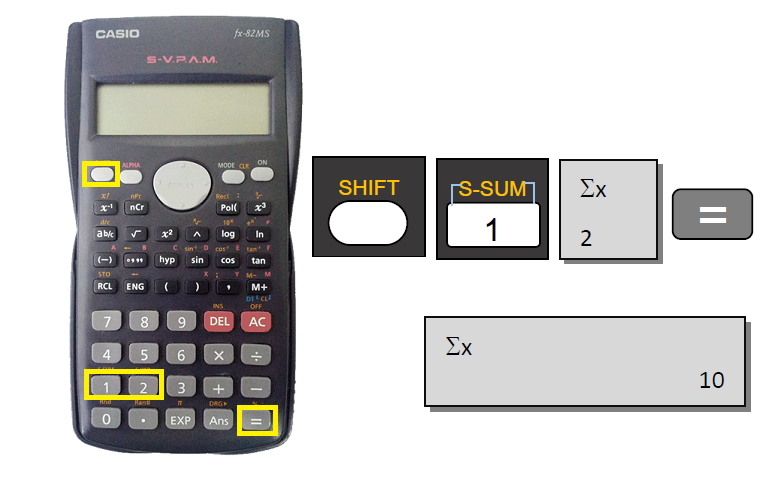
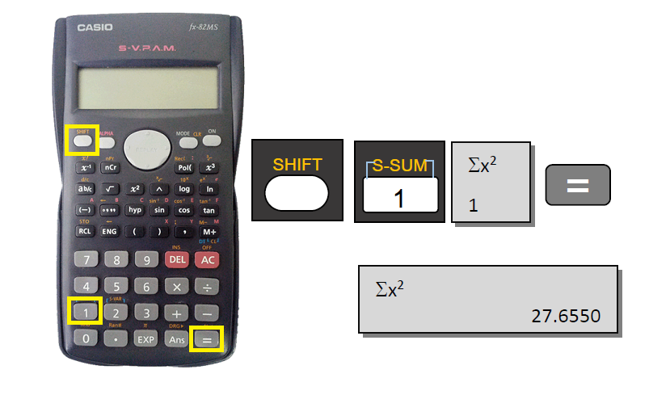
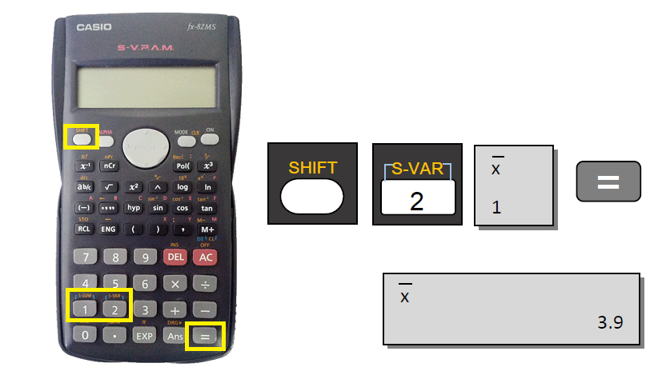
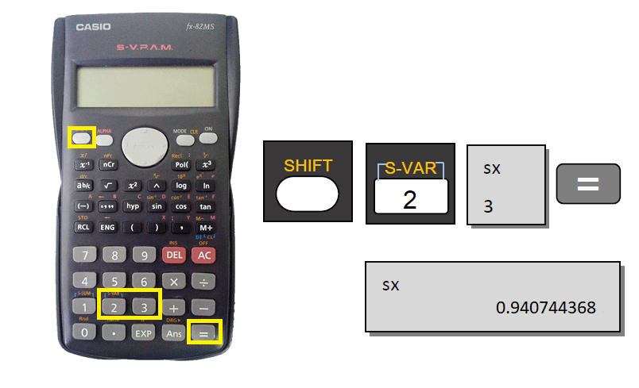

```{r setup, include=FALSE}
options(htmltools.dir.version = FALSE)
knitr::opts_chunk$set(echo = FALSE, fig.align = "center")
```
class: middle, center, inverse

# INTRODUÇÃO

## Modelos Matemáticos 

---

### Modelos Determinísticos: 

Nesse modelo as condições sob as quais um experimento é executado determinam o resultado do experimento. 

**Exemplo**: Segunda Lei de Newton:

$$F = m \cdot a$$

Esse modelo diz que o valor da força $F$ pode ser calculado tão logo os valores da massa do objeto $m$ e sua aceleração $a$ sejam fornecidos. Nesse tipo de modelo, quaisquer desvios que pudessem ocorrer seriam tão pequenos que a descrição acima seria suficiente para modelá-lo. 

**Seu resultado é determinado pelas condições sob as quais o experimento é executado**.

Exemplo de mecânica clássica, astronomia, termodinâmica, circuítos elétricos e química são comuns e abundantes na literatura.

---

```{r,echo=FALSE,message=FALSE,error=FALSE,warning=FALSE}
source("..\\R\\thema_gafico.R")
library(tidyverse)

df<- tibble(
  massa = 0:100,
  aceleracao = 2,
  dados = massa*aceleracao,
  modelo_de = dados
)
df %>% 
  ggplot()+
  geom_point(aes(x=massa,y=dados,fill="Dados"),color="black",size=3)+
  geom_line(aes(x=massa,y=modelo_de,linetype="Modelo"),color="red")+
  xkcdaxis(xrange=c(0,15),yrange=c(0,30)) +
  labs(x="Massa (kg)",y="Forca (N)",title = "Modelo Deterministico",
       fill="",linetype="")+
  annotate(geom = "text",x=3,y=30,label = 'bold("aceleração = 2 m/s²")',
            parse = TRUE) 
```

$$Dados = Modelo$$

---
## Modelos Matemáticos 

Para um grande número de situação na natureza, o modelo matemático determinístico apresentado é suficiente, contudo existem fenômenos que requerem um modelo matemático diferente:


### Modelos Estocásticos (não-determinísticos ou probabilísticos): 

**Nesse modelo admitimos que as condições nas quais o ensaio é executado determinam somente o comportamento probabilístico do resultado observável**. 

**Exemplo:** em fenômenos meteorológicos, não podemos determinar qual será a precipitação em uma determinada região como resultado de uma tempestade. Observações como temperatura, pressão, velocidade do vento e umidade relativa do ar podem fornecer um prognóstico geral da chuva (fraca, média ou forte) entretanto, não tornam possível predizer quanta chuva cairá.


---
```{r,echo=FALSE,message=FALSE,error=FALSE,warning=FALSE}
set.seed(1235)
df<- tibble(
  umidade = 10:100,
  a = 2,
  ruido = rnorm(101-10,0,3),
  dados = umidade*a + ruido,
  modelo_es = umidade*a
)
df %>% 
  ggplot()+
  geom_point(aes(x=umidade,y=dados,fill="Dados"),color="black",size=3)+
  geom_line(aes(x=umidade,y=modelo_es,linetype="Modelo"),color="red")+
  xkcdaxis(xrange=c(10,30),yrange=c(15,60)) +
  labs(x="Umidade relativa (%)",y="Chuva (mm)",title = "Modelo Estocastico (Probabilistico)",
       fill="",linetype="")+
   theme_grafico
```
$$Dados = Modelo + Ruído$$

---

### Outros exemplos de fenômenos estocásticos (probabilísticos)


.pull-left[
- Tempo gasto em "Telas"


- Padrão de Consumo

]

.pull-right[
- Produtividade de uma cultura


- Ganho de peso de bovinos

]

---

#Padrão do emissão de Gases estufa


---


## Importância e Uso da Estatística

> A Estatística é fundamental na análise de dados provenientes de quaisquer processos onde exista variabilidade, estando interessada nos métodos e processos quantitativos que servem para a *coleta, organização, resumo, apresentação e análise desses dados*, bem como na **obtenção de conclusões válidas e na tomada de decisões** a partir de tais análises. Podendo ser dividida em três áreas:

--
##### Estatística Descritiva

Utilizada nas etapas iniciais dos trabalhos, se refere à maneira de **representar dados em tabelas e gráficos**, **resumi-los** por meio de algumas medidas **sem, contudo, tirar conclusões** sobre um grupo maior.

--

##### Probabilidade

Teoria matemática utilizada para se estudar a incerteza oriunda de fenômenos de caráter **aleatório**. 

--

##### Inferência Estatística

Técnicas que possibilitam a extrapolação das informações e conclusões obtidas a partir de subconjuntos de dados, a um grande número de dados. Ou seja, **conclusões aqui serão tomadas**.

---
class: middle, center, inverse

# ESTATÍSTICA DESCRITIVA

---
## Estatística Descritiva

Utilizada nas etapas iniciais dos trabalhos, se refere à maneira de representar dados em tabelas e gráficos, resumi-los por meio de algumas medidas **sem, contudo, tirar conclusões sobre um grupo maior**.

É necessário, portanto, definirmos os nossos termos básicos para podermos nos comunicar durante a disciplina. Assim, serão definidos alguns conceitos.
--

### Dados
--

Considerados o material básico da estatística, são os valores observados de uma característica de interesse de cada amostra, é o registro da característica de interesse. 

---

**Exemplos**

--

- Variação de temperatura no processo de secagem de um alimento.
- Tempo de reabilitação de doentes após determinados tratamentos.
- Número de produtos defeituosos em lotes oriundos de uma linha de montagem.
- Peso e alturas de plantas de uma determinada variedade após aplicação de um trato cultural.


--

Cada número desses constituem os **DADOS** e a característica comum entre eles é a **VARIABILIDADE** ou **VARIAÇÃO**.

---

**Exemplo de um banco de dados**

[Dados](https://arpanosso.github.io/estatinfo/data/dados_turmas.xlsx) $\leftarrow$ Clique para baixar o banco de dados no Excel (**exemplo_dados.xlsx**)

</img>

Onde:  
**id** é a identificação do aluno;   
**sexo**: "M" masculino e "F" feminino;  
**cor_cabelo**: "P" - Preto, "C" - Castanho, "CC" - Castanho Claro, "CE" - Castanho Escuro, "L" - Loiro, "R - Ruivo";  
**GA**: é o grau de alcoolismo: "nao_consome" < "pouco" < "socialmente" < "mais_social";  
**altura**: altura declarada pelo aluno em $m$;  
**idade**: idade do aluno ao cursar a disciplina (Estatística e Bioestatística).
---
**Exemplo de um banco de dados**

[Dados](https://arpanosso.github.io/estatinfo/data/dados_turmas.xlsx) $\leftarrow$ Clique para baixar o banco de dados no R (**exemplo_dados.rds**)

```{r,echo=FALSE,message=FALSE,error=FALSE,warning=FALSE}
dados_turmas<-readxl::read_excel(path = "../data/dados_turmas.xlsx")
readr::write_rds(dados_turmas,"../data/dados_turmas.rds")
```

```{r,echo=TRUE}
# Lendo o Banco de dados
dados_turmas<-readr::read_rds("../data/dados_turmas.rds")

# Mostrando os 7 primeiro registros
head(dados_turmas, n=7)
```

---
### População

**Populações Comuns**: Uma população é um conjunto de pessoas (ou elementos) que possuem uma característica observável comum, geralmente, de interesse de estudo. Conjunto total de objetos que queremos estudar, para os quais uma decisão deve ser tomada.

</img>

---

### População

**Populações Estatísticas**: a população estatística se refere a dados, e não às pessoas (elementos) nessa abordagem, a população é composta de características dos elementos, independente de terem sido medidas ou não.

.pull-left[
- Valores de pressão sanguínea dos indivíduos de uma população.

</img>
]

.pull-right[- Presença ou ausência de doenças na população de cervos do pantanal.

</img>
]

---

### População

**Populações Estatísticas**:

.pull-left[
- Porcentagem de controle de praga por inseto predador em uma parcela experimental.

</img>
]

.pull-right[

- Valores de produção de soja por estados no Brasil.

</img>
]

---

### Amostra

Amostra é qualquer subconjunto da população.

</img>

- Não conseguimos acessar toda uma população para estudar as características de interesse, tomaremos alguns elementos dessa população para formar um grupo a ser estudado.
- Impossibilidade de acesso e implicações éticas.

---
.pull-left[
### Parâmetro: 

É a medida usada para descrever uma característica da população, por exemplo: média populacional $(\mu)$ ou a variância populacional $(\sigma^2)$.]

.pull-right[
### Estatística
É a medida usada para descrever uma característica da amostra, em analogia, média amostral $(\bar{x}\text{ ou } \bar{m} )$ e a variância amostral $(s^2)$.
]

</img>

---

### Variável

As informações obtidas, sejam com base nos elementos que constituem a população, sejam com base nos elementos que constituem a amostra, são denominadas **dados**. 

Assim, definimos que todo dado coletado refere-se a uma característica da população, agora, para nós  determinada **VARIÁVEL**.

</img>

---

### Variável Qualitativa

É aquela que apresenta como possíveis realizações uma qualidade (ou atributo) do indivíduo pesquisado.

**Nominal**: é aquela para a qual **não existe ordenação** alguma das possíveis realizações (característica observados). Em estatística dizemos que os dados são **categóricos**. 

</img>

---
### Variável Qualitativa

**Ordinal**: é aquela para a qual **existe certa ordem** nos possíveis resultados. Apesar de ordenar, não permite a indicação em termos de quanto mais ou menos.

</img>

---
### Variável Quantitativa 

**Discreta**: os possíveis valores formam um conjunto enumerável resultam, frequentemente, de um **processo  contagem** (os valores podem ser finito ou mesmo infinitos). Exemplos: número de filhos, número de células, número de ovos, número de ácaros ou insetos em uma planta.

</img>

---
### Variável Quantitativa 

**Contínua**: os possíveis valores formam um intervalo de números reais e que resultam, normalmente, de um processo de medida (mensuração). Exemplos: peso, altura, produção de leite, pressão arterial, teor de nitrogênio no solo ou na folha.

</img>

---
class: middle, center, inverse

# Ferramental

## Calculadora Científica


---
### Limpeza da Memória da Calculadora



---
### Acesso do modo Estatístico (SD)


---
### Exemplo de entrada de dados

Entrar com os valores $3.25$, $1.25$, $3.20$ e $2.30$



---
### Número total de elementos na memória 

---

### A somatória de todos os elementos $(\sum x)$

---
### A somatória do quadrado de todos os elementos $(\sum x^2)$

---
### Média dos valores da memória $(\bar{x})$

---
### Desvio padrão amostral de todos os elementos $(s)$ ou $\sigma_x$ 

---
#### 1) Utilizando a Calculadora Científica e o R, monte as expressões para resolver as equações:

$$\begin{align*} & a)\; log_5 125 \\
& b)\; 2 \cdot sen(45°) \\
& c)\; \frac{1}{\sqrt{2\pi}} \\
& d)\; \frac{1}{\sqrt{2\pi+1}} \end{align*}$$


#### 2) Dados a amostra da variável $X=\{6,8,7\}$, sendo $\Sigma$ a somatória dos elementos de $X$  e $\bar{x}$ a média (amostral) dos elementos de $X$ e $n$ o número total de elementos dessa amostra, calcule:

$$\begin{align*} 
& a)\;Soma= \sum_{i=1}^n x_i \\
& b)\; \bar{x} = \frac{\sum_{i=1}^n x_i}{n}\\
& c)\; \beta = \frac{(\sum_{i=1}^n x_i)^2}{(n-1)\cdot(n-2) } \end{align*}$$

---
### Resolução no R  
#### Exercício 01
```{r,echo=TRUE}
# 1.a
log(125,5)

# 1.b
2*sin(45*pi/180)

# 1.c
1/(sqrt(2*pi))

# 1.d
1/(sqrt(2*pi+1))
```

---
### Resolução no R

#### Exercício 02

```{r,echo=TRUE}
# Definindo dados X
X = c(6,8,7)

# 2.a
sum(X)

# 2.b
mean(X)

# 2.c
sum(X)^2/((3-1)*(3-2))
```

