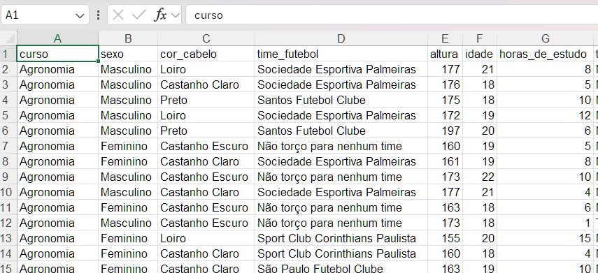
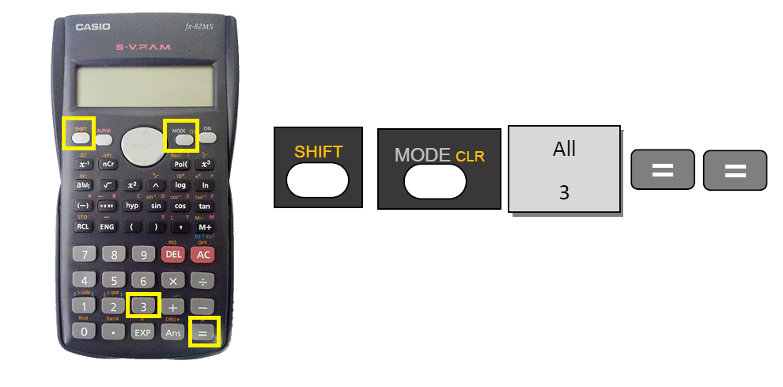
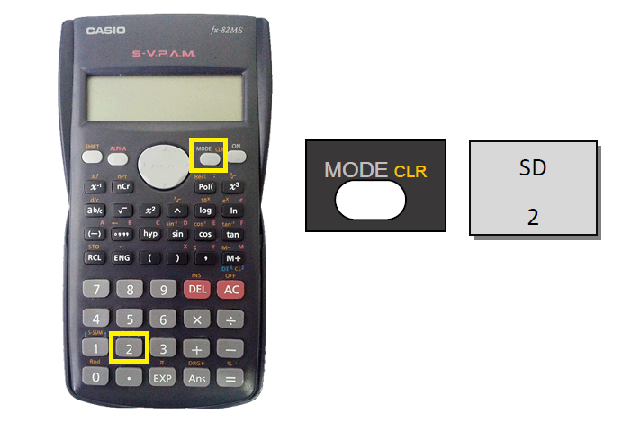
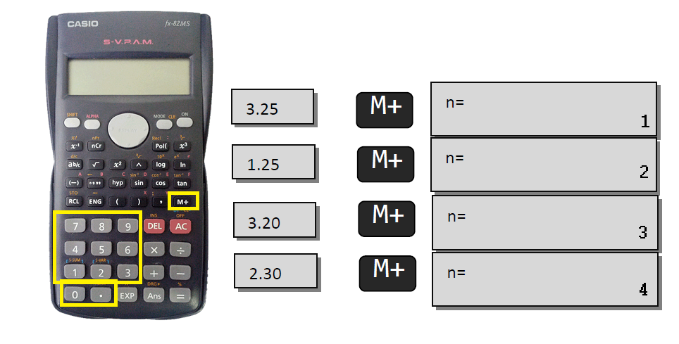
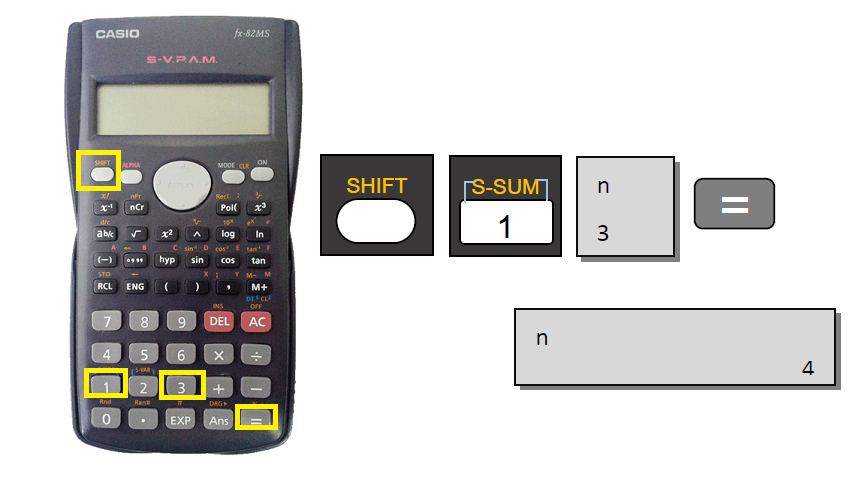
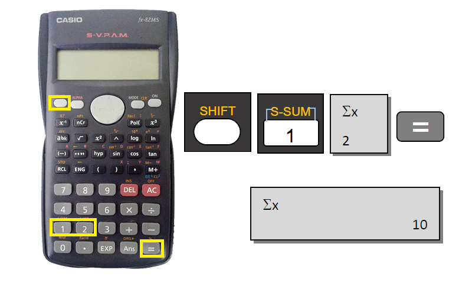
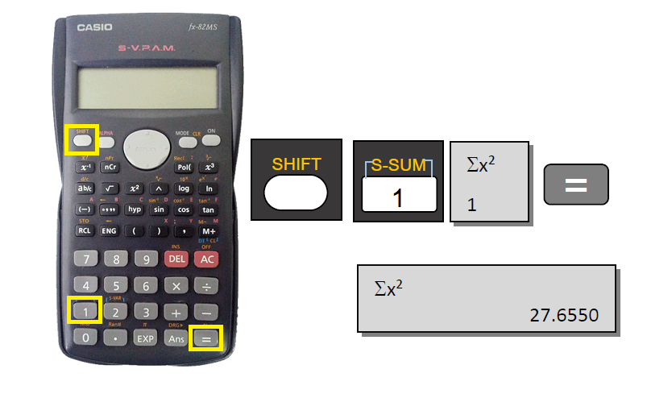
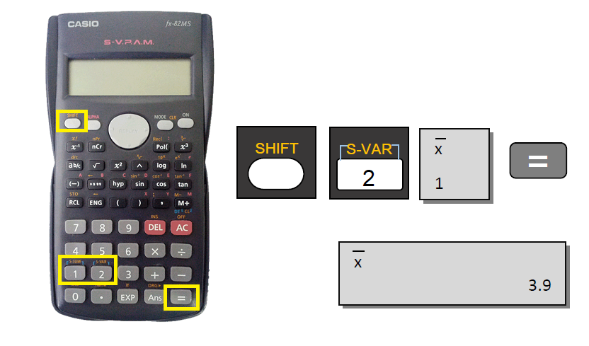
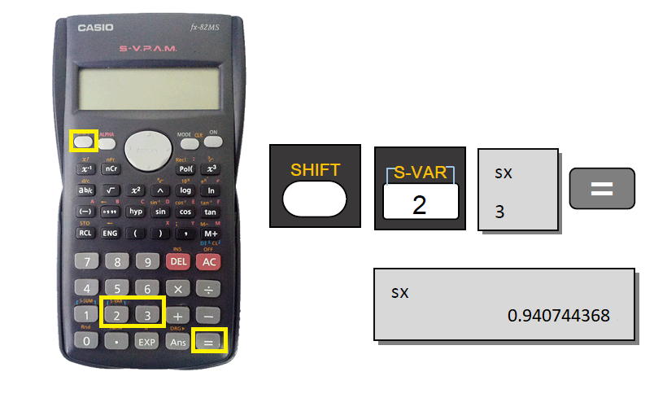

```{r setup, include=FALSE}
options(htmltools.dir.version = FALSE)
knitr::opts_chunk$set(echo = FALSE, 
                      warning = FALSE,
                      error = FALSE, 
                      message = FALSE ,
                      fig.align = "center")
```
class: middle, center, inverse

# INTRODUÇÃO

## Modelos Matemáticos 

---

### Modelos Determinísticos: 

Nesse modelo as condições sob as quais um experimento é executado determinam o resultado do experimento. 

**Exemplo**: Segunda Lei de Newton:

$$F = m \cdot a$$

Esse modelo diz que o valor da força $F$ pode ser calculado tão logo os valores da massa do objeto $m$ e sua aceleração $a$ sejam fornecidos. Nesse tipo de modelo, quaisquer desvios que pudessem ocorrer seriam tão pequenos que a descrição acima seria suficiente para modelá-lo.

**Seu resultado é determinado pelas condições sob as quais o experimento é executado**.

Exemplo de mecânica clássica, astronomia, termodinâmica, circuítos elétricos e química etc.

---

### Exemplos de fenômenos determinísticos

.pull-left[
 


]

.pull-right[


]

---

```{r,echo=FALSE,message=FALSE,error=FALSE,warning=FALSE}
source("..\\R\\thema_gafico.R")
library(tidyverse)

df<- tibble(
  massa = 0:100,
  aceleracao = 2,
  dados = massa*aceleracao,
  modelo_de = dados
)
df %>% 
  ggplot()+
  geom_point(aes(x=massa,y=dados,fill="Dados"),color="black",size=3)+
  geom_line(aes(x=massa,y=modelo_de,linetype="Modelo"),color="red")+
  xkcdaxis(xrange=c(0,15),yrange=c(0,30)) +
  labs(x="Massa (kg)",y="Forca (N)",title = "Modelo Deterministico",
       fill="",linetype="")+
  annotate(geom = "text",x=3,y=30,label = 'bold("aceleração = 2 m/s²")',
            parse = TRUE) 
```

$$Dados = Modelo$$

---

### Modelos Estocásticos (não-determinísticos ou probabilísticos): 

Para um grande número de situações na natureza, o modelo determinístico apresentado é suficiente, contudo existem fenômenos que requerem um modelo matemático diferente, como por exemplo a taxa de crescimento de qualquer população.


**Nesse modelo admitimos que as condições nas quais o ensaio é executado determinam somente o comportamento probabilístico do resultado observável**. 

--

**Exemplo:** em fenômenos meteorológicos, não podemos determinar qual será a precipitação em uma determinada região como resultado de uma chuva. 

.pull-left[


]

.pull-right[
Observações como temperatura, pressão, velocidade do vento e umidade relativa do ar podem fornecer um prognóstico geral da chuva (fraca, média ou forte) entretanto, não tornam possível predizer quanta chuva cairá.
]

---
```{r,echo=FALSE,message=FALSE,error=FALSE,warning=FALSE}
set.seed(1235)
df<- tibble(
  umidade = 10:100,
  a = 2,
  ruido = rnorm(101-10,0,3),
  dados = umidade*a + ruido,
  modelo_es = umidade*a
)
df %>% 
  ggplot()+
  geom_point(aes(x=umidade,y=dados,fill="Dados"),color="black",size=3)+
  geom_line(aes(x=umidade,y=modelo_es,linetype="Modelo"),color="red")+
  xkcdaxis(xrange=c(10,30),yrange=c(15,60)) +
  labs(x="Umidade relativa em T0 (%)",y="Chuva em T1 (mm)",title = "Modelo Estocastico (Probabilistico)",
       fill="",linetype="")+
   theme_grafico
```
$$Dados = Modelo + Ruído$$

---

### Outros exemplos de fenômenos estocásticos (probabilísticos)

.pull-left[
- Tempo gasto em "Telas"


- Padrão de Consumo

]

.pull-right[
- Produtividade de uma cultura


- Ganho de peso de bovinos

]

---

## Padrão do emissão de Gases estufa


---


## Importância da Estatística

Assim, podemos concluir que...

> ...a Estatística é fundamental na análise de dados provenientes de quaisquer processos onde exista variabilidade, estando interessada nos métodos e processos quantitativos que servem para a 

> - *coleta*; 
> - *organização*; 
> - *resumo*; 
> - *apresentação*; 
> - *análise* 

> bem como na **obtenção de conclusões válidas** e na **tomada de decisões** a partir de tais análises.


---

#### Coleta informações

- Entrevista estruturada com produtores rurais sobre uso de fertilizantes.  
- *Medição direta em campo*, como teor de carbono no solo em diferentes áreas.- *Experimento controlado*, comparando produtividade sob diferentes doses de nitrogênio.  
- Uso de *sensores automáticos*, registrando temperatura e umidade a cada hora.  
- Extração de *dados secundários*, como séries históricas do Instituto Brasileiro de Geografia e Estatística (IBGE).  
- **Aplicação de questionário** a alunos para levantar horas de estudo por semana. Ferramenta aplicada na primeira semana de aula.


---

#### Organização

Etapa em que os dados coletados são **estruturados** de forma sistemática, para permitir leitura, conferência e posterior análise. Envolve classificação, codificação, ordenação e tabulação.

Exemplo: na coleta dos dados das turmas, os dados estão dispersos, na ordem em que foram registrados. Organizar significa:

- ordenar as idades em ordem crescente;  
- corrigir ou retirar inconsistências;  
- construir uma tabela de frequências;  
- agrupar em classes (por exemplo para idade: 17–18, 19–20, 21–22 anos);
- codificar variáveis categóricas, (ex.: sexo: 0 = feminino, 1 = masculino).

Após essa etapa, os dados deixam de ser uma lista desestruturada e passam a ter forma adequada para análise. Como exemplo temos [dados-turmas-2026.xlsx](https://raw.githubusercontent.com/arpanosso/estatinfo/refs/heads/master/data/dados-turmas-2026.xlsx)


---

#### Resumo

É a etapa em que os dados organizados são sintetizados por meio de medidas numéricas ou representações simples, reduzindo a informação sem perder o essencial.

**Horas de estudo por semana (variável quantitativa)**

```{r, echo=FALSE}
library(tidyverse)
data_set <- readxl::read_xlsx("../data/dados-turmas-2026.xlsx")

data_set |> 
  reframe(
    Media = round(mean(horas_de_estudo),2),
    Mediana = round(median(horas_de_estudo),2),
    Desvio_padrao = round(sd(horas_de_estudo),2),
    Maximo = max(horas_de_estudo),
    Minimo = min(horas_de_estudo)
  ) |> DT::datatable()

```

Isso permite descrever tendência central e dispersão em poucas medidas.


---

#### Resumo

**Curso dos alunos (variável qualitativa)**

O resumo é feito por frequências:

```{r}
data_set |> 
  group_by(curso) |> 
  summarise(
    Freq_absoluta = n(),
    .groups = "drop"
    ) |> 
  mutate(
    Freq_relativa = round(Freq_absoluta/sum(Freq_absoluta),2),
    Freq_porcent = paste0(round(Freq_relativa*100),"%")
  )|> select(curso, Freq_porcent) |>  DT::datatable()
```


Aqui não faz sentido calcular média; o resumo adequado é por proporções.
---
#### Apresentação 

É a etapa em que os dados já organizados e resumidos são exibidos de forma visual ou tabular, para facilitar a comunicação e a interpretação.

**Horas de estudo por semana (variável quantitativa)**

- Tabela de frequências por classes

```{r}
data_set |> 
  mutate(
    classe_estudo = cut(horas_de_estudo,6)
  ) |> 
  group_by(classe_estudo) |> 
  summarise(
    Freq_absoluta = n(),
    .groups = "drop"
    ) |> 
  mutate(
    Freq_relativa = round(Freq_absoluta/sum(Freq_absoluta),2),
    Freq_porcent = paste0(round(Freq_relativa*100),"%")
  )|> DT::datatable()
```

---
- Histograma, gráfico de distribuição das horas.

```{r}
data_set |> 
  ggplot(aes(x=horas_de_estudo, y=..density..)) +
  geom_histogram(color="black", fill="steelblue")+
  theme_minimal()
```
---

- Boxplot, destacando mediana, quartis e possíveis outliers.

```{r}
data_set |> 
  ggplot(aes(y=horas_de_estudo)) +
  geom_boxplot(color="black", fill="orange")+
  theme_minimal() +
  xlim(-.75,.75)
```


---
**Curso dos alunos (variável qualitativa)**

- Tabela de frequências absolutas e relativas.

```{r}
data_set |> 
  group_by(curso) |> 
  summarise(
    Freq_absoluta = n(),
    .groups = "drop"
    ) |> 
  mutate(
    Freq_relativa = round(Freq_absoluta/sum(Freq_absoluta),2),
    Freq_porcent = paste0(round(Freq_relativa*100),"%")
  ) |>  DT::datatable()
```
---

- Gráfico de barras, comparando ADM e AGRO.


```{r}
data_set |> 
  ggplot2::ggplot(ggplot2::aes(x = forcats::fct_infreq(curso))) +
  ggplot2::geom_bar(fill = "steelblue", color = "black") +
  ggplot2::geom_text(stat = "count", ggplot2::aes(label =  ggplot2::after_stat(count)),
            vjust = -0.5, size = 4) +
  ggplot2::labs(
    x = "Curso",
    y = "Frequencia Absoluta"
  ) +
  ggplot2::theme_minimal() +
  ggplot2::theme(axis.text.x =  ggplot2::element_text(angle = 30, hjust = 1))
```
---

- Gráfico de setores (pizza), mostrando proporções.

```{r}
data_set |> 
  group_by(curso) |> 
  summarise(
    n = n(),
    .groups = "drop"
  ) |> 
  mutate(
    Freq_Relativa = n/sum(n),
    porc     = round(Freq_Relativa,2),
    rotulo   = paste0(curso, "\n", round(porc,2), "%")
  ) |> 
  ggplot(aes(x = "", y = porc, fill = curso)) +
  geom_col(width = 1, color = "white") +
  scale_fill_manual(values = c("orange","lightblue")) +
  coord_polar(theta = "y") +
  geom_text(aes(label = paste0(porc*100, "%")),
            position = position_stack(vjust = 0.5), size = 6.5) +
  labs(
    title = "Proporção de Alunos por Curso",
    fill  = "Curso"
  ) +
  theme_void()
```
---

#### Análise 

Etapa em que se aplicam métodos estatísticos para responder a uma pergunta de interesse, indo além da descrição.

**EXEMPLO**

> **Pergunta**: o tempo médio de estudo é diferente entre os cursos?

Temos:

- Variável quantitativa: horas de estudo por semana.
- Variável qualitativa: sexo.

---

```{r}
data_set |> 
  ggplot(aes(y=horas_de_estudo, x=sexo, fill=sexo)) +
  geom_boxplot(color="black") +
  theme_minimal() +
  theme(
    legend.position = "none"
  )
```

---

#### Hipóteses

$$
\begin{cases}
H_0: \mu_F = \mu_M \\
H_1: \mu_F \neq \mu_M
\end{cases}
$$
A análise permite concluir, com base em evidência estatística (valor-p, intervalo de confiança), se a diferença observada pode ser atribuída ao acaso ou não.

```{r}
he_m = data_set |> filter(sexo=="Masculino") |> pull(horas_de_estudo)
he_f = data_set |> filter(sexo=="Feminino") |> pull(horas_de_estudo)
t.test(he_f, he_m,alternative = "t")
```
Observa-se uma diferença média maior no grupo $F$, com evidência marginal $(p = 0,063)$, sugerindo uma possível tendência de maior tempo de estudo nesse grupo, embora sem significância estatística ao nível de $5\%$.
---

### Análise

O ciclo analítico pode ser ampliado com a inclusão de uma nova variável no **modelo**.

Nesse contexto, além de comparar cursos ou sexos isoladamente, podemos investigar uma questão mais específica:

> **Pergunta**: Existem diferenças nas horas de estudo entre os sexos dentro de cada curso?

Ou seja, a comparação passa a considerar simultaneamente curso e sexo, permitindo avaliar não apenas efeitos principais, mas também a possível interação entre esses fatores.


---
```{r}
data_set |> 
  ggplot(aes(y=horas_de_estudo, x=sexo,fill=sexo)) +
  geom_boxplot(color="black") +
  theme_classic() + 
  facet_wrap(~curso)
```

---
## Estatística

Para compreender esse ciclo, a Estatística é estruturada em três grandes áreas:

**Estatística Descritiva**: envolve organização, resumo e apresentação dos dados.

**Probabilidade**: fornece a base teórica para modelar a incerteza e o comportamento aleatório.

**Inferência Estatística**: utiliza a probabilidade para tirar conclusões sobre a população com base em uma amostra (estimação e testes de hipóteses).

A Descritiva descreve os dados observados; a Probabilidade modela o acaso; a Inferência permite generalizar resultados.

---
class: middle, center, inverse

# ESTATÍSTICA DESCRITIVA

---
## Estatística Descritiva

Utilizada nas etapas iniciais dos trabalhos, se refere à maneira de representar dados em tabelas e gráficos, resumi-los por meio de algumas medidas **sem, contudo, tirar conclusões sobre um grupo maior**.

É necessário, portanto, definirmos os nossos termos básicos para podermos nos comunicar durante a disciplina. Assim, serão definidos alguns conceitos.
--

### Dados
--

Considerados o material básico da estatística, são os valores observados de uma característica de interesse de cada amostra, é o registro da característica de interesse. 

---

**Exemplos**

--

- Variação de temperatura no processo de secagem de um alimento.
- Tempo de reabilitação de doentes após determinados tratamentos.
- Número de produtos defeituosos em lotes oriundos de uma linha de montagem.
- Peso e alturas de plantas de uma determinada variedade após aplicação de um trato cultural.


--

Cada número desses constituem os **DADOS** e a característica comum entre eles é a **VARIABILIDADE** ou **VARIAÇÃO**.

---

**Exemplo de um banco de dados**


---
### População Comum

É o conjunto de pessoas ou elementos que compartilham uma característica observável e que constituem o universo de interesse de um estudo. É o conjunto total de unidades sobre as quais se deseja tomar uma decisão.

Exemplo: todos os moradores de uma cidade; todos os alunos de uma universidade.
</img>

---

**Populações Estatísticas**: É o conjunto de todas as unidades estatísticas (indivíduos, objetos ou eventos) sobre as quais se deseja estudar uma ou mais variáveis. A população estatística não é formada pelos "dados", mas pelos elementos que possuem as características de interesse, mesmo que ainda não tenham sido observados.

.pull-left[
- Valores de pressão sanguínea de indivíduos.

</img>

População: Pessoas de uma cidade.
]

.pull-right[- Presença ou ausência de doenças.

</img>

População: Cervídeos do Pantanal
]

---

### População Estatistica


.pull-left[
- Nível de satisfação de funcionário.

</img>

População: Todos os funcionários da empresa.

]

.pull-right[

- Valores de produção de soja no Brasil.

</img>

População: Todas as propriedades produtoras de soja do estado do MT.
]

---

### Amostra

Amostra é qualquer subconjunto da população.

</img>

- Não conseguimos acessar toda uma população para estudar as características de interesse, tomaremos alguns elementos dessa população para formar um grupo a ser estudado.

- Impossibilidade de acesso e implicações éticas.

---
.pull-left[
### Parâmetro: 

É a medida usada para descrever uma característica da população, por exemplo: média populacional $(\mu)$ ou a variância populacional $(\sigma^2)$.]

.pull-right[
### Estatística
É a medida usada para descrever uma característica da amostra, em analogia, média amostral $(\bar{x}\text{ ou } \hat{m} )$ e a variância amostral $(s^2)$.
]

</img>

---

### Variável

As informações obtidas, sejam com base nos elementos que constituem a população, sejam com base nos elementos que constituem a amostra, são denominadas **dados**. 

Assim, definimos que todo dado coletado refere-se a uma característica da população, agora, para nós  determinada **VARIÁVEL**.

</img>

---

### Variável Qualitativa

É aquela que apresenta como possíveis realizações uma qualidade (ou atributo) do indivíduo pesquisado.

**Nominal**: é aquela para a qual **não existe ordenação** alguma das possíveis realizações (característica observados). Em estatística dizemos que os dados são **categóricos**. 

</img>

---

**Ordinal**: é aquela para a qual **existe certa ordem** nos possíveis resultados. Apesar de ordenar, não permite a indicação em termos de quanto mais ou menos.

</img>

---
### Variável Quantitativa 

**Discreta**: os possíveis valores formam um conjunto enumerável resultam, frequentemente, de um **processo  contagem** (os valores podem ser finito ou mesmo infinitos). Exemplos: número de filhos, número de células, número de ovos, número de ácaros ou insetos em uma planta.

</img>

---

### Variável Quantitativa 

**Contínua**: os possíveis valores formam um intervalo de números reais e que resultam, normalmente, de um processo de medida (mensuração). Exemplos: peso, altura, produção de leite, pressão arterial, teor de nitrogênio no solo, desconto em folha de pagamento, valor de aluguel.

</img>

---
class: middle, center, inverse

# Ferramental

## Calculadora Científica

---
### Limpeza da Memória da Calculadora



---
### Acesso do modo Estatístico (SD)


---
### Exemplo de entrada de dados

Entrar com os valores $3.25$, $1.25$, $3.20$ e $2.30$



---
### Número total de elementos na memória 

---

### A somatória de todos os elementos $(\sum x)$

---
### A somatória do quadrado de todos os elementos $(\sum x^2)$

---
### Média dos valores da memória $(\bar{x})$

---
### Desvio padrão amostral de todos os elementos $(s)$ ou $\sigma_x$ 

---
#### 1) Utilizando a Calculadora resolver as expressões:

$$\begin{align*} & a)\; log_5 125 \\
& b)\; 2 \cdot sen(45°) \\
& c)\; \frac{1}{\sqrt{2\pi}} \\
& d)\; \frac{1}{\sqrt{2\pi+1}} \end{align*}$$

---

#### 2) Dados a amostra da variável $X=\{6,8,7\}$, sendo $\Sigma$ a somatória dos elementos de $X$  e $\bar{x}$ a média (amostral) dos elementos de $X$ e $n$ o número total de elementos dessa amostra, calcule:

$$\begin{align*} 
& a)\;Soma= \sum_{i=1}^n x_i \\
& b)\; \bar{x} = \frac{\sum_{i=1}^n x_i}{n}\\
& c)\; \beta = \frac{(\sum_{i=1}^n x_i)^2}{(n-1)\cdot(n-2) } \end{align*}$$

---
### Resolução no R  
#### Exercício 01
```{r,echo=TRUE}
# 1.a
log(125,5)

# 1.b
2*sin(45*pi/180)

# 1.c
1/(sqrt(2*pi))

# 1.d
1/(sqrt(2*pi+1))
```

---
### Resolução no R

#### Exercício 02

```{r,echo=TRUE}
# Definindo dados X
X = c(6,8,7)

# 2.a
sum(X)

# 2.b
mean(X)

# 2.c
sum(X)^2/((3-1)*(3-2))
```

