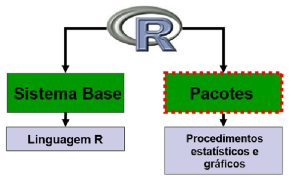
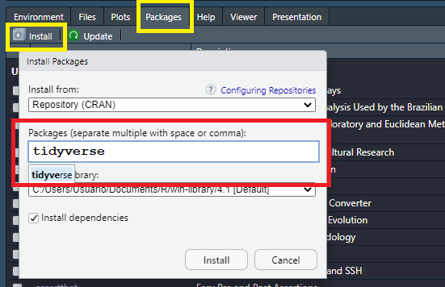

```{r setup, include=FALSE}
options(htmltools.dir.version = FALSE)
knitr::opts_chunk$set(echo=TRUE, message = FALSE, warning = FALSE, comment = "#>", fig.align = "center")
options(dplyr.print_min = 5, dplyr.print_max = 5)
```
class: middle, center, inverse

## Distribuição de frequência de uma variável


```{r, echo=FALSE}
library(tidyverse)
idade <- rnorm(1000,22,3.5)
as_tibble(idade) %>% 
  ggplot(aes(x=idade,y=..density..)) + 
  geom_histogram(bins = 10, color="black",
                 fill="gray") +
  theme_bw() +
  labs(x="Idade (anos)", y="Densidade")

```

---
## Distribuição de frequência de uma variável

Quando analisamos uma variável aleatória (qualitativa ou quantitativa), deve-se conhecer a distribuição de frequência dessa variável por meio de suas possíveis realizações (observações). 

Nesse sentido, o objetivo dessa aula será apresentar as principais formas e visualização gráfica de variáveis quali e quantitativas. 

**Exemplo:** Considerando os [dados_turmas.xlsx](https://arpanosso.github.io/estatinfo/data/dados_turmas.xlsx) amostrados das turmas de Estatísticas temos:

</img>


---
**Tamanho da População $(N)$**

O tamanho da população $N$ é o número total dos elementos alvos da pesquisa. Muitas vezes não conhecemos esse valor. 

Em nosso exemplo, poderíamos entender como $N$ o número de todos os alunos da Unesp que estão no segundo ano de sua graduação.

**Tamanho da amostra $(n)$**

É o número total de registros de sua base de dados, ou seja o número total de elementos amostrados da população. 

O comando `glimpse` permite que veriquemos o tamanho do banco de dados em linhas (Rows - $n$) e colunas (Columns - variáveis).

Onde `chr`  representa variáveis do tipo **strings**, ou seja textos e `dbl` representa variáveis numéricas.


---

```{r, echo=FALSE, out.width="10%", fig.align='left'}
knitr::include_graphics("img/R_logo.png")
```


```{r}
library(tidyverse) 
dados_turmas <- readxl::read_xlsx("../data/dados_turmas.xlsx")
glimpse(dados_turmas) 
```


---
### Exemplo da base de dados das turmas 

Construir uma tabela de frequências para a variável `sexo` contendo as frequências absolutas $(n_i)$, as frequências relativas $(f_i)$ e a porcentagem $(perc)$ para as categoria existentes. 

Após isso, realizar a visualização de dados com gráficos de Colunas, Barras e Setores (Pizza ou *Pie*).


---
### Frequência Absoluta $(n_i)$

É definida como o número de observações no conjunto de dados pertencentes à uma categoria ou classe da variável em estudo.

Então, consideramos $1$ para $F$ e $2$ para $M$, temos:

$n_1 = 15$

$n_2 = 29$


---
Assim temos a primeira regra da análise de nossa base de dados, a soma da frequência absoluta das classes $(k)$ da variável cetegória é igual a $n$. 

$$
\sum \limits_{i=1}^{k}{n_i} = n
$$

Onde $k$ é o número de categorias da variável em questão, no caso do `sexo`, temos duas categorias (M e F).

$$
\sum \limits_{i=1}^{k}{n_i} = n_1+n_2=15+29=44
$$

---

**Frequência Relativa $(f_i)$**

É definida como a proporção de cada categoria em relação ao **Total de observações** $(n)$, ou seja:

$$
f_i = \frac{n_i}{n}
$$

Portanto temos que, 

$$
f_1 = \frac{15}{44}=0,3409
$$ 

e   

$$
f_2 = \frac{29}{55}=0,6591
$$
---
Assim, temos que a soma das frequências relativas sempre será igual a $1$: 

$$
\sum \limits_{i=1}^{k} f_i=f_1+f_2 = 0,3409+0,6591 = 1
$$

onde $k$ é o número de categorias da variável `sexo`, ou seja, $2$, nesse caso.

---

**Porcentagem de frequência $(perc \text{ ou %})$**

Definida como o resultado da multiplicação da frequência relativa (proporção) por $100$.


$$perc_1 = f_1 \times 100 = 0,3409 \times 100 = 34,09\% \\
perc_2 = f_2 \times 100 = 0,6591 \times 100 = 65,91\%$$

---

Para essa tarefa, vamos utilizar o R. Precisaremos, então, fazer algumas operações nos dados das turmas e vamos usar o operador `PIPE` (`%>%`), cujo atalho é `CTRL + SHIFT + M`. 

Vamos utilizar a função `n()` para contar cada ocorrência das diferentes categorias da variável  `sexo`.

- `group_by()` agrupa as categorias da variável `sexo`.
- `summarise()` cria o resumo dos dados, ou seja, contará o valor de cada categoria usando a função `n()` e salvará na coluna `ni`.
- `mutate()` é a função utilizada para calcular $f_i$ e suas respectivas procentagens $prec_i$ a partir da coluna $_i$.

```{r}
dados_turmas %>%
  group_by(sexo) %>% 
  summarise(ni=n()) %>% # frequência Absoluta
  mutate(fi = ni/sum(ni),# frequência Relativa
         perc = fi*100) # porcentage m de frequência
```

---

A partir da tabela de frequência, poderemos criar representações gráficas que nos auxiliarão na apresentação e interpretação do comportamento dos dados.

Essa etapa é a denominada de **Visualização de Dados**. 

---
class: middle, center, inverse

# VISUALIZAÇÃO DE DADOS
## (Variáveis Qualitativas)

---
## Visualização dos dados

Os tipos de gráficos podem variar de acordo com o tipo de variável, geralmente, para as variáveis qualitativas utilizamos os gráficos de `Barras`, `Colunas` ou de `Setores (Pizza ou Pie)`. 

Para isso, vamos utilizar a funções do pacote `ggplot2` que é carregado junto com o pacote `tidyverse`. 

O ggplot funciona na forma de camadas represetações gráficas e de formatações, que são adicionadas de acordo com a necessidade do usuário por meio do operador de adição `+` digitado ao final da cada linha.

---

**Gráfico de Colunas para Sexo**

Deve ser utilizado para variáveis categóricas (qualitativas ordinais ou nominais).

```{r, plot1, eval=FALSE}
dados_turmas %>%
  group_by(sexo) %>% 
  summarise(ni=n()) %>% 
  mutate(fi = ni/sum(ni),
         perc = fi*100) %>% 
  ggplot(aes(x=sexo, y=fi)) + 
  geom_col()
```

---

### Gráfico de Colunas para Sexo

```{r, plot1, echo = FALSE}
```

---

### Gráfico de Barras para Sexo

Semelhante ao gráfico de colunas, contudo, com as barras na horizontal, facilita a leitura do nome das categorias.

```{r, plot2, eval=FALSE}
dados_turmas %>%
  group_by(sexo) %>% 
  summarise(ni=n()) %>% 
  mutate(fi = ni/sum(ni),
         perc = fi*100) %>% 
  ggplot(aes(x=fi,y=sexo)) + 
  geom_col(fill="aquamarine4",
           color="black") 
```
- o argumento `fill = "aquamarine4"` permite que possamos alterar a cor do preenchimeto (*fill*) da barra e o argumento `color="black"` permite a alteração da cor o contorno das barras. 

---

```{r, plot2, echo = FALSE}
```

Outras cores são possíveis tente algumas [das cores no R](http://www.stat.columbia.edu/~tzheng/files/Rcolor.pdf).

---

### Gráfico de Setores para Sexo

Também conhecido como gráfico de Pizza (ou torta em inglês - *pie*), ele representa cada valor de frequência relativa das diferentes categorias da variável em uma circunferência.

- A função `geom_bar()` associada à `coord_polar()` permite a transformação do gráfico de barras no gráfico de pizza.

- A função `theme_void()` retira elementos como linhas e nomes e números da representação gráfica.

```{r, plot3, eval=FALSE}
dados_turmas %>%
  group_by(sexo) %>% 
  summarise(ni=n()) %>% 
  mutate(fi = ni/sum(ni),
         perc = fi*100) %>% 
  ggplot(aes(x="",y=fi, fill=sexo)) + 
  geom_bar(stat="identity") +
  coord_polar("y", start=0) + 
  theme_void() 
```

---

```{r, plot3, echo = FALSE}
```

---
#### Vamos Adicionar os valores de $fi$ no gráfico

```{r, plot3_1, eval=FALSE}
dados_turmas %>%
  group_by(sexo) %>% 
  summarise(ni=n()) %>% 
  mutate(fi = ni/sum(ni),
         perc = fi*100) %>%
  ggplot(aes(x="",y=fi, fill=sexo)) +
  geom_bar(stat="identity") +
  coord_polar("y", start=0) +
  theme_void() +
  geom_text(
    aes(
      label=paste0(round(perc), "%")), #<<
      position=position_stack(vjust = 0.5)) #<<
```

---

```{r, plot3_1, echo = FALSE}
```

---

### Treemap

É uma técnica de visualização de dados que exibe hierarquias utilizando retângulos aninhados. 

Cada retângulo representa uma hierarquia de dados e é subdividido em retângulos menores que representam subcategorias.

Treemaps pode responder perguntas sobre os dados como: "Quais são as proporções de categorias para o total?"

---

```{r, plot3_5, eval=FALSE}
library(treemapify)
dados_turmas %>%
  group_by(sexo) %>% 
  summarise(ni=n()) %>% 
  mutate(fi = ni/sum(ni),
         perc = fi*100) %>%
  ggplot(aes(area = perc, fill = sexo)) +
  geom_treemap() +
  geom_treemap_text(
    aes(label = paste(sexo, 
                      paste0(round(perc, 2), "%"), sep = "\n")), 
    colour = "black") +
  theme(legend.position = "none") 
```

---
```{r, plot3_5, echo = FALSE}
```
---
## Tabela de Frequência para a variável Cor de cabelo


Vamos, mais uma vez, utilizar o R para conseguirmos as tabelas e a representação gráfica. 

```{r, eval=TRUE}
dados_turmas %>%
  group_by(cor_cabelo) %>% #<< 
  summarise(ni=n()) %>%      
  mutate(fi = ni/sum(ni),    
         perc = fi*100)      
```

---

### Gráfico de Colunas para Cor de cabelo

```{r, plot4, eval=FALSE}
dados_turmas %>%
  group_by(cor_cabelo) %>% #<< 
  summarise(ni=n()) %>%      
  mutate(fi = ni/sum(ni),    
         perc = fi*100) %>% 
  ggplot(aes(x=cor_cabelo,y=fi,
             fill=cor_cabelo)) + #<<
  geom_col(color="black")+
  theme_bw() #<<
```

- ao passarmos o argumento `fill=cor_cabelo` dentro da função `aes()` estamos pedindo o mapeamento das cores de cabelo a partir de cores de preeenchimento diferentes.

- `aes()` representa a estética do gráfico, ou seja, quem é x, quem é y e quem deve ser mapeado.

- a função `theme_bw()` muda o padrão de cores e de linhas do gráfico. Existem outros padrões como `theme_classic`, `theme_minimal` entre outros.

---

```{r, plot4, echo = FALSE}
```

---

### Gráfico de Barras para Cor de cabelo

```{r, plot5, eval=FALSE}
dados_turmas %>%
  group_by(cor_cabelo) %>% #<< 
  summarise(ni=n()) %>%      
  mutate(fi = ni/sum(ni),    
         perc = fi*100) %>% 
  ggplot(aes(x=fi, y=cor_cabelo,
             fill=cor_cabelo)) + 
  geom_col(color="black")+
  scale_fill_manual(values = c("salmon4",
                               "burlywood4",
                               "orange4",
                               "black"))+
  theme_minimal()
```
- utilize a função `scale_fill_manual()` para alterar as cores dos preenchimentos, se necessário.

---
```{r, plot5, echo = FALSE}
```
---
### Gráfico de Setores para cor_cabelo

```{r, plot6, eval=FALSE}
dados_turmas %>%
  group_by(cor_cabelo) %>% #<< 
  summarise(ni=n()) %>%      
  mutate(fi = ni/sum(ni),    
         perc = fi*100) %>% 
  ggplot(aes(x="", y=fi, 
             fill=cor_cabelo)) + 
  geom_bar(stat="identity",color="black") +
  coord_polar("y", start=0) +
  theme_void()
```

---

```{r, plot6, echo = FALSE}
```

---

#### Vamos Adicionar os valores de $perc$ no gráfico

```{r, plot6_1, eval=FALSE}
dados_turmas %>%
  group_by(cor_cabelo) %>% #<< 
  summarise(ni=n()) %>%      
  mutate(fi = ni/sum(ni),    
         perc = fi*100) %>%
  ggplot(aes(x="",y=fi, fill=cor_cabelo)) +
  geom_bar(stat="identity") +
  coord_polar("y", start=0) +
  theme_void() +
  geom_text(
    aes(
      label=paste0(round(perc), "%")), #<<
      position=position_stack(vjust = 0.5)) #<<
```

---

```{r, plot6_1, echo = FALSE}
```


---
#### Treemap para cor dos cabelos

```{r, plot6_5, eval=FALSE}
library(treemapify)
dados_turmas %>%
  group_by(cor_cabelo) %>% 
  summarise(ni=n()) %>% 
  mutate(fi = ni/sum(ni),
         perc = fi*100) %>%
  arrange(ni) %>% 
  ggplot(aes(area = perc, fill = cor_cabelo)) +
  geom_treemap() +
  geom_treemap_text(
    aes(label = paste(cor_cabelo, 
                      paste0(round(perc, 2), "%"), sep = "\n")), 
    colour = "black") +
  theme(legend.position = "none") +
  scale_fill_manual(values = c("salmon4",
                               "burlywood4",
                               "orange4",
                               "darkgray"))
```

---
class: middle, center, inverse

# VISUALIZAÇÃO DE DADOS
## (Variáveis Quantitativas)

---
## Tabela de frequência e visualização para Idade em anos (discreta)

Quando a variável  for quantitativa discreta, os mesmos gráficos de variáveis qualitativas podem ser utilizados. Porém, também recomendamos a utilização dos gráficos `boxplot`, `histograma` e `Função distribuição acumulada`.

Pra a variável `idade_anos` vamos criar a tabela de frequência;

```{r, echo = TRUE, eval=FALSE}
dados_turmas %>%
  group_by(idade_anos) %>% 
  summarise(ni=n()) %>%      
  mutate(fi = ni/sum(ni),    
         perc = fi*100)    
```


---

```{r,echo=FALSE}
tab<-dados_turmas %>%
        group_by(idade_anos) %>% 
        summarise(ni=n()) %>%      
        mutate(fi = ni/sum(ni),    
             perc = fi*100)  
kableExtra::kable(tab)
```

---

## Tabela de frequência para variável Altura (Quantitativa Contínua)

Quando a variável quantitativa for contínua, recomenda-se a utilização dos gráficos `histograma`  e `Função de distribuição acumulada`. 

Devemos, inicialmente construir a tabela de frequência da variável `altura`. Porém, os valores de uma variável contínua não se repetem, mesmo que isso aparentemente ocorra na base de dados. 

Em teoria suas realizações podem assumir qualquer valor dentro da reta dos números reais, portanto, ao mensurar uma variável contínua, obtém-se apenas uma aproximação de seu verdadeiro valor dada pelo instrumento de medida.

---

Para exemplificar, vamos criar $5$ classes de alturas a partir da função `cut()`.

```{r, echo = TRUE, eval=FALSE}
dados_turmas %>%
  mutate(
    classes_altura = cut(altura,5) #<<
  ) %>% 
  group_by(classes_altura) %>% 
  summarise(ni=n()) %>%      
  mutate(fi = ni/sum(ni),    
         perc = fi*100)    

```

```{r,echo=FALSE}
tab <- dados_turmas %>%
  mutate(
    classes_altura = cut(altura,5) 
    ) %>% 
  group_by(classes_altura) %>% 
  summarise(ni=n()) %>%      
  mutate(fi = ni/sum(ni),    
         perc = fi*100)  
kableExtra::kable(tab)
```

---

### Amplitude Total

Para melhor entendermos como a função `cut()` funciona, será necessário conhecermos mais algumas medidas para a construção do histograma. Vamos iniciar com a Amplitude total $(\Delta)$, definida como a diferença entre o valor máximo menos o valor mínimo da variável.

$$\Delta = Máximo - Mínimo$$

Para os dados de altura temos, $\Delta = 1,91\;m-1,50\;m = 0,41 \;m$

No R podemos calcular a amplitude total com as funções do pacote `base`, para isso devemos, primeiramente, extrair de `dados_turmas` a variável (coluna) `altura` por meio do operador de acesso de listas `$`.

```{r,eval=TRUE}
altura <- dados_turmas %>% 
  pull(altura)
```

Agora vamos encontrar o máximo e o mínimo e calcular a diferença.

```{r,eval=TRUE}
D <- max(altura) - min(altura)
D
```

---
### Número de intervalos de classes $(k)$ 

Definiremos $k$ como sendo o número de **sub-intervalos** da Amplitude Total. Uma boa representação apresenta um $k$ **NUNCA** inferior a $5$ ou superior a $15$, pois com um pequeno número de classes, perde-se informação, e com um grande número de classes, o objetivo de resumir os dados fica prejudicado.


```{r, eval=TRUE}
k <- 5
```


### Amplitude de classe $(\Delta_i)$

É o tamanho de cada um dos $k=5$ sub-intervalos, dado pela amplitude total dividida pelo número de intervalos.

$$\Delta_i = \frac{\Delta}{k}$$
Para os dados de altura:

$\Delta_i = \frac{\Delta}{k} = \frac{0.41\;m}{5} = 0,082 \;m$

---
Assim, temos

```{r,eval=TRUE}
Di = D/k
Di
```
Cada um dos $5$ intervalos terá uma amplitude de $0,086$ m. Ou seja, o cálculo dos  limites das classes é feito a partir da adição ao valor Mínimo o valor de $\Delta_i$ $k$ vezes:

```{r}
limites <- min(altura)+ 0:k * Di
limites
```
---

Obervem que foi essa a metodologia utilizada pela função `cut()` para calcular os limites de classes, e essa é a metodologia clássica para lidar com dados contínuos e os agrupar em classes.

```{r,echo=FALSE}
kableExtra::kable(tab)
limites
```


---
## Gráfico histograma (frequências absolutas)

A partir da tabela anterior, pode-se construir o gráfico de frequência de cada classe de valor de altura, denominado **Histograma**. 

```{r,plot10,eval=FALSE}
dados_turmas %>% 
  ggplot(aes(x=altura,y=..count..))+ #<<
  geom_histogram(breaks = limites,
                 color="black",
                 fill="gray")
```
O código acima gera um histograma com $5$ barras onde o eixo `y` será a frequência absoluta, ou seja, a contagem (`..count..`) de quantos valores de altura estão dentro de uma determinada classe.

A opção `breaks = limites` deixa o histograma igual ao observado na tabela anterior.

---

## Histograma da altura (m)

```{r,plot10,echo=FALSE}
```

---

## Gráfico histograma (frequências relativas)

Ao longo de nosso curso, vamos estudar que a frequência relativa $f_i$ é uma estimativa empírica da probabilidade $P(X=x_i)$, assim é interessante que a área total da figura do histograma seja igual a $1$, correspondendo à soma total das frequências relativas $( f_i )$. 

Então, para construção do histograma, sugere-se usar no eixo das ordenadas os valores de $fi / \Delta_i$ (denominado densidade de frequência), ou seja, da medida que indica qual a concentração por unidade da variável.

```{r,plot11,eval=FALSE}
dados_turmas %>% 
  ggplot(aes(x=altura,y=..density..))+ #<<
  geom_histogram(breaks = limites,
                 color="black",
                 fill="gray")
```

Para isso utilizamos `y=..density..`.

---


```{r,plot11,echo=FALSE}
```

---

## Densidade de frequência $(d_i)$

Agora vamos atualizar a tabela com o valor de densidade de frequência, dado por:

$$d_i=\frac{f_i}{\Delta_i}$$

```{r, echo = TRUE, eval=FALSE}
dados_turmas %>%
  mutate(
    classes_altura = cut(altura,5)
    ) %>% 
  group_by(classes_altura) %>% 
  summarise(ni=n()) %>%      
  mutate(fi = ni/sum(ni),    
         perc = fi*100,
         di=fi/Di) #<<
```

---

```{r,echo=FALSE}
tab <- dados_turmas %>%
  mutate(
    classes_altura = cut(altura,5) 
    ) %>% 
  group_by(classes_altura) %>% 
  summarise(ni=n()) %>%      
  mutate(fi = ni/sum(ni),    
         perc = fi*100,
         di=fi/Di)  
kableExtra::kable(tab)
```

---

## Medidas  Acumuladas

As medidas acumuladas são interessantes para compor algumas vizualizações:

$N_i$: Frequência Absoluta Acumulada.

$F_i$: Frequência Relativa Acumulada.

$Perc$: Porcentagem de Frequência Acumulada.

```{r, echo = TRUE, eval=FALSE}
dados_turmas %>%
  mutate(
    classes_altura = cut(altura,5)
    ) %>% 
  group_by(classes_altura) %>% 
  summarise(ni=n()) %>%      
  mutate(fi = ni/sum(ni),    
         perc = fi*100,
         di=fi/Di,
         Ni = cumsum(ni), #<<
         Fi = cumsum(fi), #<<
         Perc = cumsum(perc)) #<<
```

---

# Tabela de Frequência para Altura

```{r,echo=FALSE}
tab <- dados_turmas %>%
  mutate(
    classes_altura = cut(altura,5) 
    ) %>% 
  group_by(classes_altura) %>% 
  summarise(ni=n()) %>%      
  mutate(fi = ni/sum(ni),    
         perc = fi*100,
         di=fi/Di,
         Ni = cumsum(ni),
         Fi = cumsum(fi),
         Perc = cumsum(perc)
  )
kableExtra::kable(tab)
```

---

## Histograma e Polígono de Frequência

Obtemos o polígono de frequências unindo por uma poligonal (segmentos de retas) os pontos correspondentes às frequências, das classes, centradas nos pontos médios de cada classe. 

Para se obter as interseções do polígono com o eixo horizontal, cria-se em cada extremo do histograma uma classe com frequência nula.

No R:

```{r,plot12,eval=FALSE}
dados_turmas %>% 
  ggplot(aes(x=altura, y=..count..))+ #<<
  geom_histogram(breaks = limites,
                 color="black",
                 fill="gray") +
  geom_freqpoly(breaks=limites,color="red") #<<
```

---

```{r,plot12,echo=FALSE}
```


---

## Histograma e Estimativas de densidade suavizadas


Calcula e desenha a estimativa da densidade, que é uma versão suavizada do histograma. Esta é uma alternativa útil para dados contínuos que vêm de uma distribuição suave subjacente. 

```{r,plot12_1,eval=FALSE}
dados_turmas %>% 
  ggplot(aes(x=altura,y=..density..))+ #<<
  geom_histogram(breaks = limites,
                 color="black",
                 fill="white") +
  geom_density(color="red",
               fill="green",
               alpha=0.05) #<<
```

- Observe que o histograma foi construído com as frequências absolutas $(n_i)$, ou seja, `y=..density..`. Utilizamos a função `geom_density()`.  
- O argumento `alpha=0.05` controla a transparência do preenchimento. 

---

```{r,plot12_1,echo=FALSE}
```


---

## Função de Distribuição Acumulada


A função de distribuição acumulada descreve como probabilidades são associadas aos valores ou aos intervalos de valores de uma variável aleatória. Em outras palavras, ela representa a probabilidade de uma variável aleatória ser menor ou igual a um valor real qualquer $x$. 

$$
F(x) = P(X \leq x) \in [0,1].
$$

Para uma variável aleatória contínua (`altura`):

$\int \limits_{- \infty }^x f(x_i) dx$

```{r,plot13,eval=FALSE}
dados_turmas %>% 
  ggplot(aes(x=altura))+ 
  stat_ecdf(geom = "line",color="red")#<<
```

---

```{r,plot13,echo=FALSE}
```

---

## Função de Distribuição Acumulada

No caso da variável aleatória discreta (`idade_anos`):

$F(x) = \sum \limits_{x_i<x} f(x_i)$

```{r,plot14,eval=FALSE}
dados_turmas %>% 
  ggplot(aes(x=idade_anos))+ #<<
  stat_ecdf(geom = "line",color="red")
```

---
```{r,plot14,echo=FALSE}
```

---
class: middle, center, inverse

## Prática para Casa: Instalação de Pacotes no R


[Link do Video](https://drive.google.com/drive/u/0/folders/1O-sGhicXs6unUY_y1JW8yKSHm76VVMCX)

---
**Pacote em R**

Um pacote é uma coleção de funções, exemplos e documentação. A funcionalidade de um pacote é frequentemente focada em uma metodologia estatística especial" (**Everitt & Hothorn**).




Pacotes no R são coleções de funções, exemplos e documentações, que devem ser previamente instalados e alocados no ambiente pela função `library`.

---
## Pacotes básicos

Liste os pacotes carregados no ambiente com:

```{r}
(.packages())
```

O retorno da função é uma lista de nomes, `caracteres` (ou `strings`), na forma de um *objeto* denominado **vetor**. Observe que cada pacote (elemento) é referenciado dentro do vetor por um índice, um número inteiro $[\;i\;]$ apresentado entre colchetes **[i]**.

Carregue um pacote chamando a função `library`.

```{r,message=FALSE}
library(MASS)
```


---

Agora, liste novamente os pacotes e observe a diferença no retorno da função.

```{r}
(.packages())
```

Observe que o pacote `MASS` agora está no ambiente de trabalho. 


---

### Instalando pacotes

Para a realização de procedimentos estatístico e manipulação de arquivos durante o curso, serão necessários vários pacotes que não fazem parte do `base` do R, que deverão ser instalados.

**Utilizando a opção** `Packages\Install\nome do pacote`

```{r echo=FALSE, fig.cap="",fig.align='center',out.width = "450px"}

```


Instale os pacotes:  
 
 * `tidyverse`   
 * `agricolae`  

---
Os pacotes também podem ser instalados a partir das linhas de comandos:

```{r,eval=FALSE}
install.packages("tidyverse")
install.packages("agricolae")
```


Agora podemos carregar esses pacotes em nosso ambiente de trabalho.

```{r,message=FALSE,error=FALSE}
library(tidyverse)
library(agricolae)
```

Vamos agora criar uma "Pipe Line" para visualização de um banco de dados

```{r,message=FALSE,error=FALSE}
mtcars %>% 
  glimpse()
```

O simbolo para operação de arquivos de dados é o pipe `%>%` que pode ser criado a partir do atalho `CTRL + SHIFT + M`

---

## Carregando os dados no R
Para carregar o banco de dados da turma no R, siga os passos:  
1.Faça o Download dos [dados_turmas.xlsx](https://arpanosso.github.io/estatinfo/data/dados_turmas.xlsx).    

2.Salve em uma pasta `data` dentro de um projeto do R previamente criado.

</img> 

---

3.Na aba **Environment** do RStudio selecione **Import Dataset/From Excel...** como apresentado abaixo.

</img> ]

---

4.Selecione **Browse** (destacado em vermelho no canto direito superior).

</img> 

---

5.Na próxima janela busque o arquivo da base de dados **dados_turmas.xlsx** que salvamos na pasta "*data"*,  selecione o arquivo e clique em **Open**.

</img>

---
6.Na janela serão apresentados os dados, **NÃO CLIQUE EM IMPORT**, ao invés disso, **selecione e copie o código** para a importação dos dados. Após isso **CLIQUE EM CANCEL**. 

</img>

---

7.Cole o código no seu script do R e o execute. Os dados serão salvos no objeto `dados_turmas`. Se necessário, instale o pacote `readxl` com as opções da aba **Packages/Install** ou com o comando `install.packages("readxl")`.

```{r, eval=FALSE}
library(readxl)
dados_turmas <- read_excel("data/dados_turmas.xlsx")
View(dados_turmas)
```

```{r,echo=FALSE}
`%>%` <- magrittr::`%>%`
library(dplyr)
library(tidyr)
library(ggplot2)
library(readxl)
dados_turmas <- read_excel("../data/dados_turmas.xlsx")
```

</img>
