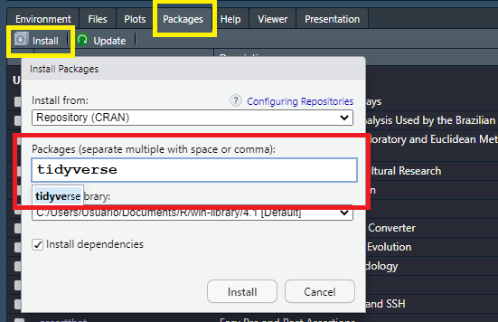

```{r setup, include=FALSE}
options(htmltools.dir.version = FALSE)
knitr::opts_chunk$set(echo=TRUE, 
                      message = FALSE, 
                      error= FALSE, 
                      warning = FALSE, 
                      comment = "#>", 
                      fig.align = "center")
options(dplyr.print_min = 5, dplyr.print_max = 5)
```
class: middle, center, inverse

# Distribuição de Frequência

```{r, echo=FALSE}
library(tidyverse)
library(patchwork)
idade <- rnorm(500,22,3.5)
altura <- rnorm(100,1.72,0.05)
peso <- rbinom(1000,50,.2) + 55
pas <- rnorm(100, 119, 8.2)

plt1 <- as_tibble(idade) |> 
  ggplot(aes(x=idade,y=..density..)) + 
  geom_histogram(bins = 10, color="black",
                 fill="gray") +
  theme_bw() +
  labs(x="Idade (anos)", y="Densidade")

plt2 <- as_tibble(altura) |> 
  ggplot(aes(x=altura,y=..density..)) + 
  geom_histogram(bins = 10, color="black",
                 fill="aquamarine4") +
  theme_bw() +
  labs(x="altura (m)", y="Densidade")

plt3 <- as_tibble(peso) |> 
  ggplot(aes(x=peso,y=..density..)) + 
  geom_histogram(bins = 10, color="black",
                 fill="orange3") +
  theme_bw() +
  labs(x="Peso (g)", y="Densidade")


plt4 <- as_tibble(pas) |> 
  ggplot(aes(x=pas,y=..density..)) + 
  geom_histogram(bins = 10, color="black",
                 fill="red") +
  theme_bw() +
  labs(x="Pressão arterial sistólica (mm Hg)", y="Densidade")
(plt1|plt2)/(plt3|plt4)
library(tidyverse)
data_set <- readxl::read_xlsx("../data/dados-turmas-2026.xlsx")

```

---
### Distribuição de frequência de uma variável

Quando analisamos uma variável aleatória (qualitativa ou quantitativa), deve-se conhecer a distribuição de frequência dessa variável por meio de suas possíveis realizações (observações). 

Assim, o objetivo dessa aula será apresentar as principais formas e visualização gráfica de variáveis quali e quantitativas. 

**Exemplo:** Considerando os [dados-turmas-2026.xlsx](https://raw.githubusercontent.com/arpanosso/estatinfo/refs/heads/master/data/dados-turmas-2026.xlsx) amostrados das turmas de Estatísticas temos:

Podemos organiza-los da seguinte forma: [dados-turmas-2026.pdf](https://raw.githubusercontent.com/arpanosso/estatinfo/refs/heads/master/docs/dados-turmas-2026.pdf)


---
**Tamanho da População $(N)$**

O tamanho da população $N$ é o número total dos elementos alvos da pesquisa. Muitas vezes não conhecemos esse valor. 


$$
N = \text{tamanho da população (desconhecido)}
$$
Em nosso exemplo, poderíamos entender como $N$ o número de todos os alunos de graduação da Unesp-FCAV.

$$
N = 35188
$$

Maiores informações, acesso o Painel [Somos UNESP](https://app.powerbi.com/view?r=eyJrIjoiMzM4YjhhOGMtMDQyNS00Y2VhLTk2ZDAtZThkMTU3ZWVhNTE0IiwidCI6ImZlODc4N2JjLWM5MTQtNDY2NS04NTQ3LTI2OGUxNWNiMGQ5YSJ9)


---

**Tamanho da amostra $(n)$**

É o número total de registros de sua base de dados, ou seja o número total de elementos amostrados da população. 

Em nosso exemplo é o número de alunos que responderam ao formulário.

$$
n =91
$$


```{r, echo=FALSE, out.width="10%", fig.align='left'}
# knitr::include_graphics("imgs/R_logo.png")
```


```{r, echo=FALSE}
library(tidyverse)
library(readxl)
dados_turmas_2026 <- read_xlsx("../data/dados-turmas-2026.xlsx")
```


---
### Variável sexo (qualitativa nominal)

Agora Construir uma tabela de frequências para a variável `sexo` contendo as frequências absolutas $(n_i)$, as frequências relativas $(f_i)$ e a porcentagem de frequência $(perc)$ para as categorias $Feminino$ e $Masculino$. 

Agora podemos definir o número de categorias dessa variável como $k$, ou seja, nesse caso:

$$ k = 2$$

---
### Frequência Absoluta $(n_i)$

É definida como o número de observações no conjunto de dados pertencentes à uma categoria/classe da variável em estudo.

Então, consideramos $n_1$ para sexo $Feminino$ e $n_2$ para sexo $Masculino$, temos:

$n_1 = 33$

$n_2 = 58$

```{r, echo=FALSE, out.width="10%", fig.align='left'}
# 
```


```{r, echo=FALSE}
# dados_turmas_2026 |> 
#   count(sexo)
```


---
Observe que a somatória da frequência absoluta das classes $(k)$ da variável cetegória é igual a $n$. 

$$
\sum \limits_{i=1}^{k}{n_i} = n
$$

sendo $k$ é o número de categorias.

$$
\begin{aligned}
\sum_{i=1}^{k} n_i &= n_1 + n_2 \\
                   &= 33 + 58 \\
                   &= 91
\end{aligned}
$$

---

**Frequência Relativa $(f_i)$**

É definida como a proporção de cada categoria em relação ao **Total de observações** $(n)$, ou seja:

$$
f_i = \frac{n_i}{n}
$$

Portanto temos que:


- Para categoria $Feminino$:

$$
f_1 = \frac{33}{91}=0{,}3626
$$ 

- Para categoria $Masculino$  

$$
f_2 = \frac{58}{91}=0{,}6373
$$
---

Observe que a somatória das frequências relativas sempre será igual a $1$: 

$$
\begin{aligned}
\sum_{i=1}^{k} f_i &= f_1 + f_2 \\
                   &= 0{,}3626 + 0{,}6373 \\
                   &= 1
\end{aligned}
$$

sendo $k$, o número de categorias da variável `sexo`.

---

**Porcentagem de frequência $(perc \text{, %})$**

Definida como o resultado da multiplicação da frequência relativa (proporção) por $100$.


$$perc_1 = f_1 \times 100 = 0{,}3626 \times 100 = 36{,}26\% \\
perc_2 = f_2 \times 100 = 0{,}6373 \times 100 = 63{,}73\%$$


De maneira análoga, a somatória das porcentagens sempre será igual a $100$: 

$$
\begin{aligned}
\sum_{i=1}^{k} f_i &= perc_1 + perc_2 \\
                   &= 36{,}26 + 63{,}73 \\
                   &= 100
\end{aligned}
$$

A partir das tabelas de frequência, poderemos criar representações gráficas que nos auxiliarão na apresentação e interpretação do comportamento dos dados.

Essa etapa é a denominada de **Apresentação - Visualização de Dados**. 


```{r, echo=FALSE, out.width="10%", fig.align='left'}
# 
```


```{r, echo=FALSE}
# 
# Precisaremos, então, fazer algumas operações nos dados das turmas e vamos usar o operador `PIPE` (`|>`), cujo atalho é `CTRL + SHIFT + M`. 
# 
# - `n()` para contar cada ocorrência das diferentes categorias da variável  `sexo`.
# - `group_by()` agrupa a variável `sexo` por suas diferentes categorias.
# - `summarise()` cria o resumo dos dados, ou seja, contará o valor de cada categoria usando a função `n()` e salvará na coluna `ni`.
# - `mutate()` é a função utilizada para calcular $f_i$ e suas respectivas procentagens $prec_i$ a partir da coluna $_i$.
# 
# dados_turmas_2026  |> 
#   group_by(sexo) |>  
#   summarise(ni=n()
#             )  |>  
#   mutate(fi = ni/sum(ni),
#          perc = fi*100) 
```


---
class: middle, center, inverse

# APRESENTAÇÃO - VISUALIZAÇÃO DE DADOS
## (Variáveis Qualitativas)

---

## Apresentação - Visualização dos dados

Os tipos de gráficos variam de acordo com o tipo de variável, geralmente, para as **variáveis qualitativas** utilizamos os gráficos de:

- Barras;
- Colunas; 
- Setores (Pizza). 

---

### Gráfico de Colunas para variável sexo

```{r, plot1, echo=FALSE}
dados_turmas_2026 |>
  group_by(sexo) |> 
  summarise(ni=n()) |> 
  mutate(fi = ni/sum(ni),
         perc = fi*100) |> 
  ggplot(aes(x=sexo, y=fi)) + 
  geom_col(
    fill="lightblue",
    color="black"
  )+
  theme_minimal()
```


---

### Gráfico de Barras para variável sexo

Semelhante ao gráfico de colunas, contudo, com as barras na horizontal, facilita a leitura do nome das categorias.

```{r, plot2, echo=FALSE}
dados_turmas_2026 |>
  group_by(sexo) |> 
  summarise(ni=n()) |> 
  mutate(fi = ni/sum(ni),
         perc = fi*100) |> 
  ggplot(aes(x=fi,y=sexo)) + 
  geom_col(fill="orange4",
           color="black") +
  theme_classic()
```

---


### Gráfico de Setores para variável sexo

```{r, plot3, echo=FALSE}
dados_turmas_2026 |> 
  group_by(sexo) |> 
  summarise(
    n = n(),
    .groups = "drop"
  ) |> 
  mutate(
    Freq_Relativa = n/sum(n),
    porc     = round(Freq_Relativa,2),
    rotulo   = paste0(sexo, "\n", round(porc,2), "%")
  ) |> 
  ggplot(aes(x = "", y = porc, fill = sexo)) +
  geom_col(width = 1, color = "white") +
  scale_fill_manual(values = c("orange","lightblue")) +
  coord_polar(theta = "y") +
  geom_text(aes(label = paste0(porc*100, "%")),
            position = position_stack(vjust = 0.5), size = 6.5) +
  labs(
    title = "Proporção de Alunos por Sexo",
    fill  = "Sexo"
  ) +
  theme_void()
```

---

## Tabela de Frequência para a variável Cor de cabelo

Vamos, mais uma vez, utilizar o R para conseguirmos as tabelas e a representação gráfica. 

```{r, eval=TRUE, echo=FALSE}
tab <- dados_turmas_2026 |>
  group_by(cor_cabelo) |> #<< 
  summarise(ni=n()) |>      
  mutate(fi = ni/sum(ni),    
         perc = fi*100)      
kableExtra::kable(tab)
```

---

### Gráfico de Colunas para Cor de cabelo

```{r, plot4, echo=FALSE}
dados_turmas_2026 |>
  group_by(cor_cabelo) |> #<< 
  summarise(ni=n()) |>      
  mutate(fi = ni/sum(ni),    
         perc = fi*100) |> 
  ggplot(aes(x=cor_cabelo,y=fi,
             fill=cor_cabelo)) + #<<
  geom_col(color="black")+
  scale_fill_manual(
    values = c(
      "Loiro" = "orange",
      "Castanho Claro" = "brown1",
      "Castanho Escuro" = "brown4",
      "Preto" = "black"
    )
  )+
  theme_bw() #<<
```


---

### Gráfico de Barras para Cor de cabelo

```{r, plot5, echo=FALSE}
dados_turmas_2026 |>
  group_by(cor_cabelo) |> #<< 
  summarise(ni=n()) |>      
  mutate(fi = ni/sum(ni),    
         perc = fi*100) |> 
  ggplot(aes(x=fi, y=cor_cabelo,
             fill=cor_cabelo)) + 
  geom_col(color="black")+
  scale_fill_manual(
    values = c(
      "Loiro" = "orange",
      "Castanho Claro" = "brown1",
      "Castanho Escuro" = "brown4",
      "Preto" = "black"
    )) +
      theme_minimal()
```


---
### Gráfico de Setores para cor_cabelo

```{r, plot6, echo=FALSE}
dados_turmas_2026 |> 
  group_by(cor_cabelo) |> 
  summarise(
    n = n(),
    .groups = "drop"
  ) |> 
  mutate(
    Freq_Relativa = n/sum(n),
    porc     = round(Freq_Relativa,2),
    rotulo   = paste0(cor_cabelo, "\n", round(porc,2), "%")
  ) |> 
  ggplot(aes(x = "", y = porc, fill = cor_cabelo)) +
  geom_col(width = 1, color = "white") +
  coord_polar(theta = "y") +
  geom_text(aes(label = paste0(porc*100, "%")),
            position = position_stack(vjust = 0.5), size = 6.5) +
  scale_fill_manual(
    values = c(
      "Loiro" = "orange",
      "Castanho Claro" = "brown1",
      "Castanho Escuro" = "brown4",
      "Preto" = "darkgray"
    )) +
  labs(
    title = "Proporção de Alunos por Cor do Cabelo",
    fill  = "cor_cabelo"
  ) +
  theme_void()
```

---

## Apresentação - Visualização dos dados

**Variável Altura (Quantitativa Contínua)**

Quando a variável quantitativa, construímos a tabela de frequência, podemos utilizar intervalos de classes e os principais gráficos são:

- histograma; 
- boxplot; 
- Distribuição acumulada 

Devemos, inicialmente construir a tabela de frequência da variável `altura`. Porém, os valores de uma variável contínua não se repetem, mesmo que isso aparentemente ocorra na base de dados. 

Em teoria suas observações podem assumir qualquer valor dentro da reta dos números $\mathbb{R}$, portanto, ao mensurar uma variável contínua, obtém-se apenas uma aproximação de seu verdadeiro valor dada pelo instrumento de medida.

---

### Tabela de frequência

Para exemplificar, vamos criar uma tabela de frequência com $k = 5$ classes de alturas.


```{r,echo=FALSE}
tab <- dados_turmas_2026 |>
  mutate(
    classes_altura = cut(altura,5) 
    ) |> 
  group_by(classes_altura) |> 
  summarise(ni=n()) |>      
  mutate(fi = ni/sum(ni),    
         perc = fi*100)  
kableExtra::kable(tab)
```

Agora vamos construir o histograma

---

### Amplitude Total $\Delta$

Vamos iniciar com a Amplitude total $(\Delta)$, definida como a diferença entre o valor máximo menos o valor mínimo da variável.

$$\Delta = Máximo - Mínimo$$

Para os dados de altura temos, $\Delta = 197-155 = 42 \;\text{cm}$


---

### Número de intervalos de classes $(k)$ 

Definiremos $k$ como sendo o número de **sub-intervalos** da Amplitude Total. Uma boa representação apresenta um $k$. 

**NUNCA** inferior a $5$ ou superior a $15$, pois com um pequeno número de classes, perde-se informação, e com um grande número de classes, o objetivo de resumir os dados fica prejudicado.

--

### Amplitude de classe $(\Delta_i)$

É o tamanho de cada um dos $k=5$ sub-intervalos, dado pela amplitude total dividida pelo número de intervalos.

$$\Delta_i = \frac{\Delta}{k}$$
Para os dados de altura:

$$\Delta_i = \frac{\Delta}{k} = \frac{42}{5} = 8{,}4 \;cm$$

---
Assim, temos que cada um dos $5$ intervalos terá uma amplitude de $8{,}4$ cm. Ou seja, o cálculo dos  limites das classes é feito a partir da adição ao valor Mínimo o valor de $\Delta_i$ um número de $k$ vezes. LI = Limite Inferior da Classe e LS = limite Superior da Classe

- Classe 1:

LI = $Mínimo = 155$  e LS = $Mínimo \times \Delta_i = 155 \times (8{,}4) = 163{,}4$

- Classe 2:

LI = LS anterior = $163{,}4$ e LS = $Mínimo \times 2\Delta_i = 155 \times 2\dot(8{,}4) = 171{,}8$

- Classe 3:

LI = $171{,}8$  LS = $Mínimo \times 3\Delta_i = 155 \times 3\dot(8{,}4) = 180{,}2$

- Classe 4:

LI = $180{,}2$  e LS = $Mínimo \times 4\Delta_i = 155 \times 4\dot(8{,}4) = 188{,}6$

- Classe 5:

LI = $188{,}6$ e LS = $Mínimo \times 2\Delta_i = 155 \times 2\dot(8{,}4) = 197$


---
## Gráfico histograma (frequências absolutas)

A partir da tabela anterior, pode-se construir o gráfico de frequência de cada classe de valor de altura, denominado **Histograma**. 

```{r,plot10,eval=FALSE}
k=5
Di = 8.4
altura <- dados_turmas_2026 |> pull(altura)
limites <- min(altura)+ 0:k * Di
limites
dados_turmas_2026 |> 
  ggplot(aes(x=altura,y=..count..))+ #<<
  geom_histogram(breaks = limites,
                 color="black",
                 fill="gray")
```
O código acima gera um histograma com $5$ barras onde o eixo `y` será a frequência absoluta, ou seja, a contagem (`..count..`) de quantos valores de altura estão dentro de uma determinada classe.

A opção `breaks = limites` deixa o histograma igual ao observado na tabela anterior.

---

## Histograma da altura (m)

```{r,plot10,echo=FALSE}
```

---

## Gráfico histograma (frequências relativas)

Ao longo de nosso curso, vamos estudar que a frequência relativa $f_i$ é uma estimativa empírica da probabilidade $P(X=x_i)$, assim é interessante que a área total da figura do histograma seja igual a $1$, correspondendo à soma total das frequências relativas $( f_i )$. 

Então, para construção do histograma, sugere-se usar no eixo das ordenadas os valores de $fi / \Delta_i$ (denominado densidade de frequência), ou seja, da medida que indica qual a concentração por unidade da variável.

```{r,plot11,eval=FALSE}
dados_turmas_2026 |> 
  ggplot(aes(x=altura,y=..density..))+ #<<
  geom_histogram(breaks = limites,
                 color="black",
                 fill="gray")
```

Para isso utilizamos `y=..density..`.

---


```{r,plot11,echo=FALSE}
```

---

## Densidade de frequência $(d_i)$

Agora vamos atualizar a tabela com o valor de densidade de frequência, dado por:

$$d_i=\frac{f_i}{\Delta_i}$$

```{r, echo = TRUE, eval=FALSE}
dados_turmas_2026 |>
  mutate(
    classes_altura = cut(altura,5)
    ) |> 
  group_by(classes_altura) |> 
  summarise(ni=n()) |>      
  mutate(fi = ni/sum(ni),    
         perc = fi*100,
         di=fi/Di) #<<
```

---

```{r,echo=FALSE}
tab <- dados_turmas_2026 |>
  mutate(
    classes_altura = cut(altura,5) 
    ) |> 
  group_by(classes_altura) |> 
  summarise(ni=n()) |>      
  mutate(fi = ni/sum(ni),    
         perc = fi*100,
         di=fi/Di)  
kableExtra::kable(tab)
```

---

## Medidas  Acumuladas

As medidas acumuladas são interessantes para compor algumas vizualizações:

$N_i$: Frequência Absoluta Acumulada.

$F_i$: Frequência Relativa Acumulada.

$Perc$: Porcentagem de Frequência Acumulada.

```{r, echo = TRUE, eval=FALSE}
dados_turmas_2026 |>
  mutate(
    classes_altura = cut(altura,5)
    ) |> 
  group_by(classes_altura) |> 
  summarise(ni=n()) |>      
  mutate(fi = ni/sum(ni),    
         perc = fi*100,
         di=fi/Di,
         Ni = cumsum(ni), #<<
         Fi = cumsum(fi), #<<
         Perc = cumsum(perc)) #<<
```

---

# Tabela de Frequência para Altura

```{r,echo=FALSE}
tab <- dados_turmas_2026 |>
  mutate(
    classes_altura = cut(altura,5) 
    ) |> 
  group_by(classes_altura) |> 
  summarise(ni=n()) |>      
  mutate(fi = ni/sum(ni),    
         perc = fi*100,
         di=fi/Di,
         Ni = cumsum(ni),
         Fi = cumsum(fi),
         Perc = cumsum(perc)
  )
kableExtra::kable(tab)
```

---

## Histograma e Polígono de Frequência

Obtemos o polígono de frequências unindo por uma poligonal (segmentos de retas) os pontos correspondentes às frequências, das classes, centradas nos pontos médios de cada classe. 

Para se obter as interseções do polígono com o eixo horizontal, cria-se em cada extremo do histograma uma classe com frequência nula.

No R:

```{r,plot12,eval=FALSE}
dados_turmas_2026 |> 
  ggplot(aes(x=altura, y=..count..))+ #<<
  geom_histogram(breaks = limites,
                 color="black",
                 fill="gray") +
  geom_freqpoly(breaks=limites,color="red") #<<
```

---

```{r,plot12,echo=FALSE}
```


---

## Histograma e Estimativas de densidade suavizadas


Calcula e desenha a estimativa da densidade, que é uma versão suavizada do histograma. Esta é uma alternativa útil para dados contínuos que vêm de uma distribuição suave subjacente. 

```{r,plot12_1,eval=FALSE}
dados_turmas_2026 |> 
  ggplot(aes(x=altura,y=..density..))+ #<<
  geom_histogram(breaks = limites,
                 color="black",
                 fill="white") +
  geom_density(color="red",
               fill="green",
               alpha=0.05) #<<
```

- Observe que o histograma foi construído com as frequências absolutas $(n_i)$, ou seja, `y=..density..`. Utilizamos a função `geom_density()`.  
- O argumento `alpha=0.05` controla a transparência do preenchimento. 

---

```{r,plot12_1,echo=FALSE}
```


---

## Função de Distribuição Acumulada


A função de distribuição acumulada descreve como probabilidades são associadas aos valores ou aos intervalos de valores de uma variável aleatória. Em outras palavras, ela representa a probabilidade de uma variável aleatória ser menor ou igual a um valor real qualquer $x$. 

$$
F(x) = P(X \leq x) \in [0,1].
$$

Para uma variável aleatória contínua (`altura`):

$\int \limits_{- \infty }^x f(x_i) dx$

```{r,plot13,eval=FALSE}
dados_turmas_2026 |> 
  ggplot(aes(x=altura))+ 
  stat_ecdf(geom = "line",color="red")#<<
```

---

```{r,plot13,echo=FALSE}
```

---

## Função de Distribuição Acumulada

No caso da variável aleatória discreta (`idade_anos`):

$F(x) = \sum \limits_{x_i<x} f(x_i)$

```{r,plot14,eval=FALSE}
dados_turmas_2026 |> 
  ggplot(aes(x=idade))+ #<<
  stat_ecdf(geom = "line",color="red")
```

---
```{r,plot14,echo=FALSE}
```


---
class: middle, center, inverse

## Medidas de Posição

___


<!-- --- -->
<!-- class: middle, center, inverse -->

<!-- ## Prática para Casa: Instalação de Pacotes no R -->

<!--  -->

<!-- [Link do Video](https://drive.google.com/drive/u/0/folders/1O-sGhicXs6unUY_y1JW8yKSHm76VVMCX) -->

<!-- --- -->
<!-- **Pacote em R** -->

<!-- Um pacote é uma coleção de funções, exemplos e documentação. A funcionalidade de um pacote é frequentemente focada em uma metodologia estatística especial" (**Everitt & Hothorn**). -->


<!--  -->

<!-- Pacotes no R são coleções de funções, exemplos e documentações, que devem ser previamente instalados e alocados no ambiente pela função `library`. -->

<!-- --- -->
<!-- ## Pacotes básicos -->

<!-- Liste os pacotes carregados no ambiente com: -->

<!-- ```{r} -->
<!-- (.packages()) -->
<!-- ``` -->

<!-- O retorno da função é uma lista de nomes, `caracteres` (ou `strings`), na forma de um *objeto* denominado **vetor**. Observe que cada pacote (elemento) é referenciado dentro do vetor por um índice, um número inteiro $[\;i\;]$ apresentado entre colchetes **[i]**. -->

<!-- Carregue um pacote chamando a função `library`. -->

<!-- ```{r,message=FALSE} -->
<!-- library(MASS) -->
<!-- ``` -->


<!-- --- -->

<!-- Agora, liste novamente os pacotes e observe a diferença no retorno da função. -->

<!-- ```{r} -->
<!-- (.packages()) -->
<!-- ``` -->

<!-- Observe que o pacote `MASS` agora está no ambiente de trabalho.  -->


<!-- --- -->

<!-- ### Instalando pacotes -->

<!-- Para a realização de procedimentos estatístico e manipulação de arquivos durante o curso, serão necessários vários pacotes que não fazem parte do `base` do R, que deverão ser instalados. -->

<!-- **Utilizando a opção** `Packages\Install\nome do pacote` -->

<!-- ```{r echo=FALSE, fig.cap="",fig.align='center',out.width = "450px"} -->
<!--  -->
<!-- ``` -->


<!-- Instale os pacotes:   -->

<!--  * `tidyverse`    -->
<!--  * `agricolae`   -->

<!-- --- -->
<!-- Os pacotes também podem ser instalados a partir das linhas de comandos: -->

<!-- ```{r,eval=FALSE} -->
<!-- install.packages("tidyverse") -->
<!-- install.packages("agricolae") -->
<!-- ``` -->


<!-- Agora podemos carregar esses pacotes em nosso ambiente de trabalho. -->

<!-- ```{r,message=FALSE,error=FALSE} -->
<!-- library(tidyverse) -->
<!-- library(agricolae) -->
<!-- ``` -->

<!-- Vamos agora criar uma "Pipe Line" para visualização de um banco de dados -->

<!-- ```{r,message=FALSE,error=FALSE} -->
<!-- mtcars |>  -->
<!--   glimpse() -->
<!-- ``` -->

<!-- O simbolo para operação de arquivos de dados é o pipe `|>` que pode ser criado a partir do atalho `CTRL + SHIFT + M` -->

<!-- --- -->

<!-- ## Carregando os dados no R -->
<!-- Para carregar o banco de dados da turma no R, siga os passos:   -->
<!-- 1.Faça o Download dos [dados_turmas.xlsx](https://arpanosso.github.io/estatinfo/data/dados_turmas.xlsx).     -->

<!-- 2.Salve em uma pasta `data` dentro de um projeto do R previamente criado. -->

<!-- </img>  -->

<!-- --- -->

<!-- 3.Na aba **Environment** do RStudio selecione **Import Dataset/From Excel...** como apresentado abaixo. -->

<!-- </img> ] -->

<!-- --- -->

<!-- 4.Selecione **Browse** (destacado em vermelho no canto direito superior). -->

<!-- </img>  -->

<!-- --- -->

<!-- 5.Na próxima janela busque o arquivo da base de dados **dados_turmas.xlsx** que salvamos na pasta "*data"*,  selecione o arquivo e clique em **Open**. -->

<!-- </img> -->

<!-- --- -->
<!-- 6.Na janela serão apresentados os dados, **NÃO CLIQUE EM IMPORT**, ao invés disso, **selecione e copie o código** para a importação dos dados. Após isso **CLIQUE EM CANCEL**.  -->

<!-- </img> -->

<!-- --- -->

<!-- 7.Cole o código no seu script do R e o execute. Os dados serão salvos no objeto `dados_turmas`. Se necessário, instale o pacote `readxl` com as opções da aba **Packages/Install** ou com o comando `install.packages("readxl")`. -->

<!-- ```{r, eval=FALSE} -->
<!-- library(readxl) -->
<!-- dados_turmas <- read_excel("data/dados_turmas.xlsx") -->
<!-- View(dados_turmas) -->
<!-- ``` -->

<!-- ```{r,echo=FALSE} -->
<!-- `|>` <- magrittr::`|>` -->
<!-- library(dplyr) -->
<!-- library(tidyr) -->
<!-- library(ggplot2) -->
<!-- library(readxl) -->
<!-- dados_turmas <- read_excel("../data/dados_turmas.xlsx") -->
<!-- ``` -->

<!-- </img> -->
