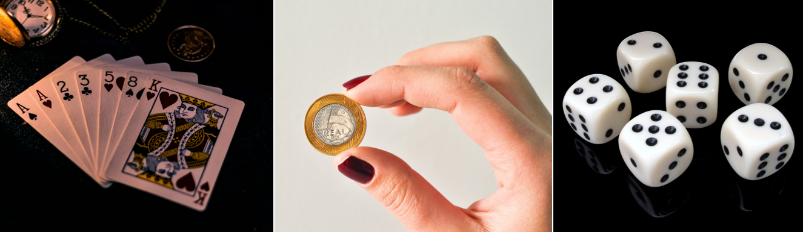

```{r setup, include=FALSE}
options(htmltools.dir.version = FALSE)
knitr::opts_chunk$set(echo=TRUE, message = FALSE, warning = FALSE, comment = "#>", fig.align = "center")
options(dplyr.print_min = 5, dplyr.print_max = 5)
```

class: middle, center, inverse

# Definições Iniciais

---

### Ensaio ou Experimento

Fazer ou observar alguma coisa sob certas condições, resultando em algum estado final de acontecimentos ou resultados.

Na prática, os experimentos não são precisamente repetíveis, mesmo sob condições supostamente idênticas.


```{r, echo=FALSE, out.width="85%", fig.align='center'}

```

### Experimento aleatório

Pode ser repetido inúmeras vezes e nas mesmas condições e, mesmo assim, apresenta resultados diferentes.


---

### Fenômeno aleatório:

É a situação ou acontecimento cujos resultados não podem ser previstos com certeza, pois envolve a eventualidade, portanto é proveniente de um **experimento aleatório**. 

Apesar do experimento ter sido realizado em condições supostamente controladas, existem fatores afetando os resultados, mas não se conhece ou não se sabe como controlá-los.

.pull-left[
Germinação de sementes de milho
```{r,out.width = "60%",fig.cap="",fig.align = 'left',echo=FALSE}
knitr::include_graphics("https://images.pexels.com/photos/1459331/pexels-photo-1459331.jpeg?cs=srgb&dl=pexels-livier-garcia-1459331.jpg&fm=jpg")
```

Produção de cana-de-açúcar (TCH)
```{r,out.width = "60%",fig.cap="",fig.align = 'left',echo=FALSE}
knitr::include_graphics("https://images.pexels.com/photos/7457175/pexels-photo-7457175.jpeg?cs=srgb&dl=pexels-kindel-media-7457175.jpg&fm=jpg")
```
]

.pull-right[
Ganho de peso bovino
```{r,out.width = "55%",fig.cap="",fig.align = 'left',echo=FALSE}
knitr::include_graphics("https://images.pexels.com/photos/3214973/pexels-photo-3214973.jpeg?cs=srgb&dl=pexels-alex-azabache-3214973.jpg&fm=jpg")
```
]

---

### Espaço amostral $(S)$

É o conjunto de todos os resultados possíveis de um certo fenômeno aleatório, é o conjunto de todos os elementos que possuem a característica em estudo representada pela letra Ômega $\Omega$ ou pelo $S$.   

Assim, no lançamento de um dado, o espaço amostral é:

$$S = \{1, 2, 3, 4, 5, 6\}$$

No lançamento de uma moeda, o espaço amostral é:

$$S = \{H, T\}$$
Onde $H$ representa Cara e $T$ representa Coroa.

---

No lançamento de duas moedas o espaço amostral é:

$$S = \{HH, HT,TH,TT\}$$

### Evento simples, ponto amostral ou evento elementar $(e)$

É cada resultado possível, ou seja, é o conjunto de resultados possíveis. Assim, para o lançamento de duas modeas,  temos: 

```{r,out.width = "100%",fig.cap="",fig.align = 'center',echo=FALSE}
knitr::include_graphics("https://raw.githubusercontent.com/arpanosso/estatinfo/master/slides/img/duas_modeas.png")
```

---

### Evento (E)

Qualquer subconjunto do espaço amostral. 

Assim, para o lançamento de um dado,  temos os eventos:

a) sair um número par: 

R: $E_1 = \{2, 4, 6\}$


b) sair um número menor que $3$:  

R: $E_2 = \{x| x< 3 \} = \{1, 2\}$ 


c) sair um número menor que $3$ ou primo:  

R: $E = \{x| x< 3 \text{ ou } x = \text{ primo }\} = \{ 1,2,3,5\}$


---

### Probabilidade de um evento - P(E)

A probabilidade é uma função $P(.)$ que atribuí valores numéricos a um determinado evento $(E)$. 

É uma medida numérica de **"quão provável"** é a ocorrência do evento na excussão do experimento, é a proporção de vezes que o evento é esperado ocorrer, quando o experimento é repetido sob idênticas condições.

A determinação das probabilidade de um evento depende da natureza do experimento e do espaço amostral associado.

---

Supondo o lançamento de duas moedas "não viciadas" (honestas). Temos o espaço amostral:
$S = \{H H, H T, T H, T T\}$.

A título de exemplificação, vamos definir uma **variável aleatória $X$** que representa **a contagem do número de caras (H)** no lançamento de duas moedas, ou no lançamento de uma moeda duas vezes, temos:

```{r,out.width = "70%",fig.cap="",fig.align = 'center',echo=FALSE}
knitr::include_graphics("https://raw.githubusercontent.com/arpanosso/estatinfo/master/slides/img/exp_prob.png")
```

Ao conjunto $\{x| P(X=x)\}$ denominamos função de probabilidade da variável aleatória X.

---
class: middle, center, inverse

# Probabilidade: Resultados Elementares Igualmente Prováveis 

---

### Resultados elementares igualmente prováveis 

Conclusões baseadas em dados empíricos, oriundos de uma observação experimental, são encerradas com incerteza que é expressa em termos de probabilidade. Assim, a atribuição é baseada nas características teóricas da realização do fenômeno.

**Definição de Laplace de Probabilidade**
.pull-left[
```{r,out.width = "50%",fig.cap="Portrait of Pierre-Simon Laplace by Johann Ernst Heinsius (1775). Fonte: Wikipedia",fig.align = 'center',echo=FALSE}
knitr::include_graphics("https://upload.wikimedia.org/wikipedia/commons/a/ac/Pierre-Simon_de_Laplace_by_Johann_Ernst_Heinsius_%281775%29.jpg")
```
  
]

.pull-right[
  >"Quociente do número de casos favoráveis sobre o número de casos igualmente possíveis". 
  
  Ao jogarmos uma moeda honesta (**"não viciada"**), não podemos afirmar que cairá Cara  $(H)$ ou Coroa $(T)$.
Por assim definimos a Probabilidade de $H$ como:
]

$$
P(H) = \frac{\text{nº de resultados favoráveis}}{\text{nº total de resultados possíveis}} = \frac{1}{2}
$$

---

### Exemplos 

**1)** No lançamento de um dado com os lados $\{1,2,3,4,5,6\}$, qual a probabilidade de cair Cara, $P(H)$?


$$P(H) = \frac{\text{nº de resultados favoráveis}}{\text{nº total de resultados possíveis}} = \frac{0}{6} = 0$$

Chamamos esse tipo de **Evento Impossível**.

**2)** No lançamento de um dado com os lados $\{1,2,3,4,5,6\}$, qual a probabilidade de cair um número entre $1$ e $6$?


$$P(H) = \frac{\text{nº de resultados favoráveis}}{\text{nº total de resultados possíveis}} = \frac{6}{6}=1$$

Chamamos esse tipo de **Evento Certo**.

---

###  Probabilidade de um Evento

>Assim, $P(E)$ é a probabilidade de um evento $E$, ou seja, é um número entre $0$ e $1$, quanto mais próximo a $1$, maior a chance de sua ocorrência.  A proporção de vezes que um evento simples pode ocorrer pode ser determinada sem executar o experimento. 

Portanto, se $S$ consiste de $k$ eventos simples $\{ e_1, e_2, \cdots, e_k\}$ que são **igualmente prováveis**, a probabilidade de cada $e_i$ é $\frac{1}{k}$ se $E$ consiste de $m$ desses $k$ elementos, então temos:

$$P(E) = \frac{\text{nº de elementos em E}}{\text{nº de elementos em }S} = \frac{m}{k},$$
---

Portanto $P(.)$ é denominada probabilidade se, e somente se: 

$i) \;0 \le P(E) \le 1, \forall E \subset S$.

$ii) \;P(S)= 1$, assim como, $P(\phi)=0$

$iii) P(E_1 \cup E_2 \cup \cdots \cup E_k) = P(\cup_{i=1}^kE_i)= \sum_{i=1}^k P(E_i)$ com os eventos $E_i$ **disjuntos (mutuamente excludentes)**.

---

### Exemplos

1) Descreva o espaço amostral e a probabilidade de sair pelo menos uma face cara no lançamento de uma moeda três vezes.

---

### Teorema 1

Se $\phi$ for espaço amostral vazio:

$$P(\phi)=0$$

**Demonstração**:

Para qualquer evento $A$, podemos escrever:

$A = A \cup \phi$, com $A$ e $\phi$ disjuntos, apresentado na propriedade (iii), temos:

$P(A)=P(A)+P(\phi)$, como conclusão imediata, temos:

$P(\phi)=0$, mas se $P(A)=0$, não é verdadeiro que $A=\phi$, existem situações que atribuiremos $P(E)=0$ para um evento que pode ocorrer.

---

### Teorema 2

Se $\bar{A}$ for o evento complementar de $A$, então: 

$$P(\bar{A}) = 1 - P(A)$$

**Demonstração**:

Podemos escrever:

$S = A \cup \bar{A}, \forall A$,

Empregando a propriedade $2$ e $3$, temos:

$P(S) = P(A)+P(\bar{A})$  

$1 = P(A)+P(\bar{A})$  

$P(A) = 1-P(\bar{A})$, assim,  $P(\bar{A}) = 1-P(A)$

Essa propriedade é importante, pois, muitas vezes é mais simples calcularmos a $P(\bar{A})$ do que $P(A)$.

---

### Propriedade da multiplicação (E)

Dados dois eventos $A$ e $B$ de interesse, qual a probabilidade de ocorrência de ambos? Se esses eventos são **independentes**, a probabilidade de ocorrência de ambos é dada por:

$$P(A \cap B) = P(A) \cdot P(B)$$
**Exemplo**: Jogamos duas moedas, honestas, qual a probabilidade de ambas as faces serem cara $(H)$.

$P(H \cap H) = P(H) \cdot P(H)$

$P(H \cap H) = \frac{1}{2} \cdot \frac{1}{2}$

$P(H \cap H) = \frac{1}{4}$

```{r,out.width = "20%",fig.cap="",fig.align = 'center',echo=FALSE}
knitr::include_graphics("https://raw.githubusercontent.com/arpanosso/estatinfo/master/slides/img/prob_01.png")
```


---

class: middle, center, inverse

# Probabilidade: Frequência Relativa 

---

### Probabilidade e Frequência Relativa 

Outra maneira de atribuição de probabilidade é por meio da repetição do experimento várias vezes para obtermos informações à respeito da frequência de ocorrência dos diferentes resultados. 

Se um experimento é repetido $n$ vezes a frequência relativa $(f_i)$ de um evento $E$ em $n$ ensaios é:


$$f_n(E)=\frac{\text{nº vezes que E ocorre em n ensaios} }{n}$$

Se as condições dos experimentos não mudam, quando o número $n$ de vezes que o ensaio é realizado tende ao infinito a frequência relativa tende a se estabilizar em um valor numérico único, a **probabilidade do Evento E**.


$$\lim_{ n \to \infty } f_n(E) = P(E)$$

Se jogarmos um dado não viciado, muitas vezes e contarmos as vezes que cada lado sai, o valor da frequência relativa de cada tenderá a $\frac{1}{6} = 0,1667$.

```{r,out.width = "15%",fig.cap="",fig.align = 'center',echo=FALSE}
knitr::include_graphics("https://images.pexels.com/photos/979722/pexels-photo-979722.jpeg?cs=srgb&dl=pexels-jonathan-petersson-979722.jpg&fm=jpg")
```

---

Vamos definir $n$ como o número de vezes que o experimento será realizado $(100)$. Depois disso, vamos simular o lançamento de $n$ dados e calcular a frequência de cada elemento.

```{r,echo=FALSE,message=FALSE,error=FALSE}
library(tidyverse)
```


```{r,tab_1,eval=FALSE}
# Carregando pacotes
library(tidyverse)
n <- 100
x <- n  %>%  
  runif(min=.5,max=6.5) %>%  
  round()
# Criando a tabela e posterior gráfico
tibble(x)  %>%  
  group_by(x)  %>%  
  summarise(
    ni = n(),
    fi = ni/n
  ) %>% 
  ggplot(aes(x=x,y=fi)) +
  geom_col(color="black",fill="lightblue") +
  geom_hline(yintercept = 1/6,color="red")
```

---

```{r,tab_1,echo=FALSE}
```


Observe que os valores de $f_i$ são diferentes, não houve a convergência para os valores de probabilidade $P(E) = 0,16667$, linha vermelha no gráfico.

---

Agora vamos aumentar o $n$ para  $1.000.000$, e observar a convergência para o valor de $1/6$, linha vermelha no gráfico.

```{r,tab_2,eval=FALSE}
n <- 1e6 # 1000000 - 1 milhão
x <- n  %>%  
  runif(min=.5,max=6.5) %>%  
  round()
# Criando a tabela e posterior gráfico
tibble(x) %>% 
  group_by(x) %>%  
  summarise(
    ni = n(),
    fi = ni/n
  ) %>%  
  ggplot(aes(x=x,y=fi)) +
  geom_col(color="black",fill="lightblue") +
  geom_hline(yintercept = 1/6,color="red")
```


---
```{r,tab_2,echo=FALSE}
```

Quando $n \to \infty$ os valores de $f_i \to P(E) = 0,16667$.

---

**Exemplo**

Dada a seguinte tabela, referente ao sexo $(F, M)$ e a cor do cabelo (*Ruivos* e *Não Ruivos*) de crianças em uma escola:


 | Ruivo $(R)$ | Não Ruivo $(\bar{R})$ | TOTAL
---|:---:|:---:|:---:|---:
**Feminino $(F)$** | 4  | 26 | **30**
**Masculino $(\bar{F})$** | 17 | 13 | **30** 
**TOTAL** | **21** | **39** | **60**

Ao selecionarmos um aluno ao acaso, pergunta-se:

a) Qual a probabilidade do estudante ser *Ruivo*:


**R**: $P(Ruivo ) = \frac{21}{60} = 0,35$


b) Qual a probabilidade do estudante ser do sexo *Feminino*?


**R**: $P(Feminino) = \frac{30}{60} = 0,50$


c) Qual a probabilidade do estudante ser do sexo *Feminino* **e** *Ruivo*?


**R**: $P(Feminino \cap Ruivo) = \frac{4}{60} = 0,06667$


---

#### c) Qual a probabilidade do estudante ser do sexo *Feminino* **ou** *Ruivo*?


Observe que existe uma região de intersecção entre esses conjuntos, então para calcularmos $P(F \cup R)$ devemos somar $P(F)$ com $P(R)$ e subtraírmos uma vez $P(F \cap R)$.


```{r,out.width = "70%",fig.cap="",fig.align = 'center',echo=FALSE}
knitr::include_graphics("https://raw.githubusercontent.com/arpanosso/estatinfo/master/slides/img/venn_13.png")
```


**R**: $P(F \cup R) = P(F)  +P(R) - P(F \cap R) =\frac{21}{60} + \frac{30}{60} -\frac{4}{60} = \frac{47}{60} = 0,7833$

---

### Regra de Adição da Probabilidade

No exemplo anterior é simples verificar que somamos duas vezes a interseção dos conjuntos na parcela $P(F) + F(R)$, ou seja, os indivíduos que são do sexo feminino e ruivos $P(F \cap R)$, por isso precisamos descontar $1$ vez essa probabilidade da soma.

Então temos a regra da adição da probabilidade:

$$P(A \cup B) = P(A) + P(B) - P(A \cap B)$$
---

#### Teorema 3

Se $A$ e $B$ forem dois eventos quaisquer, então, $P(A \cup B) = P(A) + P(B) - P(A \cap B)$:

**Demonstração**: A ideia principal dessa demonstração é decompor $A \cup B$ e $B$ em dois eventos disjuntos, e em seguida aplicar a propriedade 3 da definição de probabilidade.

```{r,out.width = "80%",fig.cap="",fig.align = 'center',echo=FALSE}
knitr::include_graphics("https://raw.githubusercontent.com/arpanosso/estatinfo/master/slides/img/venn_14.png")
```

---

#### Demonstração

$A \cup B = A \cup (B \cap \bar{A})$

Aplicando a função de probabilidade:

$P(A \cup B) = P(A) + P(B \cap \bar{A})$,

Assim, temos que:

$P(B \cap \bar{A}) =P(A \cup B) - P(A)$  **(i)**

Agora podemos definir $B$ como a reunião de dois conjuntos disjuntos.

$B = (A \cap B) \cup (B \cap \bar{A})$

Aplicando a função de probabilidade:

$P(B) = P(A \cap B) + P(B \cap \bar{A})$,


---

Assim, temos:

$P(B \cap \bar{A}) = P(B) -  P(A \cap B)$ **(ii)**

A partir de **(i)** e **(ii)** temos:

$P(A \cup B) - P(A) =  P(B) -  P(A \cap B)$

Finalmente, temos:

$P(A \cup B) =  P(A)  + P(B) -  P(A \cap B)$

---

#### Teorema 4

Demonstrar que:

$$
\begin{align}
P(A \cup B \cup C) = P(A)+P(B)+P(C) - P(A \cap B) - \\ 
  P(A \cap C) - P(B \cap C) + P(A \cap B \cap C)
\end{align}
$$
---

#### Resposta

Inicialmente vamos definir: $D = B \cup C$ (i)

Então,

$P(A \cup D)$

Pela lei da adição de probabilidade:

$P(A \cup D) = P(A) + P(D) - P(A \cap D)$ (ii)

Subistituindo (i) em (ii), temos:

$P(A \cup D) = P(A) + P(B \cup C) - P(A \cap (B \cup C))$

Ao termo $P(B \cup C)$ podemos aplicar a lei de adição e temos:

$P(A \cup D) = P(A) + P(B) + P(C) - P(B \cap C) - P(A \cap (B \cup C))$

Agora devemos aplicar a Primeira lei Distributiva ao termo $A \cap (B \cup C)$ e temos:

$P(A \cup D) = P(A) + P(B) + P(C) - P(B \cap C) - P((A \cap B) \cup (A \cap C))$


---

Observe que ao termo $P((A \cap B) \cup (A \cap C))$ podemos aplicar a lei de acidção de probabilidades:

$$
\begin{align}
P(A \cup D) = P(A) + P(B) + P(C) - P(B \cap C) -[ P(A \cap B) + P(A \cap C)  \\ - P((A \cap B) \cap (A \cap C) )]
\end{align}
$$


$$
\begin{align}
P(A \cup D) = P(A) + P(B) + P(C) - P(B \cap C) -[ P(A \cap B) + P(A \cap C)  \\ - P((A \cap B) \cap (A \cap C) )]
\end{align}
$$

Temos então que:

$$
\begin{align}
P(A \cup D) = P(A) + P(B) + P(C) - P(B \cap C) -P(A \cap B) - P(A \cap C) \\  - P(A \cap B \cap C )
\end{align}
$$

como queríamos demonstrar.

---

### Exercícios 

1) Considere um experimento e os eventos $A$ e $B$ tais que:

$P(A) = 1/2$, $P(B) = 1/3$ e $P(A \cap B) = 1/4$

Responda:

a) Qual o probabilidade de $A$ não ocorrer?  
b) Qual a probabilidade de $B$ não ocorrer?  
c) Qual a probabilidade de $A$ ou $B$ ocorrer?  
d) Qual a probabilidade de $A$ não ocorrer e $B$ não ocorrer?  
e) Qual a probabilidade de $A$ não ocorrer ou $B$ não ocorrer?  
f) Qual a probabilidade que ocorra apenas o $B$, e não ocorra o $A$?  

---

#### Respostas

a) = 1/2  

b) = 2/3  

c) = 7/12

d) = 5/12  

e) = 3/4 

f) = 1/12

---

class: middle, center, inverse

# Probabilidade Condicional e Independência 

---
### Probabilidade Condicional 

Voltando aos dados referentes ao sexo e a cor do cabelo de crianças em uma escola:


 | Ruivo $(R)$ | Não Ruivo $(\bar{R})$ | TOTAL
---|:---:|:---:|:---:|---:
**Feminino $(F)$** | 4  | 26 | **30**
**Masculino $(\bar{F})$** | 17 | 13 | **30** 
**TOTAL** | **21** | **39** | **60**

Agora, sabendo que foi sorteado uma aluna $(F)$, qual a probabilidade dessa aluna ser ruiva $(R)$?

$$P(R|F) = \frac{4}{30} = 0,1333$$

Lê-se: **"a probabilidade de R dado F"**.


Observe que a informação prévia *"...foi sorteado um aluno do sexo Feminino..."*, restringiu o espaço amostral de $60$ aluno para $30$ meninas, como base para a divisão da quantidade de $(F \cap R) = 4$.

---

### Probabilidade Condicional 

Assim, para dois eventos quaisquer $A$ e $B$, sendo $P(B)>0$, definimos a probabilidade condicional de $A$ dado que $B$ ocorreu, temos:

$$P(A|B) = \frac{P(A \cap B)}{P(B)} (i)$$

Em analogia, sendo $P(A)>0$, definimos a probabilidade condicional de $B$ dado $A$ como:

$$P(B|A) = \frac{P(A \cap B)}{P(A)} (ii)$$

Observe que o termo $(A \cap B)$ está presente em **(i)** e **(ii)**, então, podemos isolá-lo e igualar as duas expressões e, portanto, definimos a **Regra do Produto de Probabilidade**:

$$P(A \cap B) = P(A) \cdot P(B|A) = P(B) \cdot P(A|B)$$
---

### Independência entre eventos.

Dizemos que dois eventos $A$ e $B$ são independentes se  a ocorrência de $A$ não depende da ocorrência de $B$ e vice-versa. Nessas condições: 


$$
\begin{align}
P(A|B) = P(A) \\
P(B|A) = P(B)
\end{align}
$$

Ou seja, 

$$P( A \cap B) = P(A) \cdot P(B)$$
---

**Exemplo** 

Voltando aos dados referentes ao sexo e a cor do cabelo de crianças em uma escola:, verificar se esses eventos são independentes.


 | Ruivo $(R)$ | Não Ruivo $(\bar{R})$ | TOTAL
---|:---:|:---:|:---:|---:
**Feminino $(F)$** | 4  | 26 | **30**
**Masculino $(\bar{F})$** | 17 | 13 | **30** 
**TOTAL** | **21** | **39** | **60**

Na independência, a $P(F)$ deve ser igual à $P(F|R)$ e vice- versa.

Podemos verificar:

$P(F) = P(F|R)$

$P(F) = \frac{P(F \cap R)}{P(R)}$

$\frac{30}{60} = \frac{4/60}{21/60}$

$0,50 = 0,19$ FALSO, então concluímos que os eventos **NÃO SÃO INDEPENDENTES**, ou seja a cordo do cabelo depende do sexo.

---

**Exemplo** 

Agora, teste a independência para a seguinte condição:


 | Ruivo $(R)$ | Não Ruivo $(\bar{R})$ | TOTAL
---|:---:|:---:|:---:|---:
**Feminino $(F)$** | 15  | 27 | **42**
**Masculino $(\bar{F})$** | 8 | 13 | **28** 
**TOTAL** | **25** | **45** | **70**

Na independência, a $P(F)$ deve ser igual à $P(F|R)$ e vice-versa.


Podemos verificar:

$P(F) = P(F|R)$

$P(F) = \frac{P(F \cap R)}{P(R)}$

$\frac{42}{70} = \frac{15/70}{25/70}$

$0,60 = 0,60$ VERDADEIRO, então concluímos que os eventos **SÃO INDEPENDENTES**, ou seja, a cor do cabelo não depende do sexo.

---

**INDEPENDÊNCIA**: Imagine uma urna contento $2$ bolas brancas e $3$ bolas vermelhas. Serão sorteados duas bolas **COM REPOSIÇÃO**, ou seja, sorteiá-se a primeira bola, anotá-se sua cor, **devolve-se a bola para a urna** e realizá-se o segundo sorteio. Nessas condições o espaço amostral desse ensaio seguido de suas respectivas probabilidades de ocorrência, pode ser dado por: $S = \{ BB, BV, VB, VV\}$

--

```{r,out.width = "90%",fig.cap="",fig.align = 'center',echo=FALSE}
knitr::include_graphics("https://raw.githubusercontent.com/arpanosso/estatinfo/master/slides/img/reposicao.png")
```


---

**NÃO INDEPENDÊNCIA** Na mesma situação anterior onde serão sorteadas duas bolas, mas agora **SEM REPOSIÇÃO**, ou seja, sorteiá-se a primeira bola, anotá-se sua cor, contudo, **não se devolve a bola para a urna** e realizá-se o segundo sorteio. Nessas condições o espaço amostral é reduzido de um sorteio para outro e as probabilidades de ocorrência associadas ao espaço amostral $S = \{ BB, BV, VB, VV\}$ serão dadas por:


--

```{r,out.width = "90%",fig.cap="",fig.align = 'center',echo=FALSE}
knitr::include_graphics("https://raw.githubusercontent.com/arpanosso/estatinfo/master/slides/img/sem_reposicao.png")
```

---

class: middle, center, inverse

# Teorema de Bayes

---
#### Teorema de Bayes 

Considere a incidência de uma doença em um rebanho  em diferentes faixas etárias: *jovens*, *adultos* e *idosos*, $E_1$, $E_2$ e $E_3$, respectivamente.

```{r,out.width = "50%",fig.cap="",fig.align = 'center',echo=FALSE}
knitr::include_graphics("https://raw.githubusercontent.com/arpanosso/estatinfo/master/slides/img/Bayes.png")
```
Sabe-se que $P(E_1) = 0,60$, $P(E_2) = 0,30$ e $P(E_3) = 0,10$, além disso, é conhecido que as incidências da doença nas diferentes faixas etárias são:
.pull-left[
$P(D|E_1)=0,02$  
$P(D|E_2)=0,05$  
$P(D|E_3)=0,10$  
Toma-se  um  animal desse rebanho  ao  acaso  e  verificamos que ele está doente.
]
.pull-right[
   Qual  a probabilidade do animal escolhida pertencer à faixa etária $E_1$, ou seja ?
$$P(E_1|D) = ?$$
]

---

Aplicando a expressão da probabilidade condicional, temos que:

$$P(E_1 | D) = \frac{P(E_1 \cap D)}{P(D)} \;\;\;\;\;(i)$$ 

Assim, podemos isolar $P(E_1 \cap D)$ em (i):

$P(E_1 \cap D) = P(E_1|D) \cdot P(D)$, da mesma forma que: 

$P(E_1 \cap D) = P(D|E_1) \cdot P(E_1)$

Assim, podemos reescrever (i) como:

$$P(E_1 | D) = \frac{P(D|E_1) \cdot P(E_1)}{P(D)}$$ 

O evento Doente $(D)$ pode se escrito como a reunião de 3 eventos disjuntos, ou seja:

$$D = (E_1 \cap D) \cup (E_2 \cap D) \cup (E_3 \cap D)$$
Aplicando a função de probabilidade temos:

$$P(D) = P(E_1 \cap D) + P(E_2 \cap D) + P(E_3 \cap D)$$

---

Em analogia à passagem anterior:

$$P(D) = P(D|E_1) \cdot P(E_1) + P(D|E_2) \cdot P(E_2) + P(D|E_3) \cdot P(E_3)$$
Assim, podemos reescrever (i) como:

$$
P(E_1 | D) = \frac{P(D|E_1) \cdot P(E_1)}{P(D|E_1) \cdot P(E_1) + P(D|E_2) \cdot P(E_2) + P(D|E_3) \cdot P(E_3)}
$$ 

O Teorema  de  Bayes expressa  uma  probabilidade condicional em termos de outras probabilidades condicionais e marginais. 

Essas probabilidades podem ser teoricamente deduzidas a partir de um modelo representado pelo  espaço  amostral  em  que  esses  eventos  são  definidos, pela expressão:


$$P(E_i | D) = \frac{P(D|E_i) \cdot P(E_i)}{ \sum \limits_{j=1}^k P(D|E_j) \cdot P(E_j)}$$ 

---

Portanto, para o exemplo temos que a probabilidade da pessoa escolhida ser pretencente à faixa etária $E_1$, dado que ele é $D$ é:

$$P(E_1 | D) = \frac{0,02 \cdot 0,60}{ 0,02  (0,60) + 0,05  (0,30) + 0,10  (0,10)}$$ 

$$P(E_1 | D) = \frac{0,012}{ 0,037}$$ 

$$P(E_1 | D) = 0,3243$$ 

Aplicando a mesma fórmula podemos calcular:


$$
P(E_2 | D) = \frac{0,05 \cdot 0,30}{ 0,02  (0,60) + 0,05 (0,30) + 0,10  (0,10)}
$$ 


$P(E_2 | D) = \frac{0,015}{ 0,037}$ 

$P(E_2 | D) = 0,4054$

---


$$
P(E_3 | D) = \frac{0,10 \cdot 0,10}{ 0,02  (0,60) + 0,05  (0,30) + 0,10  (0,10)}
$$ 


$P(E_3 | D) = \frac{0,01}{ 0,037}$

$P(E_3 | D) = 0,2703$

---
### Exercícios

1-Considere dois eventos $A$ e $B$ disjuntos, com: $P(A)=0,3$ e $P(B)=0,5$. Calcule:  
a) A probabilidade de $A$ e $B$ ocorrer.  
b) A probabilidade de $A$ ou $B$ ocorrer.  
c) A probabilidade de $A$ ocorrer dado que $B$ ocorreu.  
d) A probabilidade de $A$ não ocorrer.  
e) A probabilidade de $A$ não ocorrer e $B$ não ocorrer.  

---

```{r,out.width = "100%",fig.cap="",fig.align = 'center',echo=FALSE}
knitr::include_graphics("https://raw.githubusercontent.com/arpanosso/estatinfo/master/slides/img/exercicio_aula7_1.png")
```
---
2-Se $P(A \cup B) = 0,8$,  $P(A)=0,5$ e $P(B) = x$, determine $x$ para os casos:  

a) A e B serem disjuntos.  
b) A e B serem independentes.

---

```{r,out.width = "100%",fig.cap="",fig.align = 'center',echo=FALSE}
knitr::include_graphics("https://raw.githubusercontent.com/arpanosso/estatinfo/master/slides/img/exercicio_aula7_2.png")
```
---
3-Em uma turma de Estatística, temos $40\%$ de estudantes do sexo masculino. Entre eles, $20%$ não entregaram a lista de exercícios. Ao passo que entre os estudantes do sexo feminino, essa porcentagem foi de $50\%$. Qual a probabilidade de que um estudante selecionado ao acaso seja:   

a) Do sexo masculino e não tenha entregado a lista de exercícios. 

b) Do sexo feminino, ou não tenha entregado a lista de exercícios.

---

3-Em uma turma de Estatística, temos $40\%$ de estudantes do sexo masculino. Entre eles, $20%$ não entregaram a lista de exercícios. Ao passo que entre os estudantes do sexo feminino, essa porcentagem foi de $50\%$. Qual a probabilidade de que um estudante selecionado ao acaso seja:   

a) Do sexo masculino e não tenha entregado a lista de exercícios.  
**R:** $0,08$ ou $8\%$.

b) Do sexo feminino ou não tenha entregado a lista de exercícios.  
**R:** $0,68$ ou $68\%$

---

4-Se  $P(B) = 0,4$, $P(A)=0,7$ e $P(A \cap B)= 0,3$, calcule $P(A|\bar{B})$.

---
```{r,out.width = "100%",fig.cap="",fig.align = 'center',echo=FALSE}
knitr::include_graphics("https://raw.githubusercontent.com/arpanosso/estatinfo/master/slides/img/exercicio_aula7_4.png")
```
