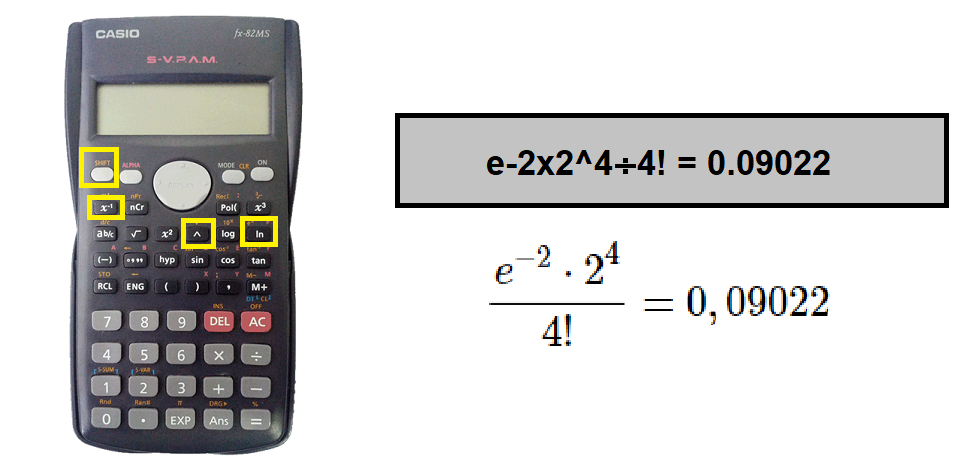

```{r setup, include=FALSE}
options(htmltools.dir.version = FALSE)
knitr::opts_chunk$set(echo=TRUE, message = FALSE, warning = FALSE, comment = "#>", fig.align = "center")
options
library(tidyverse)
```


### Variável Aleatória Discreta

Muitos experimentos  produzem resultados não numéricos, portanto, antes de analisá-los é conveniente transformar seus resultados em números. 

Para isso deve-se associar a cada resultado elementar $(e_i)$ do espaço amostral $(S)$ um número real, o que é feito por meio de uma regra ou função denominada **variável aleatória (v.a.)**.

**Exemplo** Considerando o cruzamento de dois organismos heterozigotos para o gene $A$, $Aa \times Aa$, os possíveis resultados são ilustrados em um espaço amostral com $4$ resultados elementares, ou seja:

$$S = \{AA,Aa,aA,aa\}$$
---

Agora defini-se $X$, como a variável aleatória, que é o número de alelos dominantes $A$. Tem-se:

```{r,out.width = "50%",fig.cap="",fig.align = 'center',echo=FALSE}
knitr::include_graphics("https://raw.githubusercontent.com/arpanosso/estatinfo/master/slides/img/va_d_01.png")
```

Note que para ser discreta, a variável aleatória (v.a.) deve assumir valores em um conjunto finito ou infinito, porém contável.

---
class: middle, center, inverse

# Distribuição de Probabilidade

---

### Distribuição de Probabilidade

É uma relação dos distintos valores $x_i$ da variável aleatória $X$ junto às suas respectivas probabilidades $P(x_i)$, com:


$$\sum \limits_{i=1}^nP(x_i) = 1$$

em que: $P(x_i)$ é chamada função de probabilidade, que a cada valor de $x_i$ associa a sua respectiva probabilidade de ocorrência.


#### Exemplo:

No cruzamento de dois organismos heterozigotos para o gene $A$, temos:

Genótipos | AA | Aa | aa | ** $\Sigma$ **
:---|:---:|:---:|:---:|---:
$X=x_i$ | $2$ | $1$ |  $0$ | -
$P(X=x_i)$ | $1/4$ | $1/2$| $1/4$| $1$

A distribuição de probabilidade mostra-nos como a probabilidade total $(1)$ é distribuída de acordo com os diferentes valores da variável aleatória $X$.

---

**Representação Gráfica**


```{r,plot_1,eval=FALSE}
library(tidyverse)
tibble(x=0:2,
       px = c(1/4, 1/2, 1/4) ) |> 
  ggplot(aes(x=x,y=px)) +
  geom_col(color="black",
           fill="gray")
```

---


```{r,plot_1,echo=FALSE}
```

---
class: middle, center, inverse

# Esperança Matemática

---

Seja uma população finita de $n$ indivíduos, e o evento $E$  denotado pelo número de alelos dominantes $A$. Calcule a frequência relativa para cada categoria.


```{r,echo=FALSE}
tibble(Genótipo=c("AA","Aa","aa"),
       x=2:0,
       px = c(1/4, 1/2, 1/4) ) |> 
  kableExtra::kable()
```
Lembrando que a média pode ser calculada a partir da frequência relativa:

$$\bar{x} = \sum \limits_{i=1}^k f_i \cdot x_i$$

Em que $k$ é o número de elementos no espaço amostral associado ao evento aleatório $X = x_i$.


---

Agora, pergunta-se: qual o número médio de genes $A$ esperado?


$$\bar{x} = \sum \limits_{i=1}^k f_i(x_i) = \frac{n_1}{n}(x_1)+\frac{n_2}{n}(x_2)+\frac{n_3}{n}(x_3)$$
$$\bar{x} =  \frac{1}{4}(0)+\frac{1}{2}(1)+\frac{1}{4}(2) = 0+\frac{1}{2}+\frac{1}{2} = 1$$
---

Considerando um modelo de população infinita $(n \to \infty)$ as frequências relativas $n_i/n$ $(i = 1, 2, 3)$ podem se aproximar de limites que são probabilidades $P(X = x_i) = P(x_i)$, onde: $x_i = \{2, 1, 0\}$, e se aproximará de um limite que é chamado **ESPERANÇA DE X** (isto é, o número esperado de genes $A$ em uma população infinita). O resultado pode ser generalizado na seguinte definição:


$$E(X) = \sum \limits_{i=1}^k x_i \cdot P(x_i)$$
**Definição**: A média de uma *v.a.* $X$ ou de sua distribuição de probabilidade, também chamada **valor esperado** ou **esperança matemática** ou simplesmente **esperança de $X$**, será definida como:

$$E(X) = \mu$$

assim:

$$E(X) = \sum \limits_{i=1}^k x_i \cdot P(x_i) = 0. \frac{1}{4} + 1.\frac{1}{2}+ 2.\frac{1}{4} = 1$$

---

### Propriedades da Esperança

Dado a variável aleatória $X$ e a constante $k$ as propriedades da esperança matemática são:

$i) E(k) = k$;

$ii) E(kX) = K \times E(X)$;

$iii) E(X+k) = E(X) + k$

$iv) E(k+k \cdot X) = k + k \times E(X)$


---

class: middle, center, inverse

# Variância de uma Variável Aleatória

---

### Definição

A variância de uma v.a. $X$ ou a medida de dispersão de sua distribuição de probabilidade, representada por $\sigma^2_X$, é definida por: 

$$\sigma^2 = Var(X) = E[(X - \mu)^2]$$

Podendo ser calculada como:

$$E[(X - \mu)^2] = \sum_{i=1}^k(x_i - \mu)^{2} . P(x_i)$$

#### ou

$$E[(X - \mu)^2] = E(X^2) - \mu^2 = \sum_{i=1}^n x_i^2 . P(x_i) - [E(X)]^2$$

---

### Exemplo

Qual a variância da distribuição de probabilidade da variável $X$ (número de alelos dominantes) a partir do cruzamento de dois organismos heterozigotos $Aa \times Aa$.

```{r,echo=FALSE}
tibble(Genótipo=c("AA","Aa","aa"),
       x=2:0,
       px = c("1/4", "1/2", "1/4") ) |> 
  kableExtra::kable()
```

Lembrado que a média $\bar{x} = 1$

$$
Var(X) \begin{cases}
  E[(X - \mu)^2] = (0-1)^2.\frac{1}{4} + (1-1)^2.\frac{1}{2} +(2-1)^2.\frac{1}{4} = \frac{1}{2}
 \\\
E[(X - \mu)^2] = E(X^2) - \mu^2 = \sum_{i=1}^k x_i.P(x_i) - [E(X)]^2 \\\
E[(X - \mu)^2] =\left( 0^2\frac{1}{4} + 1^2\frac{1}{2} + 2^2\frac{1}{4} \right) - 1^2 =\frac{1}{2}+1-1= \frac{1}{2}
\end{cases}
$$
---

### Propriedades da Variância

Dado a variável aleatória $X$ e a constante $k$ as propriedades das variâncias são:

$i) Var(X)$ não pode ser um número negativo;

$ii) Var(X + k) = Var(X)$;

$iii) Var(k \cdot X) = k^2Var(x)$

$iv) Var(k+k \cdot X) = k^2Var(x)$

---

### Prova da propriedade **(ii)**

Para demonstrar essa propriedade, vamos consider uma variável $Y$ , definida por $(X+k)$ e agora podemos definir a variância de $Y$:


$Var(Y) = E[(Y - \mu_Y)^2] = \sum_{i=1}^k(y_i - \mu_y)^{2} . P(y_i)$

$Var(Y) = \sum_{i=1}^n([x_i+k] - \mu_{[X+k]})^{2} . P([x_i + k])$

$Var(Y) = \sum_{i=1}^n(x_i+k - \mu_{x} - k)^{2} . P(x_i)$

$Var(Y) = \sum_{i=1}^n(x_i - \mu_{x} )^{2} . P(x_i) = Var(X)$

---

### Prova da propriedade **(iii)**

Para demonstrar essa propriedade, vamos consider uma variável $Y$ , definida por $(kX)$ e agora podemos definir a variância de $Y$:


$Var(Y) = E[(Y - \mu_Y)^2] = \sum_{i=1}^k(y_i - \mu_y)^{2} . P(y_i)$

$Var(Y) = \sum_{i=1}^n([kx_i] - \mu_{[kX]})^{2} . P(kx_i)$

$Var(Y) = \sum_{i=1}^n(kx_i - k\mu_{[X]})^{2} . P(x_i)$

$Var(Y) = \sum_{i=1}^n(k[x_i - \mu_{X}])^{2} . P(x_i)$

$Var(Y) = \sum_{i=1}^nk^2(x_i - \mu_{X})^{2} . P(x_i)$

$Var(Y) = k^2\sum_{i=1}^n(x_i - \mu_{X})^{2} . P(x_i)$

$Var(Y) = k^2\sum_{i=1}^n(x_i - \mu_{X})^{2} . P(x_i)$

$Var(Y) = k^2Var(X)$

---

### Demonstração no R

```{r}
X<- 0:2
px<-c(1/4,1/2,1/4)

# Esperança
E_X <- sum(X*px)
E_X

# Variância
Var_X <- sum(X^2*px) - E_X^2
Var_X
```

---

Dado $k = 5$, temos agora duas variáveis $Y = X+k$ e $Z = k.X$.

1) Pelas propriedades da variância sabemos que:

$Var(Y) = Var(X) = 0,5$

Prova:

```{r}
k <- 5
Y <- k+X
Var_Y = sum(Y^2*px) - (sum(Y*px))^2
Var_Y
```

2) Pelas propriedades da variância sabemos que:

$Var(Z) = k^2Var(X) = 5^2.0,5 = 12,5$

Prova:
```{r}
Z <- k*X
Var_Z = sum(Z^2*px) - (sum(Z*px))^2
Var_Z
```

---

### Exercício 

Um revendedor de produtos agropecuários recebe de vários laboratórios certo tipo de antibiótico, que tem custo diferenciado. Levando-se em conta a proporção fornecida e o preço apresentado por cada laboratório, pode-se considerar que o custo de uma dose de antibiótico em reais, escolhida ao acaso, é uma variável aleatória $C$. Admitindo a seguinte distribuição de probabilidade para $C$:

$c_i$ | $1,00$ | $1,10$ | $1,20$ | $1,30$ | $1,40$
:---|:---:|:---:|:---:|:---:|:---:
$P(c_i)$| $0,20$ | $0,30$ | $0,20$ | $0,20$ | $0,10$ 


a) Determinar a esperança (média) e a variância da variável aleatória $C$:

b) Supondo que o revendedor venda cada um desses antibióticos acrescentando $50\%$ sobre o custo, além de um adicional de `R$` $0,10$ pelo frete, calcular a média e a variância da nova variável aleatória preço de revenda $R$.

---

### Resposta

a)   
$E(C) = 1,17$ reais

$Var(C) = 0,016$ reais²


b)  

$E(R) = 1,855$ reais

$Var(R) = 0,036$ reais²

---

class: middle, center, inverse

# Distribuições Teóricas de Probabilidade de Variáveis Aleatórias Discretas

---

### Definição

O modelo probabilístico da variável aleatória $X$, é a forma específica de função de distribuição de probabilidade que reflete o comportamento de $X$.

1. Distribuição de Bernoulli

2. Distribuição Binomial 

3. Distribuição de Poisson

---
  

# Distribuição de Bernoulli

```{r,out.width = "40%",fig.cap="",fig.align = 'center',echo=FALSE}
knitr::include_graphics("https://raw.githubusercontent.com/arpanosso/estatinfo/master/slides/img/bernoulli_1.png")
```

---
### Distribuição de Bernoulli

Essa distribuição é caracterizada por uma única realização de um experimento aleatório, onde há somente dois resultados possíveis, designados por: **Sucesso (S)** ou **Fracasso (F)**.

**Exemplos**: 

a) testa-se um antibiótico em um indivíduo, a reação (v.a.) ou é positiva (S) ou é negativa (F);

b) uma planta é escolhida, ao acaso, em um pomar e observa-se se essa planta é doente (v.a.) (S) ou não (F).

Assim, para cada experimento, podemos definir uma variável aleatória $X$: o número de sucessos, que assume apenas dois valores, o valor $1$ se ocorre sucesso $(S)$ e o valor $0$ (zero) se ocorre fracasso $(F)$, sendo $P(S) = p$, $0 < p <1$, ou seja:


$$
X \begin{cases}
0(F) \\\
1(S)
\end{cases}
$$

com $P(X=1) = p$ e $P(X=0) = 1-p = q$

---

### Definição

Nestas condições, a variável aleatória $X$ tem a função de probabilidade

$X$ | $P(X)$
:---: | :---:
1 | p 
0 | q

Com função de probabilidade dada por:

$$P(X=x) = p^x \cdot q^{1-x}$$
.pull-left[
#### Esperança
$E(X) = \sum x_i P(x_i)$

$E(X) = 0(q) + 1(p)$

$E(X) = p$
]

.pull-right[
#### Variância

$Var(X) = E(X^2) - [E(X)]^2$

$Var(X) = (0^2.q + 1^2.p) - p^2$

$Var(X) = p - p^2$

$Var(X) = p(1 - p) = p.q$
]

---
### Exemplo

.pull-left[

Dado $p =0,7$, construa a distribuição de probabilidade dessa variável e calcule a esperança e a variância dessa distribuição.

```{r,plot_2,eval=FALSE}
p <- 0.7
q <- 1-p
x <- 0:1
px <- c(q,p)
tibble(x,px) |> 
  ggplot(aes(x=x,y=px)) +
  geom_col(color="black",
           fill="lightgray")
```

]

.pull-right[

```{r,plot_2,echo=FALSE}
```
]

$$E(X) = p = 0,7$$  


$$Var(X) = p.q = 0,7 . 0,3 = 0,21$$

---

class: middle, center, inverse

# Distribuição Binomial

---

## Distribuição Binomial

### Definição

Quando um número fixo $n$ de ensaios de *Bernoulli* são repetidos, supondo que as repetições sejam *independentes* com $P(S) = p$ em cada ensaio, a variável aleatória $X$ representa a contagem (soma) do número de sucessos em $n$ ensaios. 

Os possíveis valores de $X$ são os inteiros $0, 1, 2,..., n$. A distribuição de probabilidade de $X$ é chamada **DISTRIBUIÇÃO BINOMIAL* com $n$ ensaios e probabilidade de sucesso $p$. 

---

**Exemplo**: No lançamento de uma moeda, vamos definir como Sucesso o evento *cair a face cara*:

```{r,out.width = "70%",fig.cap="",fig.align = 'center',echo=FALSE}
knitr::include_graphics("https://raw.githubusercontent.com/arpanosso/estatinfo/master/slides/img/binomial_1.png")
```


Para deduzir uma fórmula para $P(X = x)$, consideremos o lançamento de $3$ moedas ( $n = 3$ ensaios), cada um dos quais podendo resultar em $S$ (H - cara) ou $F$ (T - coroa). 
Há $2 × 2 × 2 = 8$ resultados possíveis, os quais estão relacionados nas colunas de acordo com o número de sucessos $(S)$:

---
Uma característica interessante dos experimentos considerados é que estamos interessados apenas no número total de sucessos e não na ordem que eles ocorrem. Segue abaixo o diagrama de árvore das probabilidades binomiais no lançamento de 3 moedas, ou seja, $n=3$ e $P(S) = p$ e $P(F) = q$.

```{r,out.width = "60%",fig.cap="",fig.align = 'center',echo=FALSE}
knitr::include_graphics("https://raw.githubusercontent.com/arpanosso/estatinfo/master/slides/img/binomial_2.png")
```

---

```{r,out.width = "100%",fig.cap="",fig.align = 'center',echo=FALSE}
knitr::include_graphics("https://raw.githubusercontent.com/arpanosso/estatinfo/master/slides/img/binomial_3.png")
```

---

### Obtenção das sequências

Como os ensaios são independentes, com $P(S) =p$ e $P(F) = q$, os fatores: $1, 3, 3, 1$ são obtido por meio do **"teorema da expansão binomial"**:

$$(a+b)^n = {n \choose 0}a^n + {n \choose 1}a^{n-1}b + {n \choose 2}a^{n-2}b^2 + \dots + {n \choose n}b^n$$

### Função de Distribuição Binomial

Assim, a função de distribuição binomial é:

$$P(X=x) = {n \choose x}p^x \cdot q^{n-x}$$

### Denotação

$$b(n,p) \text{ onde } \sum \limits_{i=0}^n b(n,p) = 1$$

---

Se $X$ é uma variável aleatória com distribuição Binomial ela apresenta:
 
**Esperança**:  $E(X) = n \cdot p$ e **Variância**: $Var(X) = n \cdot p \cdot q$

---
E se, ao invés de $3$ moedas, tivéssemos $4$ moedas?

```{r,out.width = "100%",fig.cap="",fig.align = 'center',echo=FALSE}
knitr::include_graphics("https://raw.githubusercontent.com/arpanosso/estatinfo/master/slides/img/binomial_4.png")
```

Qual a probabilidade do número de caras ser igual ao número de coroas?

**R**: Dado que a moeda é honesta, ou seja, $P(H) = \frac{1}{2}$, temos que o $x=2$ e $n=4$, aplicando a função de probabilidade Binomial $b(4;0.5)$:

$P(X=x) = {n \choose x}p^x \cdot q^{n-x}$

$P(X=2) = {4 \choose 2} \left(\frac{1}{2}\right)^2 \cdot \left(\frac{1}{2}\right)^{4-2}  = 0,375$
---

class: middle, center

**Montando a fórmula na calculadora científica**


---

No R podemos utilizar a função `dbinon()` com os argumentos $x$, $n$ e $p$ a probabilidade de sucesso.
.pull-left[
```{r,eval=FALSE}
n <- 4
x <- 0:n
p<-1/2
px<-dbinom(x,n,p)
tibble(x,px)
```

```{r,echo=FALSE}
n <- 4
x <- 0:n
p<-1/2
px<-dbinom(x,n,p)
tibble(x,px) %>%  
  kableExtra::kable()
```
]

.pull-right[

```{r}
tibble(x,px) %>%  
  ggplot(aes(x=x,y=px)) +
  geom_col(color="black",
           fill="gray")
```
]

---

### Estudo do parâmetro (p)

A distribuição binomial é **simétrica** se o valor de $p$ em um histograma tem o mesmo valor de $q$ em outro, as probabilidades são exatamente as mesmas, mas dispostas de forma invertida. 

A propriedade geral da distribuição binomial: quando $p$ e $q$ são alternados, a distribuição de probabilidades é invertida, então:

$$b(x,n,p) = b(n-x,n,1-p)$$

---
.pull-left[
```{r,echo=FALSE}
n <- 5
x <- 0:n
p<-.7
px<-dbinom(x,n,p)
tibble(x,px) |>   ggplot(aes(x=x,y=px)) +
  geom_col(color="black",fill="gray")+
  labs(title = "b(5,0.7)")+
  theme(plot.title = element_text(hjust = 0.5))
```

```{r,echo=FALSE}
tibble(x,px) |> 
  tidyr::pivot_wider(names_from = x,
                     values_from = px)  |> 
  kableExtra::kable()
```


]

.pull-right[
```{r,echo=FALSE}
n <- 5
x <- 0:n
p<-1-p
px<-dbinom(x,n,p)
tibble(x,px) |>   ggplot(aes(x=x,y=px)) +
  geom_col(color="black",fill="gray")+
  labs(title = "b(5,0.3)")+
  theme(plot.title = element_text(hjust = 0.5))
```


]

```{r,echo=FALSE}
tibble(x,px) |> 
  tidyr::pivot_wider(names_from = x,
                     values_from = px)  |> 
  kableExtra::kable()
```
---
### Exercícios

1) Seis moedas são jogadas uma vez (ou, o que representa a mesma coisa), uma moeda é jogada $6$ vezes. Achar a probabilidade de obter cara:  
 a) exatamente $3$ vezes;  
 
 b) no máximo $3$ vezes;  
 
 c) pelo menos $3$ vezes;  
 
 d) pelo menos $1$ vez.  

--

### Respostas
a) $0,3125$  
b) $0,6562$  
c) $0,6562$  
d) $0,9844$  

---

2) Uma urna contém bolas brancas e pretas na proporção $2$ para $3$. Chamemos sucesso a probabilidade de tirar uma bola branca. Três bolas são tiradas separadamente e depois de cada tirada a bola é retornada à urna e completamente misturada com as outras, de tal modo que a probabilidade fundamental do sucesso permanece constante durante as tentativas. 

Achar a probabilidade de $0, 1, 2 e 3$ sucessos. 

Calcule a esperança e a variância dessa distribuição de probabilidade.

---

**Respostas**

$P(S) = p = \frac{2}{5}$ e, portanto, $P(F) = q = \frac{3}{5}$ 

```{r,echo=FALSE,out.width="50%",out.height="50%"}
n <- 3
x <- 0:n
p<-2/5
px<-dbinom(x,n,p)
tibble(x,px) |>   ggplot(aes(x=x,y=px)) +
  geom_col(color="black",fill="gray")+
  labs(title = "b(5,0.3)")+
  theme(plot.title = element_text(hjust = 0.5))
```

```{r,echo=FALSE}
tibble(x,px) %>%  
    tidyr::pivot_wider(names_from = x,
                     values_from = px) %>% 
  kableExtra::kable()
```


$E(X) = 1,2$   
$Var(X) = 0,72$

---
3) Uma urna contém $52$ bolas sendo $13$ brancas e $39$ pretas.

 a) Qual a probabilidade de se tirarem $6$ bolas brancas, uma a uma, retornando a bola à urna após cada retirada?  
 
 
 b) Calcule a esperança e a variância dessa distribuição de probabilidade.  
 
 c) Nas mesmas condições da questão anterior, qual a probabilidade de se terem $5$ brancas e $1$ preta? 

---

**Respostas**

$P(S) = p = \frac{13}{52}$ e, portanto, $P(F) = q = \frac{39}{52}$ 

```{r,echo=FALSE,out.width="40%",out.height="40%"}
n <- 6
x <- 0:n
p<-13/52
px<-dbinom(x,n,p)
tibble(x,px) |>   ggplot(aes(x=x,y=px)) +
  geom_col(color="black",fill="gray")+
  labs(title = "b(5,0.25)")+
  theme(plot.title = element_text(hjust = 0.5))
```

```{r,echo=FALSE}
tibble(x,px) %>%  
    tidyr::pivot_wider(names_from = x,
                     values_from = px) %>% 
  kableExtra::kable()
```


a) $0,0002441$;  
b) $E(X) = 1,5$ e $Var(X) = 1,125$;  
c) $0,0043945$

---

class: middle, center, inverse

# Distribuição de Poisson

---
### Distribuição de Poisson

O comportamento de variáveis aleatórias, as quais representam o número de ocorrências de eventos em um intervalo de tempo ou no espaço, pode ser descrito pela chamada distribuição de **Poisson**, cuja função de probabilidade é:

### Função de Distribuição Poisson é:

$$P(X=x) = \frac{e^{-\lambda} \lambda^x}{x!}$$

Onde $e = 2,71828$ e $\lambda$ é o parâmetro da distribuição que representa o número médio (taxa) de ocorrências do evento por unidade de tempo ou espaço.

### Denotação

$$X \sim Po(\lambda) \text{ , onde } \sum \limits_{x=0}^\infty Po(\lambda) = 1$$
---

### Definição 

A variável aleatória $X$ com distribuição de Poisson apresenta:

**Esperança**: 

$$E(X) = \lambda$$ 

e **Variância**: 

$$Var(X) = \lambda$$

Ou seja, o número médio e a variância de ocorrências de eventos por unidade de tempo (ou espaço) são iguais $(\lambda)$ e constantes ao longo do tempo (ou espaço).

---


**Exercício 1)** Em uma população, seja $X$ o número de descendentes produzidos por família/geração. Assumindo que Média = $\lambda = 2$, pergunta-se:

Qual a probabilidade de, em um sorteio ao acaso, selecionar-se um família com  $X= 4$ descendentes?

```{r,echo=FALSE,out.width="60%"}
n <- 10
x <- 0:n
lambda <- 2
px <- dpois(x,lambda)
tibble(x,px) |>
  mutate(px2 = ifelse(x==4,px,0) ) |> 
  ggplot(aes(x=x,y=px)) +
  geom_col(color="black",fill="lightblue") +
  geom_col(aes(x=x,y=px2),color="red",fill="yellow") +
  theme_bw()
```
---

class: middle, center


$$P(X=4) = \frac{e^{-2} \cdot 2^4}{4!} = 0,09022$$


**Montando a fórmula na calculadora científica**



---
**Exercício 2)** Suponha que o número de partículas *alfa*, emitidas por minuto seja uma variável aleatória segundo um modelo de Poisson com parâmetro $\lambda = 5$, isto é, a taxa média de emissão é de $5$ partículas a cada minuto. 

a) Calcule a probabilidade de haver mais de $2$ emissões em um minuto.


```{r,out.width = "60%",fig.cap="",fig.align = 'center',echo=FALSE}
knitr::include_graphics("https://media.giphy.com/media/3ov9jQWd5qhiUSPDri/giphy.gif")
```

---

.pull-left[
```{r,echo=FALSE}
n <- 20
x <- 0:n
lambda <- 5
px <- dpois(x,lambda)
tibble(x,px) |>
  mutate(px2 = ifelse(x>2,px,0) ) |> 
  ggplot(aes(x=x,y=px)) +
  geom_col(color="black",fill="lightblue") +
  geom_col(aes(x=x,y=px2),color="red",fill="yellow") +
  theme_bw()
```
]

.pull-right[
Assim temos que:

Se $P(S) = \sum \limits_{i=1}^\infty \frac{e^{-\lambda}\lambda^x}{x!}$, então:

$P(x >2 ) = 1 - \sum \limits_{i=0}^2\frac{e^{-\lambda}\lambda^x}{x!}$

]

$P(x >2 ) = 1 - [P(X=0) + P(X=1) + P(X=2)]$

$P(x >2 ) = 1-[\frac{e^{-5}5^0}{0!} + \frac{e^{-5}5^1}{1!}+\frac{e^{-5}5^2}{2!}]=0,87535$

---

b) Calcule a probabilidade da emissão de até $4$ partículas em $2$ minutos. 


.pull-left[
```{r,echo=FALSE}
n <- 20
x <- 0:n
lambda <- 5*2
px <- dpois(x,lambda)
tibble(x,px) |>
  mutate(px2 = ifelse(x<=4,px,0) ) |> 
  ggplot(aes(x=x,y=px)) +
  geom_col(color="black",fill="lightblue") +
  geom_col(aes(x=x,y=px2),color="red",fill="yellow") +
  theme_bw()
```
]

.pull-right[

Se o intervalo de tempo é alterado a variável aleatória mantém a mesma distribuição de Poisson, mas com o valor de parâmetro ajustado de forma conveniente. 

Por exemplo, se o período de tempo considerado para o exemplo anterior for de $2$ minutos, teremos que o número de partículas emitidas em dois minutos terá distribuição: $\lambda'= 2 \times 5 = 10$ partículas em dois minutos.


$$P(X \le 4) = 0,029252$$
]

---
**Exercício 3)** Supondo que o número médio de bactérias por litro de água purificada é $2$, qual é a probabilidade que $5$ ou mais bactérias sejam encontradas em uma amostra de $3$ litros de água?
--
.pull-left[
```{r,echo=FALSE}
n <- 20
x <- 0:n
lambda <- 3*2
px <- dpois(x,lambda)
tibble(x,px) |>
  mutate(px2 = ifelse(x>=5,px,0) ) |> 
  ggplot(aes(x=x,y=px)) +
  geom_col(color="black",fill="lightblue") +
  geom_col(aes(x=x,y=px2),color="red",fill="yellow") +
  theme_bw()
```
]

.pull-right[
Se o volume é alterado a variável aleatória mantém a mesma distribuição de Poisson, se o volume for de $3$ litros, teremos que o número de bactérias observado terá distribuição: $\lambda'= 3 \times 2 = 6$ bactérias por litro.

$$P(X \ge 5) =1 - \sum_{i=0}^4 \frac{e^{-\lambda}\lambda^x}{x!} = 0,7149$$
]

---

### Distribuição de Poisson como aproximação da Distribuição Binomial

Algumas vezes, no uso da distribuição binomial, ocorre que $n$ é muito grande e $p$ é muito pequeno, de modo que $q$ é próximo de $1$. Em tais casos, o cálculo torna-se muito difícil. Pode-se, então, fazer uma aproximação da distribuição Binomial pela Poisson, por meio de:

$$\lambda = n \cdot p$$

Função de Distribuição: 

$$b(n,p) \sim \frac{e^{-n.p}(n.p)^x}{x!}$$

A aproximação é boa, se $n \cdot p = \lambda \le 7$.

Nestas condições, a variável aleatória $X$ com distribuição Binominal aproximada pela  Poisson apresenta:


**Esperança**: $E(X) = n \cdot p$ 

**Variância**: $Var(X) = n \cdot p$

---
**Exercício 4)** Sabendo-se que a probabilidade de um ser humano ter reação negativa à uma vacina é de $0,001$, determinar a probabilidade de que, de $2000$ pessoas vacinadas, mais do que $4$ pessoas tenham reação negativa?

--

$n \times p = \lambda =2000 \times 0,001 = 2$

$P(X > 4)= 1 - P(X \le 4) = 1 - \sum \limits_{i=0}^{4}Po(2)$

$P(X > 4)= 1 - P(X \le 4) = 1 - \sum \limits_{i=0}^{4}Po(2)=0,0526$

```{r}
n <- 2000 
lambda <- n*0.001
1-ppois(4,lambda)
```


