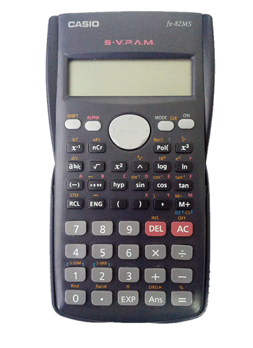

.pull-left[

</img>

]

.pull-right[

**ALAN RODRIGO PANOSSO**  

**Professor Assistente Doutor ** 

Departamento de Engenharia e Ciências Exatas  

E-mail: <alan.panosso@unesp.br>   

Tel: (16) 3209-7210  
]

**Formação**

$^{[1]}$ Engenheiro Agrônomo formado pela FCAV/Unesp Jaboticabal (2000-2004)

$^{[2]}$ Mestre em Agronomia (Ciência do Solo) pelo programa de Pós-Graudação da FCAV/Unesp Jaboticabal (2005-2006). 

$^{[3]}$ Doutor em Agronomia (Produção Vegetal) pelo programa de Pós-Graudação da FCAV/Unesp Jaboticabal (2007-2011).

$^{[4]}$ Pós-Doutorado em Agronomia (Ciência do Solo) pela FCAV/Unesp Jaboticabal (2011 - 2013).

Fonte: [https://www.fcav.unesp.br/#!/alan](https://www.fcav.unesp.br/#!/alan)

---

## Ementa

- Noções de programação
- Introdução
- Estatística Descritiva
- Ditribuições de Probabilidade
- Amostragem
- Estimação de Parâmetros
- Teste de hipóteses e intervalos de confiança
- Correlação e regressão linear simples

---

## Objetivos

- Resumir  e  apresentar  dados  por meio de  tabelas,  gráficos  e  medidas.  

- Inferir  resultados  amostrais para as populações alvo por meio de  técnicas estatísticas apropriadas.

- Utilizar as ferramentas computacionais para apresentação dos resumos e análises de dados.

---

## Avaliação 

Serão  realizados **02  Provas** ( $P1$ e $P2$) e serão atribuídas listas de exercícios que deverão ser entregues no **Google Classroom**. Ao final da disciplina as listas serão utilizadas para compor a nota da **Listas Semanais** $LS$. 

A  nota  de  aproveitamento da disciplina será  a  média  ponderada  das notas dos trabalhos e listas, dada por:

$$
\text{Nota Final} = \frac{LS+3 \cdot P1 + 4 \cdot P2}{8}
$$

onde: $P1$ = Nota da 1ª prova; $P2$ = Nota do 2ª Prova; $LS$ = Nota das listas de exercícios entregues durante a disciplina.

---

| Dia	| Semana	| Conteúdo |  
|:--- | :---: | :---:|
| 09/03/2023	| 1 | Apresentação da Disciplina e Noções de Programação | 
| 16/03/2023	| 2 | Introdução à Estatística	
| 23/03/2023	| 3 | Medidas estatísticas	
|30/03/2023	| 4 | Probabilidade	
|06/04/2023	| 5 | Variáveis aleatórias discretas	
|13/04/2023	| 6 | Variáveis aleatórias contínuas	
|**20/04/2023**	| **7** | **Prova 01** 
|27/04/2023	| 8 | Estatística e distribuição amostral	
|04/05/2023	| 9 | Estimação	
|11/05/2023	| 10 | Testes de hipóteses	
|18/05/2023	| 11 | Comparação de parâmetros de duas populações 	
|25/05/2023 | 12 | XLVIII SECITAP
|01/06/2023	| 13 | Correlação e regressão	
|**15/06/2023**	| **14** | **Prova 02** $\leftarrow$		
|**22/06/2023**	| **15** | **Prova Substitutiva**	$\leftarrow$	
|**29/06/2023**	| **16** | **Período de Recuperação**	$\leftarrow$	

---

## Metodologia de Ensino

- Aulas teóricas expositivas.

- Vídeos de aula teóricas de anos anteriores serão disponibilizadas (**Google Classroom**).

- Serão utilizados vídeos gravados pelo professor disponíveis no YouTube <https://www.youtube.com/channel/UCCJBXRV7CbfkcyaIixp0CqQ>

- Resolução de listas de exercícios (**Google Classroom**).  

- Apostila didática [Baixar Apostila](https://www.fcav.unesp.br/Home/departamentos/cienciasexatas/alanrodrigopanosso/apostila_bioestatistica_2019.pdf)

- Material Didático: [Link](https://www.fcav.unesp.br/#!/departamentos/ciencias-exatas/docentes/alan-rodrigo-panosso/material-didatico/estataistica-e-informatica/)

- Consulta a livros.

---

## Bibliografia básica

BUSSAB, W. O.; MORETTIN, P. A. **Estatística Básica**. 5 ed.  São Paulo: Saraiva, 2002.  p. [LINK](https://www.amazon.com.br/Estat%C3%ADstica-B%C3%A1sica-Wilton-Bussab/dp/8547220224/ref=asc_df_8547220224/?tag=googleshopp00-20&linkCode=df0&hvadid=379748610448&hvpos=&hvnetw=g&hvrand=13078554075477532168&hvpone=&hvptwo=&hvqmt=&hvdev=c&hvdvcmdl=&hvlocint=&hvlocphy=1031739&hvtargid=pla-811770768458&psc=1)

FORBELLONE A. L.; EBERSPACHER, H. **Lógica de Programação: A Construção de Algoritmos e Estruturas de Dados**. São Paulo: Editora Pearson Universidades, 2005. 218 p. [LINK](https://www.amazon.com.br/L%C3%B3gica-programa%C3%A7%C3%A3o-constru%C3%A7%C3%A3o-algoritmos-estruturas/dp/8576050242/ref=sr_1_2?__mk_pt_BR=%C3%85M%C3%85%C5%BD%C3%95%C3%91&crid=10ANF2PLKU3KG&keywords=l%C3%B3gica+de+programa%C3%A7%C3%A3o+a+constru%C3%A7%C3%A3o+de+algoritmos&qid=1678318256&sprefix=l%C3%B3gica+de+programa%C3%A7%C3%A3o+a+constru%C3%A7%C3%A3o+de+algoritmo%2Caps%2C241&sr=8-2&ufe=app_do%3Aamzn1.fos.6121c6c4-c969-43ae-92f7-cc248fc6181d)

MAGALHÃES, M. N.; LIMA, A. C. P. **Noções de Probabilidade e Estatística**.  São Paulo: Editora da Universidade de São Paulo, 2005. 392 p. [LINK](https://www.amazon.com.br/No%C3%A7%C3%B5es-Probabilidade-Estat%C3%ADstica-Nascimento-Magalh%C3%A3es/dp/8531406773/ref=asc_df_8531406773/?tag=googleshopp00-20&linkCode=df0&hvadid=379712528301&hvpos=&hvnetw=g&hvrand=3043005081199790255&hvpone=&hvptwo=&hvqmt=&hvdev=c&hvdvcmdl=&hvlocint=&hvlocphy=1031739&hvtargid=pla-422923055890&psc=1)

BLAIR, R. C.; TAYLOR, R. A. **Bioestatística para ciências da saúde**.  São Paulo: Pearson Education do Brasil, 2013. 469 p. [LINK](https://www.submarino.com.br/produto/1368960931/livro-bioestatistica-para-ciencias-da-saude?WT.srch=1&acc=d47a04c6f99456bc289220d5d0ff208d&epar=bp_pl_00_go_g35177&gclid=Cj0KCQjw1PSDBhDbARIsAPeTqretIWgohh4CuyLOwGdNd-W56zb9kfuDNz9YaVg3KmFtZXGWyZuk1REaAhW-EALw_wcB&i=561e53416ed24cafb5322074&o=5ec29a42f8e95eac3dc7d8f4&opn=XMLGOOGLE&sellerid=03)

BATSCHELET, E. **Introdução à matemática para biocientistas**.  São Paulo: Ed. Da Universidade de São Paulo., 1978. 596 p. [LINK](https://www.amazon.com.br/Introdu%C3%A7%C3%A3o-%C3%A0-Matem%C3%A1tica-Para-Biocientistas/dp/8571930295/ref=asc_df_8571930295/?tag=googleshopp00-20&linkCode=df0&hvadid=379751745514&hvpos=&hvnetw=g&hvrand=15178690494420387835&hvpone=&hvptwo=&hvqmt=&hvdev=c&hvdvcmdl=&hvlocint=&hvlocphy=1031739&hvtargid=pla-836184941200&psc=1)

---
class: middle, center

## Ferramentas de trabalho

Calculadora Científica Cassio  *fs-82MS*
 
---
class: middle, center

# Linguagem Computacional de Alto Nível

 
---

##  Instalação do R e do RStudio

<iframe width="853" height="480" src="https://www.youtube.com/embed/AqTzQzuQUPw?list=PLkhAqI7pygoYy6zhepFnF7KDK5jJSQUEv" title="Curso R - Aula 01 - Instalação do R e do RStudio" frameborder="0" allow="accelerometer; autoplay; clipboard-write; encrypted-media; gyroscope; picture-in-picture; web-share" allowfullscreen></iframe>

---

## Configurando o RStudio

<iframe width="853" height="480" src="https://www.youtube.com/embed/ehXn5keH9C8?list=PLkhAqI7pygoYy6zhepFnF7KDK5jJSQUEv" title="Curso R - Aula 02 - Configurando o RStudio" frameborder="0" allow="accelerometer; autoplay; clipboard-write; encrypted-media; gyroscope; picture-in-picture; web-share" allowfullscreen></iframe>
