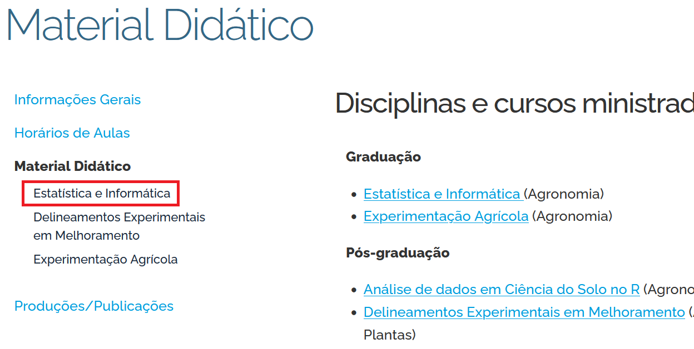
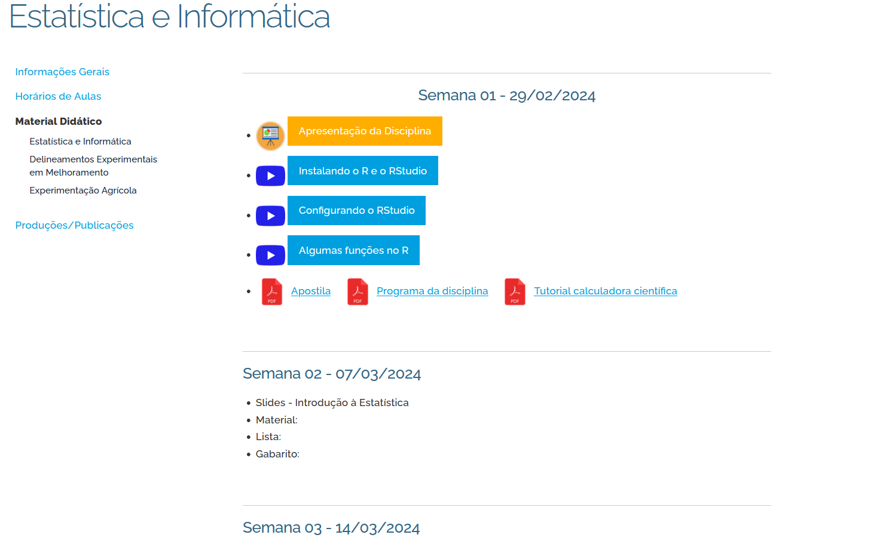
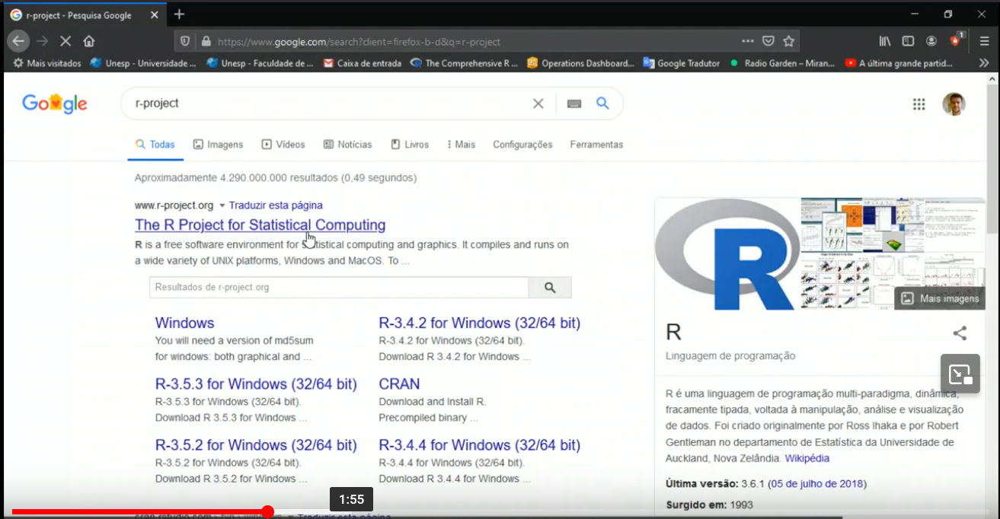
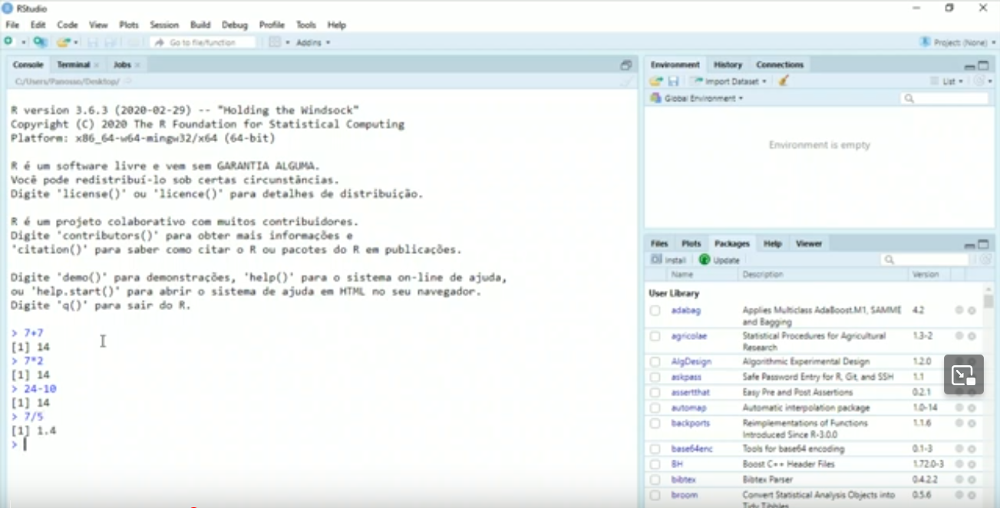
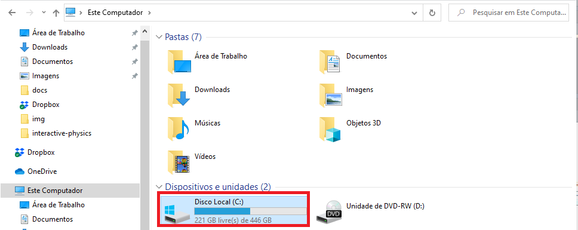
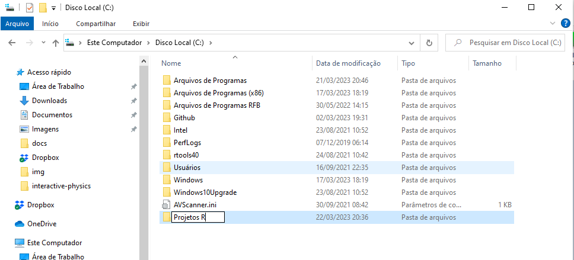
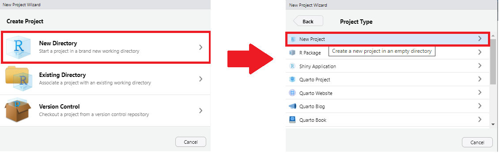
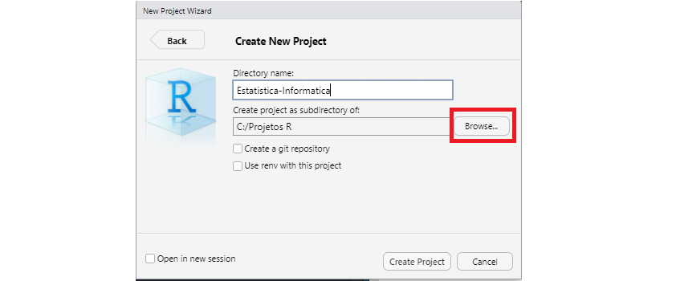
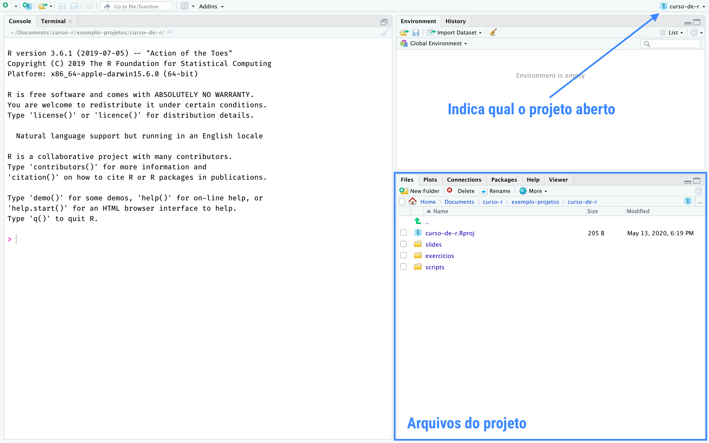
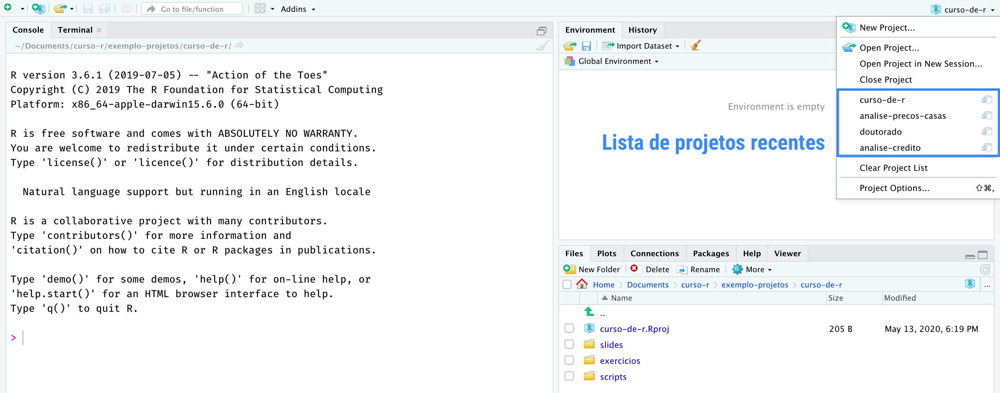

**ALAN RODRIGO PANOSSO**  

**Professor Assistente Doutor ** 

Departamento de Engenharia e Ciências Exatas  

E-mail: <alan.panosso@unesp.br>   

Tel: (16) 3209-7210  


**Formação**

$^{[1]}$ Engenheiro Agrônomo formado pela FCAV/Unesp Jaboticabal (2000-2004)

$^{[2]}$ Mestre em Agronomia (Ciência do Solo) pelo programa de Pós-Graudação da FCAV/Unesp Jaboticabal (2005-2006). 

$^{[3]}$ Doutor em Agronomia (Produção Vegetal) pelo programa de Pós-Graudação da FCAV/Unesp Jaboticabal (2007-2011).

$^{[4]}$ Pós-Doutorado em Agronomia (Ciência do Solo) pela FCAV/Unesp Jaboticabal (2011 - 2013).

$^{[5]}$ Livre Docente (Experimentação Agrícola) pelo Departamento de Engenharia e Ciências Exatas da FCAV/Unesp Jaboticabal (2023).

https://www.fcav.unesp.br/#!/alan

---

## Material Didático

#### 01 - Acesse: https://www.fcav.unesp.br/alan .


---

## Material Didático

##### 02 - Selecione **Material Didático** no menu lateral.


---

##### 03 - Selecione **Estatística e Informática** .




---

#### Material Didático

Você terá acesso à página da disciplina com todo o material que será utilizado durante o curso, como apresentações de slides, apostilas, tabelas, listas, vídeos e calendário com as aulas programadas, inclusive os dias das avaliações.


---
## Ementa da disciplina

- Introdução
- Estatística Descritiva
- Ditribuições de Probabilidade
- Amostragem
- Estimação de Parâmetros
- Teste de hipóteses e intervalos de confiança
- Correlação e regressão linear simples

---

## Objetivos

- Resumir  e  apresentar  dados  por meio de  tabelas,  gráficos  e  medidas.  

- Inferir  resultados  amostrais para as populações alvo por meio de  técnicas estatísticas apropriadas.

- Utilizar as ferramentas computacionais para apresentação dos resumos e análises de dados.

---

## Avaliação 

Serão  realizados **02  Provas** ( $P1$ e $P2$ ). 

A  nota  de  aproveitamento da disciplina será  a  média  ponderada  das notas dos trabalhos e listas, dada por:

$$
\text{Nota Final} = \frac{2 \cdot P1 + 3 \cdot P2}{5}
$$

onde: 

$P1$ = Nota da 1ª prova; 

$P2$ = Nota do 2ª Prova

---

| Dia	| Semana	| Conteúdo |  
|:--- | :---: | :---:|
| 29/02/2024	| 1 | Apresentação da Disciplina 
| 07/03/2024	| 2 | Introdução à Estatística	
| 14/03/2024	| 3 | Medidas Estatísticas	
| 21/03/2024	| 4 | Probabilidade	 Parte I
| 28/03/2024	| 5 | Probabilidade	 Parte II 	
| 04/04/2024	| 6 | Variáveis Aleatórias Discretas	
| 11/04/2024	| 7 | Variáveis Aleatórias Contínuas	
|**18/04/2024**	| **8** | **Prova 01** $\leftarrow$
| 25/04/2024	| 9 | Estatística e Distribuição Amostral	
| 02/05/2024	| 10 | Estimação	
| 09/05/2024	| 11 | Testes de Hipóteses	
| 16/05/2024	| 12 | XLIX SECITAP	
| 23/05/2024 | 13 | Comparação de Parâmetros
| 06/06/2024	| 14 | Correlação e Regressão	
|**13/06/2024**	| **15** | **Prova 02** $\leftarrow$		
|**20/06/2024**	| **16** | **Prova Substitutiva**	$\leftarrow$	
|**27/06/2024**	| **17** | **Período de Recuperação**	$\leftarrow$	

---

## Metodologia de Ensino

- Aulas teóricas expositivas.

- Vídeos de aulas teóricas de anos anteriores serão disponibilizadOs.

- Resolução de listas de exercícios.  

- Apostila didática [Baixar Apostila](https://www.fcav.unesp.br/Home/departamentos/cienciasexatas/alanrodrigopanosso/apostila_bioestatistica_2019.pdf)

- Material Didático: [Link](https://www.fcav.unesp.br/#!/departamentos/ciencias-exatas/docentes/alan-rodrigo-panosso/material-didatico/estatistica-e-informatica/)

- Consulta a livros.

---

## Bibliografia básica

BUSSAB, W. O.; MORETTIN, P. A. **Estatística Básica**. 5 ed.  São Paulo: Saraiva, 2002.  p. [LINK](https://www.amazon.com.br/Estat%C3%ADstica-B%C3%A1sica-Wilton-Bussab/dp/8547220224/ref=asc_df_8547220224/?tag=googleshopp00-20&linkCode=df0&hvadid=379748610448&hvpos=&hvnetw=g&hvrand=13078554075477532168&hvpone=&hvptwo=&hvqmt=&hvdev=c&hvdvcmdl=&hvlocint=&hvlocphy=1031739&hvtargid=pla-811770768458&psc=1)

FORBELLONE A. L.; EBERSPACHER, H. **Lógica de Programação: A Construção de Algoritmos e Estruturas de Dados**. São Paulo: Editora Pearson Universidades, 2005. 218 p. [LINK](https://www.amazon.com.br/L%C3%B3gica-programa%C3%A7%C3%A3o-constru%C3%A7%C3%A3o-algoritmos-estruturas/dp/8576050242/ref=sr_1_2?__mk_pt_BR=%C3%85M%C3%85%C5%BD%C3%95%C3%91&crid=10ANF2PLKU3KG&keywords=l%C3%B3gica+de+programa%C3%A7%C3%A3o+a+constru%C3%A7%C3%A3o+de+algoritmos&qid=1678318256&sprefix=l%C3%B3gica+de+programa%C3%A7%C3%A3o+a+constru%C3%A7%C3%A3o+de+algoritmo%2Caps%2C241&sr=8-2&ufe=app_do%3Aamzn1.fos.6121c6c4-c969-43ae-92f7-cc248fc6181d)

MAGALHÃES, M. N.; LIMA, A. C. P. **Noções de Probabilidade e Estatística**.  São Paulo: Editora da Universidade de São Paulo, 2005. 392 p. [LINK](https://www.amazon.com.br/No%C3%A7%C3%B5es-Probabilidade-Estat%C3%ADstica-Nascimento-Magalh%C3%A3es/dp/8531406773/ref=asc_df_8531406773/?tag=googleshopp00-20&linkCode=df0&hvadid=379712528301&hvpos=&hvnetw=g&hvrand=3043005081199790255&hvpone=&hvptwo=&hvqmt=&hvdev=c&hvdvcmdl=&hvlocint=&hvlocphy=1031739&hvtargid=pla-422923055890&psc=1)

BLAIR, R. C.; TAYLOR, R. A. **Bioestatística para ciências da saúde**.  São Paulo: Pearson Education do Brasil, 2013. 469 p. [LINK](https://www.submarino.com.br/produto/1368960931/livro-bioestatistica-para-ciencias-da-saude?WT.srch=1&acc=d47a04c6f99456bc289220d5d0ff208d&epar=bp_pl_00_go_g35177&gclid=Cj0KCQjw1PSDBhDbARIsAPeTqretIWgohh4CuyLOwGdNd-W56zb9kfuDNz9YaVg3KmFtZXGWyZuk1REaAhW-EALw_wcB&i=561e53416ed24cafb5322074&o=5ec29a42f8e95eac3dc7d8f4&opn=XMLGOOGLE&sellerid=03)

BATSCHELET, E. **Introdução à matemática para biocientistas**.  São Paulo: Ed. Da Universidade de São Paulo., 1978. 596 p. [LINK](https://www.amazon.com.br/Introdu%C3%A7%C3%A3o-%C3%A0-Matem%C3%A1tica-Para-Biocientistas/dp/8571930295/ref=asc_df_8571930295/?tag=googleshopp00-20&linkCode=df0&hvadid=379751745514&hvpos=&hvnetw=g&hvrand=15178690494420387835&hvpone=&hvptwo=&hvqmt=&hvdev=c&hvdvcmdl=&hvlocint=&hvlocphy=1031739&hvtargid=pla-836184941200&psc=1)


---
class: middle, center

## Ferramentas de trabalho
### Calculadora Científica Cassio  *fs-82MS*


---
class: middle, center

# Linguagem Computacional


 
---

##  Instalação do R e do RStudio


Acesse o vídeo: [LINK](https://drive.google.com/file/d/1jE2sHYyr_SLYTU1QapHFZmqR0z3hgCAB/view?usp=sharing)

---

## Configurando o RStudio




Acesse o vídeo: [LINK](https://drive.google.com/file/d/1Ycf3_iaaIH54DSf6-cxbqBfIyAtQqWrc/view?usp=sharing)

---
## Algumas Funções no RStudio


Acesse o vídeo: [LINK](https://drive.google.com/file/d/1kAoKIladRS7Z-KB6_nA5fTRkBkVoTQeW/view?usp=sharing)

---

class: center, middle, inverse

# Linguagem de Programação, Algoritmos
# &
# Lógica de Programação

---

# Computador

>“Computador é aquele que faz cômputos ou que calcula; máquina à base de circuitos eletrônicos que efetua grandes operações e cálculos gerais, de maneira ultra rápida." 

>"Computador é a entidade mais veloz do mundo, pois fará qualquer coisa que nós lhe ordenarmos a uma velocidade extremamente alta." 

>"Computador é um equipamento capaz de aceitar elementos relativos a um problema, submetê-lo a operações predeterminadas e chegar a um resultado."

```{r, echo=FALSE, out.width="100%", fig.align='center'}
knitr::include_graphics("img/laptop.png")
```

---

#### Componentes básicos de um computador


O **processador** (ou microprocessador) é responsável pelo tratamento de informações armazenadas em memória (programas em código de máquina e dos dados).

A **memória** é responsável pela armazenagem dos programas e dos dados. 

**Periféricos**, que são os dispositivos responsáveis pelas entradas e saídas de dados do computador, ou seja, pelas interações entre o computador e o mundo externo. Exemplos de periféricos são o monitor, teclados, mouses, impressoras, etc.

**Barramento**, que liga todos estes componentes e é uma via de comunicação de alto desempenho por onde circulam os dados tratados pelo computador.

---


---


---
### Exemplo de como funciona o computador:

Uso de um programa que faz cálculos matemáticos:
  + Usuário digita: $10+20*2$
  + **UC** recebe estes dados
  + **UC** verifica que precisam ser calculados
  + **UC** envia para a **ULA**
  + **ULA** realiza o cálculo necessário
  + **ULA** *retorna* o valor $50$ para a **UC**
  + **UC** armazena na memória
  + **UC** mostra o resultado no dispositivo de saída
  
---
class: middle, center, inverse

# Conceitos Básicos


---

## Linguagem de programação

É o conjunto de palavras e regras que permitem **comunicar** ao computador o que este deve **executar**.

Em computação, uma linguagem de programação é a ferramenta de **comunicação** entre o **programador** que visa resolver um problema e o **computador** que irá ajudá-lo a resolver.


```{r, echo=FALSE, out.width="65%", fig.align='center'}
knitr::include_graphics("img/linguagens-programacao.png")
```

---

## Algoritmo

Sequência lógica e não ambígua de **instruções** que levam à solução de um problema num tempo finito.


  + As instruções devem ser definidas em uma ordem correta.
 
  + A sequência lógica e as instruções não devem dar margem à dupla interpretação.

  + A sequência lógica deve resolver exatamente (nem mais e nem menos) o problema identificado.

  + A sequência lógica não deve possuir iterações infinitas.


--

### Atenção:
Um algoritmo é **“uma solução”** e não **“a solução”** de um problema.
Um problema pode ser resolvido por mais de um algoritmo! ** -- SEMPRE -- **

Tarefas que possuem **“padrão de comportamento”** podem ser descritas por um algoritmo.

Ex: Qual será o próximo número da sequência $0,1,4,9,16,25$?

---
**Exemplo 3** – Apresente os números de $1$ a $10$, com os valores ímpares negativos e pares positivos.

Algoritmo - Pseudocódigo

```{r, eval=FALSE}
início
  inteiro: contador;
  inteiro: resultado;
  para contador <- 1 até 10 faça 
    resultado <- contador * pot(-1, contador);
    escreva(resultado);
  fim para
fim.
```

---
**Exemplo 3** – Apresente os números de $1$ a $10$, com os valores ímpares negativos e pares positivos.

Implementação em linguagem R

```{r}
resultado <- integer()
for(contador in 1:10){
  resultado <- contador * (-1)^contador
  print(resultado)
}
```

---
## Lógica de Programação

É o encadeamento lógico de "*instruções*" para o desenvolvimento de "*programas*".

### Instrução
+ Informação que representa uma ação elementar que deve ser executada.
+ O ";" (**ponto-e-vírgula**) indica o fim de uma instrução!
+ Em **R** cada instrução deve ser digitada em uma linha, se mais de uma instrução for digitada na mesma linha, usa-se, então, o ponto-e-vírgula.

.pull-left[
```{r}
x <- 2
y <- 3
x*y
```
]

.pull-right[
```{r}
x <- 2; y <- 3; x*y
```
]

Ambas as instruções retornam o mesmo valor, $6$.

---

## Construindo algoritmos

Uma boa prática para construir algoritmos é dividir o problema em $3$ fases (Entrada, Processamento e Saída).

```{r, echo=FALSE, out.width="90%", fig.align='center'}
knitr::include_graphics("img/mantra.png")
```

**ENTRADA**: São os dados de entrada do algoritmo.  

**PROCESSAMENTO**: São os procedimentos utilizados para chegar ao resultado final.  

**SAÍDA**: São os dados já processados.  


---

No algoritmo Fahrenheit-Celsius temos:
  
  + **ENTRADA:** Temperatura em Fahrenheit  

  + **PROCESSAMENTO:** Celsius = 5/9 *(Fahrenheit – 32)    

  + **SAÍDA:** Temperatura em Celsius  

Num algoritmo para calcular a área de um triângulo temos:

--

  + **ENTRADA:** Base e Altura do triângulo  

  + **PROCESSAMENTO:** Área = (Base * Altura)/2  

  + **SAÍDA:** Área

--

  > Dividir o problema em Entrada, Processamento e Saída irá ajudá-lo a ordenar corretamente as instruções do seus algoritmos.

Por isso, antes de construir um algoritmo, pare para pensar e identificar:

Que dados preciso para começar? – **Entrada**  
Quais são os cálculos e decisões? – **Processamento**
Que dados devem ser exibidos? – **Saída**


---

## Atividades

1) Calcular e exibir a média ponderada de $2$ notas dadas.   
(nota1 = peso $6$ e nota2 = peso $4$).

--
```{r, eval=FALSE}
Algoritmo media-ponderada
Real: mediaP, nota1, nota2;
Início
  Ler(nota1, nota2);
  mediaP <- (nota1*6 + nota2*4)/(6+4);
  Escrever(mediaP);
Fim.
```

Implementação em R

```{r}

```

---

2) Reajustar um salário em $7,75%$.

--

```{r, eval=FALSE}
Algoritmo reajuste-salarial
Real: porcentagem, salario, novo_salario
Início
  Ler(salario, porcentagem);
  novo_salario = salario + salario*porcentagem;
  Escrever(novo_salario);
Fim.
```

Implementação em R

```{r}
porcentagem <- 0.075 # real
salario <- 1212.00 # real 
novo_salario <- 0.00 # real
novo_salario = salario + salario*porcentagem # processamento
cat("Novo Salário: R$", round(novo_salario,2)) # saída
```

---

3) Calcular o desconto de $23\%$ sobre o preço de um produto.

--

```{r, eval=FALSE}
Algoritmo desconto
Real: preço, desconto;
Início
  Ler(preço);
  desconto <- preço*0.23;
  Escrever(desconto);
Fim.
```

Implementação em R

```{r}
preco <- 4274.90 #real
desconto <- preco *23/100
cat("desconto: R$ ", desconto)
cat("Preço com desconto: R$", preco-desconto)
```


---

4) Dada uma taxa de câmbio, transformar um valor em Dólar para Reais.

--

```{r, eval=FALSE}
Algoritmo dolar-real
Real: valor_dolar, taxa_cambio, valor_real;
Início
  Ler(valor_dolar, taxa_cambio);
  valor_real <- valor_dolar * taxa_cambio;
  Escrever(valor_real);
Fim.
```

Implementação em R

```{r}
taxa_cambio <- 5.24
valor_dolar <- 405.78
valor_real <- valor_dolar * taxa_cambio
cat("valor em R$", round(valor_real,2))
```

---

5) Dada uma taxa de câmbio, transformar um valor em Reais para Dólar.

```{r, eval=FALSE}
Algoritmo real-dolar
Real: valor_dolar, taxa_cambio, valor_real;
Início
  Ler(valor_real, taxa_cambio);
  valor_dolar <- valor_real * taxa_cambio;
  Escrever(valor_dolar);
Fim.
```

Implementação em R

```{r}
taxa_cambio <- 5.24
valor_real <- 4274.90
valor_dolar <- valor_real / taxa_cambio
cat("valor em USD", round(valor_dolar,2))
```


---

class: middle, center, inverse

# Conceitos Básicos

## Identificadores e Palavras Reservadas


---

## Identificadores

São nomes únicos definidos pelos programadores para identificar/distinguir os elementos de um algoritmo.


--
## Palavras Reservadas

São instruções primitivas que têm significados pré-determinados e fazem parte da estrutura de qualquer linguagem de programação.


```{r, eval=FALSE}
if; else; in; for; while; repeat; break; function
next; NULL; Inf; NA; NaN; TRUE; FALSE; T; F
```


---

### Algumas regras para os nomes de Identificadores:

1) Devem começar por um caractere alfabético, nunca por um caractere numérico.

2) Podem ser seguidos por mais caracteres alfabéticos e/ou numéricos.

3) Não é permitido o uso de espaço em branco ou de caracteres especiais, como: @, #, &, *, +, ?, $ (exceto o _ e o . ).

4) Não poderá ser uma palavra reservada a uma instrução do algoritmo.

5) Devem ser significativos.

6) Não podem ser repetidos dentro de um mesmo algoritmo/sub-algoritmo.

---

## Recomendação

> Você deseja que os nomes de seus objetos sejam descritivos, portanto, precisará adotar uma convenção para várias palavras. Recomendamos snake_case, onde você separa palavras minúsculas com underline.

```{r, eval = FALSE}
i_use_snake_case # chatGPT_to #<<
otherPeopleUseCamelCase
some.people.use.periods
And_aFew.People_RENOUNCEconvention
```

---

## Exercício

Identifique os erros e reescreva os identificadores abaixo:

vm

13salário

salário$

salário_mínimo 

salário+reajuste

novoSalário

fumante? 

preço médio

%desconto

km/h

---

## Exercício - Resposta

Identifique os erros, se houver, e reescreva os identificadores abaixo, se necessário:

vm: não tem significado, ideal `valor_médio`, por exemplo;

13salário: não se inicial com número, ideal `salario_13`;

salário$: não utilizar caractere especial, ideal `salario`;

salário_mínimo: correto, outra opção seria `salario_minimo`;

salário+reajuste: não utilizar caractere especial, ideal `salario_reajuste`;

novoSalário: correto, outra opção `novoSalario`;

fumante? :não utilizar caractere especial, ideal `fumante`;

preço médio: não utilizar caractere especial, espaço, ideal `preco_medio`;

%desconto: não utilizar caractere especial, ideal `desconto`: 

km/h: não utilizar caractere especial, ideal `km_h`. 

---

class: middle, center, inverse

# Tipos de Dados

---

### Tipos de Dados

As fases de **Entrada**, **Processamento** e **Saída** podem manipular vários tipos primitivos de dados, a saber: 


Tipo Primitivo | Descrição | Exemplo
:--- | :---: | :---:
Inteiro | Representa o conjunto de números inteiros | 1, 40, -8, 1024
Real | Representa o conjunto de números reais | 3.14, 2.455, -9.88
Caracter | Representa um ou mais caracteres do teclado | "Oi Mundo"
Lógico | Representa valor lógico (Verdadeiro ou Falso) | TRUE, FALSE

**OBS**: Um Caractere **SEMPRE** deve estar entre aspas "   "

Todos os exemplos abaixo serão considerados do tipo caractere: 

"A"   
"Discente",  
"Fone 3333-33333",   
"1"  

---

**Exercício:** Classifique os dados de acordo com o seu tipo, sendo (I = Inteiro, R = Real, C = Caractere e L = Lógico):  

.pull-left[

a(__)  0	   
 
b(__) + 36  
 
c(__) 0,3257  

d(__) F  
 
e(__)  1  
 
f(__) "F"  
 
g(__) "+3257"	  
 
h(__) -1  
 
i(__) 0,0      
 
j(__) - 0,001	     
 
k(__) "-0,0"	  
 
l(__) ".F."  
 
]
 
 .pull-right[
 m(__) "o"
 
 n(__) +0,05	     
 
 o(__) ".V."		  
 
 p(__) 7/2
 
 q(__) 32     
 
 r(__) +3257	     
 
 s(__) V		  
 
 t(__) -32   
 
 u(__) "A"	  
 
 v(__) "abc"	     
 
 x(__) -1,9E123	  
 
 z(__) "0"  
]

---

**Exercício: Respostas** Classifique os dados de acordo com o seu tipo, sendo (I = Inteiro, R = Real, C = Caractere e L = Lógico):  

.pull-left[

a(I)  0	   
 
b(I) + 36  
 
c(R) 0,3257  

d(L) F  
 
e(I)  1  
 
f(C) "F"  
 
g(C) "+3257"	  
 
h(I) -1  
 
i(R) 0,0      
 
j(R) - 0,001	     
 
k(C) "-0,0"	  
 
l(C) ".F."  
 
]
 
 .pull-right[
 m(C) "o"
 
 n(R) +0,05	     
 
 o(C) ".V."		  
 
 p(R) 7/2
 
 q(I) 32     
 
 r(I) +3257	     
 
 s(L) V		  
 
 t(I) -32   
 
 u(C) "A"	  
 
 v(C) "abc"	     
 
 x(R) -1,9E123	  
 
 z(C) "0"  
]


---
class: middle, center, inverse

# Variável e Constante

---


Exemplo de constantes no R:

```{r}
pi # valor de Pi
exp(1) # constante de Euler
letters # letras minúsculas
LETTERS # letras maiúsculas
```
---

Exemplo de constantes no R:

```{r}
month.name # meses
month.abb # meses abreviados
```


---

**Variável** é um **endereço físico** da memória principal, que é representado por um **identificador** que, ao longo do seu tempo de existência, pode armazenar vários conteúdos de um único tipo pré-determinado.

Endereço físico | Identificador	| Conteúdo	| Tipo
:--- | :---: | :---: | :---: | :---:
1000:2000|	Nome|	"João" | Caracter
2001:3000|	RG|	12345|	Inteiro
3001:4000|	Salário|	999,99|	Real
4001:5000|	Fumante|	F	|Lógico

```{r}
x <- 1:4 # x é um conunto de números que vão de 1 a 4
print(x)

x[5] <- "A" # x foi coagido a um conjunto de caracteres
print(x)
```


**OBS**: Conversão de tipos ou **COERÇÃO** são as diferentes formas de, implícita ou explicitamente, alterar uma entidade de um tipo de dados em outro.


---

class: middle, center, inverse

# Expressões

---

Uma **expressão** é uma fórmula para processamento de um valor.

As principais expressões são as seguintes:

**Aritméticas**: Retornam um valor numérico (inteiro ou real).   
EX: $10+(3+1)/2$ 
RETORNO: $12$

```{r}
10+(3+1)/2
```

**Relacionais**: Retornam um valor lógico $V$ ou $F$.  
EX: $7 = 14/2$  
RETORNO: $VERDADEIRO$

No R o operador relacional de igualdade são dois sinais de igual (`==`).
```{r}
(7 == 14/2) 
```


**Lógicas**: Retornam um valor lógico $V$ ou $F$.  
EX: $(3=2+1) E (3>2)$  
RETORNO: $VERDADEIRO$

```{r}
(3 == 2+1) & (3>2)
```


---


---
class: middle, center, inverse

# Operadores


---

**Operadores Aritméticos**: são as operações aritméticas básicas.

```{r, echo=FALSE, out.width="100%", fig.align='center'}
knitr::include_graphics("img/operadores-aritmeticos.png")
```


---

### Exemplos

Operador	| Operação	| Exemplo	| Resultado | No R
:--- | :--: | :---: | :---: | :---: 
+	| Adição| 	4+3	|7 | `4+3`
-	| Subtração| 	4-3 |	1 | `4 - 1`
*	| Multiplicação| 	4*3|	12 | `4 * 3` 
/	| Divisão| 	4/3	| 1,33 | `4 / 3`
MOD	| Resto da Divisão Inteira| 	5 MOD 3|	2 | `5 %% 3`
DIV	| Quociente da Divisão Inteira|	5 DIV 3|	1 | `5 %/% 3`
POT(x,y)	| Potenciação| 	POT (4,3)|	64 | `4^3` ou `4**3`
RAD(x)	| Radiciação| 	RAD(4)|	2 | `sqrt(4)`
+	| Manutenção do Sinal|	+- 4|	- 4 | `+(-4)`
-	| Inversão do Sinal	| -- 4|	+4 | `-(-4)`

---

### Exemplos - Implementados no R

.pull-left[
```{r}
4+3
4 - 1
4 * 3 
4 / 3
5 %% 3
5 %/% 3
```
]

.pull-right[
```{r}
4^3
4**3
sqrt(4)
+-4
--4
```
]

---
**Operadores Relacionais**: são operadores binários (de mesma prioridade) que somente retornam os valores lógicos $V$ ou $F$.

Operador| Símbolo	| Comparação | Exemplo no R | Retorno
:--- | :---: |:---: | :---:
$>$	| > |maior que | `7 > 5`  | TRUE 
$<$	| < |menor que | `7 < 5` | FALSE
$\geq$| >= | 	maior ou igual | `7 >= 40/5` | FALSE
$\leq$| <= |	menor ou igual | `7 <= 40/5` | TRUE
$=$	| = |igual| `4 == 8/2` | TRUE
$\not=$| <> |	diferente| `4 != 8/2` | FALSE

Estes somente são usados para efetuar comparações, as quais só podem ser feitas entre dados do mesmo tipo.

```{r}
x <- "Meu Nome"; x == "MEU NOME"
```


O resultado de uma comparação é sempre um valor lógico. 

---

```{r}
7 > 5 # maior que
7 < 5 # menor que 
7 >= 40/5 # maior ou igual a
7 <= 35/5 # menor ou igaul a
4 == 8/2 # igual a 
4 != 8/2 # não igual a
```


---

**Operadores Lógicos** ou **Booleanos**: são usados para combinar expressões relacionais e lógicas. Também retornam como resultado valores lógicos, ou seja, $V$ ou $F$.


Operador	| Tipo	| Operação|	| Prioridade
:--- | :---: | :---: | :---: | :---:
NÃO |	Unário	| Negação |	 | 1
E	| Binário	| Conjunção	|  | 2
OU	| Binário	| Disjunção	|  | 3

**Exemplos**
.pull-left[
```{r}
! TRUE # Negação
TRUE & FALSE # Conjunção
TRUE & TRUE # Conjunção
```
]

.pull-right[
```{r}
TRUE | FALSE # Disjunção
TRUE | TRUE # Disjunção
```
]

---

## Ordem de prioridades dos operadores

```{r, echo=FALSE, out.width="80%", fig.align='center'}
knitr::include_graphics("img/ordem-operadores.png")
```

Observações:
Operadores de igual prioridade, execução da esquerda para direita.
Para alterar a ordem de prioridade, utilizar parênteses.

---
**Exercício**

Imagine que você está parado na beira de um penhasco e deixa cair uma pedra da borda. Assim que você solta a pedra, ela começa a cair em direção ao solo devido à força da gravidade. A aceleração da rocha ao cair é de $9,8$ metros por segundo ao quadrado (m/s²), que é a aceleração da gravidade na Terra.

.pull-left[
```{r, echo=FALSE, out.width="90%", fig.align='center'}
knitr::include_graphics("img/holding.jpg")
```
]

.pull-right[
Nessa condição a rocha continuará acelerando até atingir a chamada  velocidade terminal, e então cairá com velocidade constante, pois a força de resistência do ar vai equilibrar a força da gravidade.

]
---

A velocidade terminal é a velocidade máxima que um objeto pode atingir ao cair através de um fluido, como ar ou água, devido ao equilíbrio entre a força da gravidade e a resistência do fluido. Assim, a fórmula para calcular a velocidade terminal de um objeto em queda é dada pela expressão:

$$
v_t = \sqrt{\frac{2mg}{\rho .  A . C_D}}
$$
Onde:  
$v_t$ é a velocidade terminal em metros por segundo $(m/s)$;  
$m$ é a massa do objeto em quilogramas $(kg)$;  
$g$ é a aceleração da gravidade em metros por segundo ao quadrado $(m/s²)$;  
$ρ$ é a densidade do fluido em quilogramas por metro cúbico $(kg/m³)$;  
$A$ é a área da seção transversal do objeto perpendicular à direção do movimento em metros quadrados $(m²)$;  
$C_D$ é o coeficiente de arrasto, que depende da forma e das propriedades da superfície do objeto.  
---
No exemplo da rocha caindo no ar, podemos assumir que a densidade do ar é de aproximadamente $1,21$ kg/m³, e podemos estimar o coeficiente de arrasto para uma rocha esférica em torno de $0,47$.
Digamos que a rocha tenha uma massa de $1$ quilograma e um raio $r$ de $0,1 metros$. Sabendo que a seção transversal da rocha pode ser calculada por:

A = π.r²

Construa um código em R para calcular a velocidade terminal da pedra, não esqueça de documentar o seu código na forma de um pseudo-código.

```{r, eval=FALSE}
início
  // declaração de constantes

  // declaração de variáveis

  //entrada

  //processamento

  //saída

fim.
```


**Resposta**: a velocidade terminal da rocha caindo no ar será de aproximadamente: 
---

```{r}
## declaração das constantes
g <- 9.8
rho <- 1.2
cd <- 0.47

## declaração das variáveis
r <- 0.1
m <- 1
vt <- 0

## processamento
A = pi*r^2
vt <- sqrt((2 * m * g) / (rho * A * cd))

## saída
cat(round(vt,2), " m/s")
```


---
## Projetos no R

No **RStudio** podemos criar projetos, que é uma pasta no seu computador ondes estarão todos os arquivos relativos para execução de trabalho, onde serão armazenados, os dados, os scripts das análises, os exercícios resolvidos e eventuais relatórios.

Recomenda-se que seja criada uma pasta em seu computador onde todas os projetos serão armazenados.

  + Abra o `Windows Explorer`  e clique duas vezes no Drive `C:/`.



---

+ Clique em `Início` e Selecione `Nova Pasta` .


 
  + Atribua o nome `Projetos R` para a nova pasta. Nesta pasta serão salvos todos os projetos do R criados em seu computador.
 
---
## RStudio - Criando um Novo Projeto

 +  Para criar um projeto, clique em `New Project...` no `Menu File`. 
 
 + Na caixa de diálogo que aparecerá, clique em `New Directory` para criar o projeto em uma nova pasta ou `Existing Directory` para criar em uma pasta existente.

+ No caso do presente exercício vamos clicar em `New Directory` e posteriormente clique em `New Project`.



---

+ No campo `Directory Name:` atribua o nome de seu **novo projeto** (`Estatistica-Informatica`, no exemplo).  
+ Clique em `Browse...` e selecione a pasta `C:/Projetos R`, previamente criada.


---

Criando um projeto, o RStudio criará na pasta escolhida um arquivo `nome-do-projeto.Rproj`. Você pode usar esse arquivo para iniciar o RStudio já com o respectivo projeto aberto.

Quando um projeto estiver aberto no RStudio, o seu nome aparecerá no canto superior direito da tela. Na aba `Files`, aparecerão todos os arquivos contidos no projeto.

```{r, echo=FALSE, out.width="100%", fig.align='center'}

```

---

Você pode criar livremente novas pastas dentro da pasta do projeto. Por padrão, o R sempre começará a procurar arquivos na pasta raiz do projeto (é a pasta que contem o nome-do-projeto.Rproj).

Uma maneira fácil de navegar entre projetos é utilizar o menu disponibilizado quando clicamos no nome do projeto. Veja a figura a seguir:


```{r, echo=FALSE, out.width="100%", fig.align='center'}

```

+ Agora, na aba `Files` clique no botão `New Folder` e crie a pasta `data` (dados em inglês), odne serão adicionados todas as bases de dados para serm carregadas futuramente em nosso projeto.  

---

# Entrada de Dados no R

Antes de realizarmos a entrada de dados no R, vamos conhecer alguns conceitos básicos de estatística...


```{r, echo=FALSE, out.width="50%", fig.align='center'}

```

---
## O Estudo da Estatística

- Estatística é fundamental para o avanço do conhecimento científico, uma vez que a essência da Ciência é a observação e que o seu objetivo básico é a inferência, destacando-se nas áreas da *Saúde*, *Farmaceuticas*, *Melhoramento* (animal e vegetal), *Produção de alimentos* e demais *áreas científicas*.


- Os conhecimentos estatísticos são fundamentais para análise e interpretações das informações coletadas *em campo*.


- Várias técnicas de análises estatísticas ajudam o pesquisador a **confirmar as hipóteses** à respeito de um fenômeno de interesse.

---

##  Ciclo do Data-Science

```{r, echo=FALSE, out.width="100%", fig.align='center'}
knitr::include_graphics("img/data-science.png")
```

Principais etapas de uma análise de dados

--

- Todo fenômeno pode ser melhor investigado quando formulado um modelo matemático, que podem ser **determinísticos** ou **estocásticos** (*probabilísticos*). 
